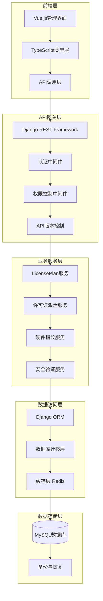
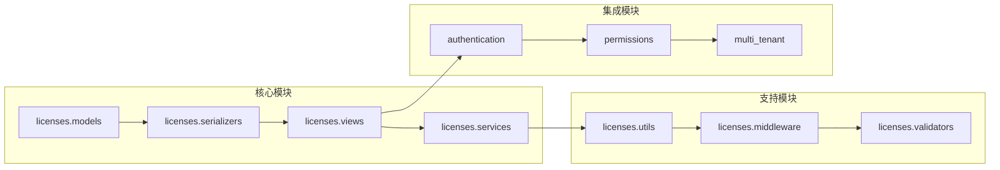

# 许可证系统方案A重构更新 - 设计文档

## 📋 设计概述

### 架构设计理念
基于现有的多租户Django架构，采用分层设计模式实现许可证系统的渐进式重构。设计遵循SOLID原则，确保系统的可扩展性、可维护性和向后兼容性。

### 核心设计目标
- **语义明确性**: 通过字段重命名明确区分模板配置与实际使用值
- **跨平台兼容**: 实现macOS（Intel + Apple Silicon）完整支持
- **安全增强**: 强化RSA签名验证和异常检测机制
- **用户体验**: 保证前端界面的流畅性和一致性

## 🏗️ 系统架构设计

### 整体架构图


### 模块依赖关系


## 🔄 数据模型设计

### LicensePlan模型重构
```python
class LicensePlan(BaseModel):
    """许可证方案模型 - 重构后"""
    
    # 基础信息（无变更）
    name = models.CharField(max_length=100, verbose_name="方案名称")
    code = models.CharField(max_length=50, unique=True, verbose_name="方案代码")
    plan_type = models.CharField(max_length=20, choices=PLAN_TYPE_CHOICES)
    
    # 重构字段（语义化命名）
    default_max_activations = models.PositiveIntegerField(
        verbose_name="默认最大激活数",
        help_text="该方案的模板默认最大激活设备数"
    )
    default_validity_days = models.PositiveIntegerField(
        verbose_name="默认有效天数", 
        help_text="该方案的模板默认有效期天数"
    )
    
    # 其他字段保持不变
    features = models.JSONField(default=dict, verbose_name="功能配置")
    price = models.DecimalField(max_digits=10, decimal_places=2)
    currency = models.CharField(max_length=3, default='CNY')
    status = models.CharField(max_length=20, default='active')
    
    class Meta:
        db_table = 'licenses_license_plan'
        verbose_name = "许可证方案"
        verbose_name_plural = "许可证方案"
```

### License模型（保持不变）
```python
class License(BaseModel):
    """许可证模型 - 实际使用值，无需变更"""
    
    license_key = models.CharField(max_length=255, unique=True)
    plan = models.ForeignKey(LicensePlan, on_delete=models.PROTECT)
    
    # 实际使用字段（无变更）
    max_activations = models.PositiveIntegerField(
        verbose_name="实际最大激活数"
    )
    expires_at = models.DateTimeField(verbose_name="实际过期时间")
    
    # 其他字段保持不变
    issued_to = models.CharField(max_length=200)
    customer_email = models.EmailField()
    status = models.CharField(max_length=20, default='active')
```

### 数据库迁移设计
```python
# 0004_rename_licenseplan_fields.py
from django.db import migrations

class Migration(migrations.Migration):
    dependencies = [
        ('licenses', '0003_previous_migration'),
    ]
    
    operations = [
        migrations.RenameField(
            model_name='licenseplan',
            old_name='max_machines',
            new_name='default_max_activations',
        ),
        migrations.RenameField(
            model_name='licenseplan',
            old_name='validity_days',
            new_name='default_validity_days',
        ),
    ]
```

## 🔌 API设计

### API序列化器重构
```python
class LicensePlanSerializer(serializers.ModelSerializer):
    """LicensePlan序列化器 - 支持新旧字段名兼容"""
    
    # 新字段名（主要使用）
    default_max_activations = serializers.IntegerField()
    default_validity_days = serializers.IntegerField()
    
    # 向后兼容字段（只读，用于过渡期）
    max_machines = serializers.IntegerField(
        source='default_max_activations', 
        read_only=True
    )
    validity_days = serializers.IntegerField(
        source='default_validity_days',
        read_only=True  
    )
    
    class Meta:
        model = LicensePlan
        fields = [
            'id', 'name', 'code', 'plan_type',
            'default_max_activations', 'default_validity_days',
            'max_machines', 'validity_days',  # 兼容字段
            'features', 'price', 'currency', 'status',
            'created_at', 'updated_at'
        ]
    
    def to_representation(self, instance):
        """自定义响应格式，根据API版本返回对应字段"""
        data = super().to_representation(instance)
        
        # 检查请求版本，决定是否包含兼容字段
        request = self.context.get('request')
        if request and hasattr(request, 'version'):
            if request.version == 'v1':
                # v1版本保留旧字段名
                data['max_machines'] = data['default_max_activations']
                data['validity_days'] = data['default_validity_days']
            elif request.version == 'v2':
                # v2版本移除旧字段名
                data.pop('max_machines', None)
                data.pop('validity_days', None)
        
        return data
```

### API端点设计
```python
# licenses/views/license_plan_views.py
class LicensePlanViewSet(viewsets.ModelViewSet):
    """许可证方案API视图集"""
    
    serializer_class = LicensePlanSerializer
    permission_classes = [IsAuthenticated, HasLicenseManagePermission]
    filterset_class = LicensePlanFilter
    ordering_fields = ['name', 'created_at', 'default_max_activations']
    
    def get_queryset(self):
        """根据租户过滤数据"""
        return LicensePlan.objects.filter(
            tenant=self.request.tenant
        ).select_related('tenant')
    
    def perform_create(self, serializer):
        """创建时自动设置租户"""
        serializer.save(
            tenant=self.request.tenant,
            created_by=self.request.user
        )
```

## 🔐 安全设计

### 硬件指纹生成算法
```python
class HardwareFingerprintService:
    """跨平台硬件指纹生成服务"""
    
    @staticmethod
    def generate_fingerprint(hardware_info: dict) -> str:
        """生成统一的硬件指纹"""
        
        # 提取关键硬件信息
        key_components = {
            'hardware_uuid': hardware_info.get('hardware_uuid'),
            'cpu_model': hardware_info.get('cpu_info', {}).get('model'),
            'mac_addresses': sorted(hardware_info.get('network_info', {}).get('mac_addresses', [])),
            'platform': hardware_info.get('system_info', {}).get('os_name')
        }
        
        # 生成稳定的指纹
        fingerprint_data = json.dumps(key_components, sort_keys=True)
        fingerprint_hash = hashlib.sha256(fingerprint_data.encode()).hexdigest()
        
        return f"fp_{fingerprint_hash[:32]}"
    
    @staticmethod
    def validate_fingerprint_similarity(stored_fp: str, current_fp: str) -> float:
        """计算指纹相似度，处理硬件微小变化"""
        # 实现指纹相似度算法
        # 返回0.0-1.0之间的相似度分数
        pass
```

### RSA签名验证增强
```python
class LicenseSignatureService:
    """许可证数字签名服务"""
    
    @staticmethod
    def verify_license_signature(license_key: str, signature: str, public_key: str) -> bool:
        """验证许可证RSA数字签名"""
        try:
            # 加载RSA公钥
            rsa_key = RSA.import_key(public_key)
            
            # 创建签名验证器
            verifier = pkcs1_15.new(rsa_key)
            
            # 计算许可证密钥的哈希
            license_hash = SHA256.new(license_key.encode())
            
            # 验证签名
            verifier.verify(license_hash, base64.b64decode(signature))
            return True
            
        except (ValueError, TypeError) as e:
            logger.warning(f"License signature verification failed: {e}")
            return False
```

## 🎨 前端设计

### TypeScript类型定义
```typescript
// types/license.ts
export interface LicensePlan {
  id: number;
  name: string;
  code: string;
  plan_type: string;
  
  // 新字段名（主要使用）
  default_max_activations: number;
  default_validity_days: number;
  
  // 其他字段
  features: Record<string, any>;
  price: string;
  currency: string;
  status: string;
  created_at: string;
  updated_at: string;
}

// 向后兼容的类型定义
export interface LegacyLicensePlan extends LicensePlan {
  max_machines: number;  // 映射到 default_max_activations
  validity_days: number; // 映射到 default_validity_days
}
```

### Vue组件设计
```vue
<!-- components/LicensePlan/LicensePlanForm.vue -->
<template>
  <el-form ref="formRef" :model="form" :rules="rules" label-width="120px">
    <el-form-item label="方案名称" prop="name">
      <el-input v-model="form.name" placeholder="请输入方案名称" />
    </el-form-item>
    
    <el-form-item label="方案代码" prop="code">
      <el-input v-model="form.code" placeholder="请输入方案代码" />
    </el-form-item>
    
    <!-- 使用新字段名 -->
    <el-form-item label="默认最大激活数" prop="default_max_activations">
      <el-input-number 
        v-model="form.default_max_activations" 
        :min="1" 
        :max="1000"
        placeholder="设备数量限制"
      />
    </el-form-item>
    
    <el-form-item label="默认有效天数" prop="default_validity_days">
      <el-input-number 
        v-model="form.default_validity_days"
        :min="1"
        :max="3650" 
        placeholder="有效期天数"
      />
    </el-form-item>
    
    <el-form-item label="价格" prop="price">
      <el-input v-model="form.price" placeholder="请输入价格">
        <template #append>{{ form.currency }}</template>
      </el-input>
    </el-form-item>
    
    <el-form-item>
      <el-button type="primary" @click="handleSubmit">保存</el-button>
      <el-button @click="handleCancel">取消</el-button>
    </el-form-item>
  </el-form>
</template>

<script setup lang="ts">
import { ref, reactive } from 'vue'
import type { LicensePlan } from '@/types/license'
import { createLicensePlan, updateLicensePlan } from '@/api/license'

interface Props {
  modelValue?: LicensePlan
  mode: 'create' | 'edit'
}

const props = defineProps<Props>()
const emit = defineEmits<{
  submit: [plan: LicensePlan]
  cancel: []
}>()

// 表单数据（使用新字段名）
const form = reactive({
  name: '',
  code: '',
  plan_type: 'basic',
  default_max_activations: 1,
  default_validity_days: 365,
  price: '0.00',
  currency: 'CNY',
  status: 'active'
})

// 表单验证规则
const rules = {
  name: [
    { required: true, message: '请输入方案名称', trigger: 'blur' }
  ],
  code: [
    { required: true, message: '请输入方案代码', trigger: 'blur' }
  ],
  default_max_activations: [
    { required: true, message: '请设置默认最大激活数', trigger: 'blur' }
  ],
  default_validity_days: [
    { required: true, message: '请设置默认有效天数', trigger: 'blur' }
  ]
}

const handleSubmit = async () => {
  try {
    if (props.mode === 'create') {
      const result = await createLicensePlan(form)
      emit('submit', result)
    } else {
      const result = await updateLicensePlan(props.modelValue!.id, form)
      emit('submit', result)
    }
  } catch (error) {
    console.error('保存失败:', error)
  }
}
</script>
```

### API调用层设计
```typescript
// api/license.ts
import { request } from '@/utils/request'
import type { LicensePlan } from '@/types/license'

export interface LicensePlanListResponse {
  count: number
  results: LicensePlan[]
}

export interface CreateLicensePlanRequest {
  name: string
  code: string
  plan_type: string
  default_max_activations: number  // 使用新字段名
  default_validity_days: number    // 使用新字段名
  price: string
  currency: string
}

export const licensePlanAPI = {
  // 获取方案列表
  async getPlans(params?: any): Promise<LicensePlanListResponse> {
    return request.get('/api/licenses/plans/', { params })
  },
  
  // 创建方案
  async createPlan(data: CreateLicensePlanRequest): Promise<LicensePlan> {
    return request.post('/api/licenses/plans/', data)
  },
  
  // 更新方案
  async updatePlan(id: number, data: Partial<CreateLicensePlanRequest>): Promise<LicensePlan> {
    return request.patch(`/api/licenses/plans/${id}/`, data)
  },
  
  // 删除方案
  async deletePlan(id: number): Promise<void> {
    return request.delete(`/api/licenses/plans/${id}/`)
  }
}
```

## 🧪 测试设计

### 单元测试设计
```python
# tests/test_license_plan_serializer.py
class TestLicensePlanSerializer(TestCase):
    """LicensePlan序列化器测试"""
    
    def setUp(self):
        self.plan_data = {
            'name': '测试方案',
            'code': 'TEST',
            'plan_type': 'basic',
            'default_max_activations': 5,
            'default_validity_days': 365,
            'price': '999.00'
        }
    
    def test_serializer_with_new_field_names(self):
        """测试新字段名序列化"""
        serializer = LicensePlanSerializer(data=self.plan_data)
        self.assertTrue(serializer.is_valid())
        
        plan = serializer.save()
        self.assertEqual(plan.default_max_activations, 5)
        self.assertEqual(plan.default_validity_days, 365)
    
    def test_backward_compatibility_fields(self):
        """测试向后兼容字段"""
        plan = LicensePlan.objects.create(**self.plan_data)
        serializer = LicensePlanSerializer(plan)
        
        data = serializer.data
        # 新字段名
        self.assertEqual(data['default_max_activations'], 5)
        self.assertEqual(data['default_validity_days'], 365)
        
        # 兼容字段名（只读）
        self.assertEqual(data['max_machines'], 5)
        self.assertEqual(data['validity_days'], 365)
```

### 集成测试设计
```python
# tests/test_license_plan_api.py
class TestLicensePlanAPI(APITestCase):
    """LicensePlan API集成测试"""
    
    def setUp(self):
        self.user = create_test_user()
        self.tenant = create_test_tenant()
        self.client.force_authenticate(user=self.user)
        
    def test_create_plan_with_new_fields(self):
        """测试使用新字段名创建方案"""
        data = {
            'name': '新测试方案',
            'code': 'NEW_TEST',
            'plan_type': 'professional',
            'default_max_activations': 10,
            'default_validity_days': 730,
            'price': '1999.00'
        }
        
        response = self.client.post('/api/licenses/plans/', data)
        self.assertEqual(response.status_code, 201)
        
        plan = LicensePlan.objects.get(code='NEW_TEST')
        self.assertEqual(plan.default_max_activations, 10)
        self.assertEqual(plan.default_validity_days, 730)
    
    def test_api_response_format(self):
        """测试API响应格式包含新旧字段名"""
        plan = LicensePlan.objects.create(
            name='响应测试',
            code='RESPONSE_TEST',
            default_max_activations=3,
            default_validity_days=180,
            tenant=self.tenant
        )
        
        response = self.client.get(f'/api/licenses/plans/{plan.id}/')
        self.assertEqual(response.status_code, 200)
        
        data = response.json()
        # 验证新字段名存在
        self.assertIn('default_max_activations', data)
        self.assertIn('default_validity_days', data)
        self.assertEqual(data['default_max_activations'], 3)
        self.assertEqual(data['default_validity_days'], 180)
```

## 📊 性能设计

### 数据库查询优化
```python
# 优化后的查询集
class LicensePlanQuerySet(models.QuerySet):
    """优化的查询集"""
    
    def with_license_stats(self):
        """包含许可证统计信息"""
        return self.annotate(
            total_licenses=Count('license'),
            active_licenses=Count('license', filter=Q(license__status='active')),
            total_activations=Sum('license__max_activations')
        )
    
    def for_tenant(self, tenant):
        """租户过滤"""
        return self.filter(tenant=tenant)
    
    def active_plans(self):
        """活跃方案"""
        return self.filter(status='active')

# 使用示例
plans = LicensePlan.objects.for_tenant(request.tenant)\
    .active_plans()\
    .with_license_stats()\
    .select_related('tenant')\
    .order_by('name')
```

### 缓存策略设计
```python
# 缓存配置
CACHE_SETTINGS = {
    'license_plan_list': {
        'timeout': 300,  # 5分钟
        'key_pattern': 'license_plans:tenant:{tenant_id}:list'
    },
    'license_plan_detail': {
        'timeout': 600,  # 10分钟
        'key_pattern': 'license_plan:detail:{plan_id}'
    }
}

class CachedLicensePlanService:
    """带缓存的许可证方案服务"""
    
    @staticmethod
    def get_plans_for_tenant(tenant_id: int) -> List[LicensePlan]:
        cache_key = f'license_plans:tenant:{tenant_id}:list'
        
        plans = cache.get(cache_key)
        if plans is None:
            plans = list(LicensePlan.objects.for_tenant_id(tenant_id).active_plans())
            cache.set(cache_key, plans, timeout=300)
        
        return plans
```

## 🔄 部署设计

### 数据库迁移策略
```python
# 迁移执行计划
MIGRATION_PLAN = {
    'phase_1': {
        'description': '执行字段重命名迁移',
        'migrations': ['0004_rename_licenseplan_fields'],
        'rollback_safe': True,
        'estimated_time': '< 1分钟'
    },
    'phase_2': {
        'description': '验证数据完整性',
        'commands': ['python manage.py check_license_data_integrity'],
        'rollback_safe': True,
        'estimated_time': '< 30秒'
    }
}
```

### 部署脚本设计
```bash
#!/bin/bash
# deploy_license_update.sh

set -e

echo "开始部署许可证系统更新..."

# 1. 备份数据库
echo "1. 备份数据库..."
python manage.py dbbackup

# 2. 执行数据库迁移
echo "2. 执行数据库迁移..."
python manage.py migrate licenses

# 3. 验证数据完整性
echo "3. 验证数据完整性..."
python manage.py check_license_data_integrity

# 4. 重启服务
echo "4. 重启应用服务..."
sudo systemctl restart gunicorn
sudo systemctl restart celery

# 5. 验证服务状态
echo "5. 验证服务状态..."
python manage.py health_check

echo "部署完成！"
```

## 📝 监控设计

### 关键指标监控
```python
# 监控指标定义
MONITORING_METRICS = {
    'api_performance': {
        'license_plan_list_response_time': 'histogram',
        'license_plan_create_response_time': 'histogram',
        'license_plan_update_response_time': 'histogram'
    },
    'business_metrics': {
        'license_plans_created_daily': 'counter',
        'license_plans_updated_daily': 'counter',
        'api_field_compatibility_usage': 'counter'
    },
    'error_metrics': {
        'license_plan_api_errors': 'counter',
        'database_migration_errors': 'counter',
        'field_validation_errors': 'counter'
    }
}
```

## ✅ 设计验证

### 设计原则验证
- ✅ **向后兼容性**: API支持新旧字段名，平滑过渡
- ✅ **数据完整性**: 迁移过程保证数据不丢失
- ✅ **性能保障**: 优化查询和缓存策略
- ✅ **安全增强**: RSA签名和硬件指纹验证
- ✅ **用户体验**: 前端界面保持一致性

### 技术债务评估
- **低风险**: 字段重命名对现有功能影响最小
- **中风险**: 前端组件需要系统性更新
- **可控风险**: 通过分阶段部署降低风险

---

*设计文档版本: v1.0*  
*创建日期: 2025年9月26日*  
*基于需求: license-system-update requirements v1.0*
