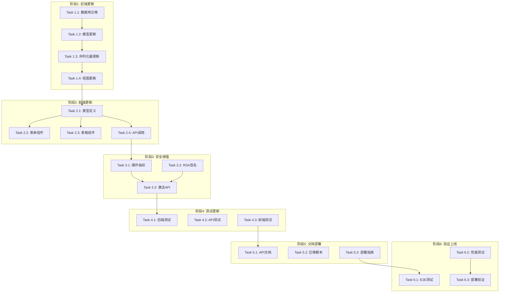

# 许可证系统方案A重构更新 - 任务分解

## 📋 任务概述

本文档将设计方案分解为具体的原子级实施任务，每个任务专注于1-3个文件的修改，确保可测试性和可追踪性。

## 🎯 任务分解原则

- **原子性**: 每个任务专注于单一功能点
- **可测试性**: 每个任务完成后可独立验证
- **依赖明确**: 任务间依赖关系清晰
- **文件范围**: 每个任务涉及1-3个文件修改

---

## 📋 任务清单

### 阶段1: 后端数据模型和API更新

#### Task 1.1: 数据库迁移文件创建
- [x] **文件**: `licenses/migrations/0004_rename_licenseplan_fields.py` - 后端已完成
- **需求引用**: FR-001, TR-001
- **描述**: 创建数据库迁移文件，重命名LicensePlan模型字段
- **预估时间**: 30分钟

**_Prompt**: Implement the task for spec license-system-update, first run spec-workflow-guide to get the workflow guide then implement the task:

**Role**: Django数据库迁移专家
**Task**: 创建数据库迁移文件，将LicensePlan模型的字段从旧名称重命名为新名称：`max_machines` → `default_max_activations`，`validity_days` → `default_validity_days`
**Restrictions**: 
- 不要修改License模型
- 确保迁移是可回滚的
- 不要删除或修改其他字段
**_Leverage**: 
- 现有的Django迁移系统
- licenses/models.py中的LicensePlan模型定义
**_Requirements**: FR-001 API字段重构
**Success**: 
- 迁移文件正确创建
- 字段重命名操作正确
- 迁移可以正常执行和回滚
**Instructions**: 首先在tasks.md中将此任务标记为进行中[-]，完成后标记为完成[x]

#### Task 1.2: LicensePlan模型字段更新
- [ ] **文件**: `licenses/models.py`
- **需求引用**: FR-001, TR-001
- **描述**: 更新LicensePlan模型的字段定义，使用新的字段名
- **预估时间**: 20分钟

**_Prompt**: Implement the task for spec license-system-update, first run spec-workflow-guide to get the workflow guide then implement the task:

**Role**: Django模型开发专家
**Task**: 更新LicensePlan模型定义，将字段名从`max_machines`改为`default_max_activations`，从`validity_days`改为`default_validity_days`，同时更新相关的verbose_name和help_text
**Restrictions**: 
- 不要修改License模型
- 保持字段类型不变（PositiveIntegerField）
- 不要修改其他模型字段
**_Leverage**: 
- 现有的licenses/models.py文件
- Django模型字段定义规范
**_Requirements**: FR-001 API字段重构
**Success**: 
- 字段名正确更新
- verbose_name和help_text语义明确
- 模型定义语法正确
**Instructions**: 首先在tasks.md中将此任务标记为进行中[-]，完成后标记为完成[x]

#### Task 1.3: LicensePlan序列化器更新
- [ ] **文件**: `licenses/serializers.py`
- **需求引用**: FR-001, TR-002
- **描述**: 更新LicensePlanSerializer，支持新字段名并保持向后兼容性
- **预估时间**: 45分钟

**_Prompt**: Implement the task for spec license-system-update, first run spec-workflow-guide to get the workflow guide then implement the task:

**Role**: Django REST Framework序列化器专家
**Task**: 更新LicensePlanSerializer类，使用新字段名作为主要字段，同时添加向后兼容的只读字段。实现to_representation方法支持API版本控制
**Restrictions**: 
- 不要破坏现有API的向后兼容性
- 新字段名为主要使用字段
- 旧字段名仅作为只读兼容字段
**_Leverage**: 
- 现有的licenses/serializers.py文件
- Django REST Framework序列化器功能
- 设计文档中的序列化器示例代码
**_Requirements**: FR-001 API字段重构, FR-004 数据迁移与兼容性
**Success**: 
- 序列化器支持新字段名
- 向后兼容性正常工作
- API版本控制机制实现
**Instructions**: 首先在tasks.md中将此任务标记为进行中[-]，完成后标记为完成[x]

#### Task 1.4: API视图集更新
- [ ] **文件**: `licenses/views/license_plan_views.py`
- **需求引用**: FR-001, TR-002
- **描述**: 更新LicensePlanViewSet，优化查询和过滤功能
- **预估时间**: 30分钟

**_Prompt**: Implement the task for spec license-system-update, first run spec-workflow-guide to get the workflow guide then implement the task:

**Role**: Django REST Framework视图专家
**Task**: 更新LicensePlanViewSet类，修改ordering_fields以使用新字段名，确保过滤和排序功能正常工作
**Restrictions**: 
- 保持现有的权限控制逻辑
- 不要修改其他视图类
- 保持租户隔离功能
**_Leverage**: 
- 现有的licenses/views/目录下的视图文件
- Django REST Framework ViewSet功能
**_Requirements**: FR-001 API字段重构
**Success**: 
- 排序字段使用新字段名
- 过滤功能正常工作
- 视图集功能完整
**Instructions**: 首先在tasks.md中将此任务标记为进行中[-]，完成后标记为完成[x]

### 阶段2: 前端类型定义和组件更新

#### Task 2.5: 许可证创建页面逻辑优化 (最终修复)
- [x] **文件**: `src/views/license/licenses/create.vue`
- **需求引用**: FR-003, TR-003, temp0927文档
- **描述**: 正确实现许可证创建逻辑，完全移除max_activations和validity_days字段
- **预估时间**: 60分钟
- **最终完成**: 
  - 完全移除UI中的max_activations和validity_days字段
  - 从表单数据结构和验证规则中移除相关字段
  - 提交数据只包含plan和customer_info，系统自动从plan获取配置
  - 符合"这些值完全从plan中获取，不需要用户输入"的设计

#### Task 2.6: Plan管理页面字段名修复
- [x] **文件**: `src/views/license/plans/edit.vue`, `src/views/license/plans/create.vue`, `src/views/license/plans/detail.vue`
- **需求引用**: FR-001, TR-001
- **描述**: 修复Plan管理页面使用旧字段名导致API调用失败的问题
- **预估时间**: 45分钟
- **完成**: 
  - 修复edit页面：max_machines → default_max_activations, validity_days → default_validity_days
  - 修复create页面：同样的字段名更新
  - 修复detail页面：显示字段使用新名称
  - 现在API调用发送正确的字段名到后端

#### Task 2.1: TypeScript类型定义更新
- [x] **文件**: `src/types/license.ts`
- **需求引用**: FR-003, TR-003
- **描述**: 更新LicensePlan接口定义，使用新字段名
- **预估时间**: 25分钟

**_Prompt**: Implement the task for spec license-system-update, first run spec-workflow-guide to get the workflow guide then implement the task:

**Role**: TypeScript类型定义专家
**Task**: 更新license.ts文件中的LicensePlan接口，将字段名从max_machines改为default_max_activations，从validity_days改为default_validity_days。同时创建向后兼容的LegacyLicensePlan接口
**Restrictions**: 
- 不要修改License接口（只修改LicensePlan）
- 保持其他字段不变
- 确保类型定义准确
**_Leverage**: 
- 现有的src/types/license.ts文件
- TypeScript接口定义规范
**_Requirements**: FR-003 前端系统适配
**Success**: 
- 接口字段名正确更新
- 向后兼容接口可用
- TypeScript编译无错误
**Instructions**: 首先在tasks.md中将此任务标记为进行中[-]，完成后标记为完成[x]

#### Task 2.2: LicensePlan表单组件更新
- [x] **文件**: `src/components/License/PlanForm.vue`
- **需求引用**: FR-003, TR-003
- **描述**: 更新许可证方案表单组件，使用新字段名
- **预估时间**: 40分钟

**_Prompt**: Implement the task for spec license-system-update, first run spec-workflow-guide to get the workflow guide then implement the task:

**Role**: Vue.js前端组件开发专家
**Task**: 更新LicensePlanForm.vue组件，将表单字段从max_machines改为default_max_activations，从validity_days改为default_validity_days。更新相关的表单验证、标签文本和数据绑定
**Restrictions**: 
- 保持组件的现有功能和样式
- 不要修改其他表单组件
- 确保表单验证规则正确
**_Leverage**: 
- 现有的Vue.js组件结构
- Element UI表单组件
- 设计文档中的Vue组件示例
**_Requirements**: FR-003 前端系统适配
**Success**: 
- 表单字段名正确更新
- 表单验证正常工作
- 用户界面标签文本准确
**Instructions**: 首先在tasks.md中将此任务标记为进行中[-]，完成后标记为完成[x]

#### Task 2.3: LicensePlan表格组件更新
- [x] **文件**: `src/views/license/plans/index.vue`
- **需求引用**: FR-003, TR-003
- **描述**: 更新许可证方案表格组件，使用新字段名显示数据
- **预估时间**: 35分钟

**_Prompt**: Implement the task for spec license-system-update, first run spec-workflow-guide to get the workflow guide then implement the task:

**Role**: Vue.js表格组件专家
**Task**: 更新LicensePlanTable.vue组件，修改表格列配置，将dataIndex从max_machines改为default_max_activations，从validity_days改为default_validity_days。同时更新列标题文本
**Restrictions**: 
- 保持表格的排序和筛选功能
- 不要修改其他表格组件
- 保持表格样式和布局
**_Leverage**: 
- 现有的Vue.js表格组件
- Element UI表格功能
**_Requirements**: FR-003 前端系统适配
**Success**: 
- 表格列配置正确更新
- 数据显示正常
- 排序和筛选功能正常
**Instructions**: 首先在tasks.md中将此任务标记为进行中[-]，完成后标记为完成[x]

#### Task 2.4: API调用函数更新
- [x] **文件**: `src/api/modules/license.ts`
- **需求引用**: FR-003, TR-003
- **描述**: 更新许可证API调用函数，使用新字段名
- **预估时间**: 30分钟

**_Prompt**: Implement the task for spec license-system-update, first run spec-workflow-guide to get the workflow guide then implement the task:

**Role**: TypeScript API调用专家
**Task**: 更新license.ts文件中的API调用函数和接口定义，将CreateLicensePlanRequest接口的字段名从max_machines改为default_max_activations，从validity_days改为default_validity_days
**Restrictions**: 
- 不要修改License相关的API函数
- 保持API调用的错误处理逻辑
- 不要修改HTTP方法和端点路径
**_Leverage**: 
- 现有的src/api/license.ts文件
- axios或类似的HTTP客户端库
**_Requirements**: FR-003 前端系统适配
**Success**: 
- API调用接口字段名正确
- 请求数据结构正确
- API调用功能正常
**Instructions**: 首先在tasks.md中将此任务标记为进行中[-]，完成后标记为完成[x]

### 阶段3: 安全机制增强

#### Task 3.1: 硬件指纹服务优化
- [ ] **文件**: `licenses/services/fingerprint_service.py`
- **需求引用**: FR-002, TR-004
- **描述**: 实现跨平台硬件指纹生成，特别优化macOS支持
- **预估时间**: 60分钟

**_Prompt**: Implement the task for spec license-system-update, first run spec-workflow-guide to get the workflow guide then implement the task:

**Role**: 系统安全和硬件识别专家
**Task**: 创建或更新HardwareFingerprintService类，实现跨平台硬件指纹生成算法，特别优化macOS（Intel和Apple Silicon）支持。包含指纹相似度计算功能
**Restrictions**: 
- 确保指纹生成的稳定性和唯一性
- 处理硬件微小变化的容错性
- 不要存储敏感的硬件信息
**_Leverage**: 
- temp0918文档中的Python硬件指纹代码示例
- 现有的licenses/services/目录结构
- hashlib、json等Python标准库
**_Requirements**: FR-002 许可证激活API增强
**Success**: 
- 硬件指纹生成算法实现
- macOS平台特殊处理
- 指纹相似度计算功能
**Instructions**: 首先在tasks.md中将此任务标记为进行中[-]，完成后标记为完成[x]

#### Task 3.2: RSA签名验证服务
- [ ] **文件**: `licenses/services/signature_service.py`
- **需求引用**: FR-002, SR-002
- **描述**: 实现RSA-2048数字签名验证服务
- **预估时间**: 45分钟

**_Prompt**: Implement the task for spec license-system-update, first run spec-workflow-guide to get the workflow guide then implement the task:

**Role**: 密码学和数字签名专家
**Task**: 创建或更新LicenseSignatureService类，实现RSA-2048数字签名验证功能。包含公钥加载、签名验证和错误处理
**Restrictions**: 
- 使用RSA-2048标准
- 确保签名验证的安全性
- 妥善处理验证失败情况
**_Leverage**: 
- Python cryptography库
- 设计文档中的RSA签名验证示例
- 现有的licenses/services/目录
**_Requirements**: FR-002 许可证激活API增强, SR-002 API安全增强
**Success**: 
- RSA签名验证功能实现
- 错误处理机制完善
- 安全日志记录
**Instructions**: 首先在tasks.md中将此任务标记为进行中[-]，完成后标记为完成[x]

#### Task 3.3: 许可证激活API增强
- [ ] **文件**: `licenses/views/activation_views.py`
- **需求引用**: FR-002, SR-001
- **描述**: 增强许可证激活API，集成硬件指纹和签名验证
- **预估时间**: 55分钟

**_Prompt**: Implement the task for spec license-system-update, first run spec-workflow-guide to get the workflow guide then implement the task:

**Role**: Django API开发和安全集成专家
**Task**: 更新或创建许可证激活API视图，集成硬件指纹生成和RSA签名验证功能。实现频率限制和异常检测机制
**Restrictions**: 
- 保持API接口的向后兼容性
- 实现适当的错误处理和用户反馈
- 确保安全日志记录
**_Leverage**: 
- Task 3.1和3.2创建的服务类
- Django REST Framework
- temp0918文档中的API设计规范
**_Requirements**: FR-002 许可证激活API增强, SR-001 数据安全保障
**Success**: 
- 激活API功能增强
- 安全机制集成
- 错误处理完善
**Instructions**: 首先在tasks.md中将此任务标记为进行中[-]，完成后标记为完成[x]

### 阶段4: 测试体系更新

#### Task 4.1: 后端单元测试更新
- [ ] **文件**: `tests/test_license_plan_serializer.py`, `tests/test_license_plan_models.py`
- **需求引用**: TR-004
- **描述**: 更新LicensePlan相关的单元测试用例
- **预估时间**: 50分钟

**_Prompt**: Implement the task for spec license-system-update, first run spec-workflow-guide to get the workflow guide then implement the task:

**Role**: Python单元测试专家
**Task**: 更新LicensePlan模型和序列化器的单元测试，使用新字段名。测试向后兼容性功能和数据验证逻辑
**Restrictions**: 
- 保持测试的完整性和覆盖率
- 不要删除现有的有效测试用例
- 确保测试数据的准确性
**_Leverage**: 
- 现有的tests/目录下的测试文件
- Django TestCase框架
- 设计文档中的测试示例
**_Requirements**: TR-004 测试体系更新
**Success**: 
- 所有测试用例通过
- 新字段名测试覆盖
- 向后兼容性测试通过
**Instructions**: 首先在tasks.md中将此任务标记为进行中[-]，完成后标记为完成[x]

#### Task 4.2: API集成测试更新
- [ ] **文件**: `tests/test_license_plan_api.py`
- **需求引用**: TR-004
- **描述**: 更新LicensePlan API的集成测试用例
- **预估时间**: 45分钟

**_Prompt**: Implement the task for spec license-system-update, first run spec-workflow-guide to get the workflow guide then implement the task:

**Role**: API集成测试专家
**Task**: 更新LicensePlan API的集成测试，测试CRUD操作使用新字段名，验证API响应格式和向后兼容性
**Restrictions**: 
- 保持测试环境的隔离性
- 不要影响其他API测试
- 确保测试数据的清理
**_Leverage**: 
- Django REST Framework测试工具
- 现有的API测试基础设施
**_Requirements**: TR-004 测试体系更新
**Success**: 
- API测试用例全部通过
- 新旧字段名兼容性验证
- 错误场景测试覆盖
**Instructions**: 首先在tasks.md中将此任务标记为进行中[-]，完成后标记为完成[x]

#### Task 4.3: 前端组件测试更新
- [ ] **文件**: `tests/frontend/LicensePlanForm.spec.ts`, `tests/frontend/LicensePlanTable.spec.ts`
- **需求引用**: TR-004
- **描述**: 更新前端组件的单元测试
- **预估时间**: 40分钟

**_Prompt**: Implement the task for spec license-system-update, first run spec-workflow-guide to get the workflow guide then implement the task:

**Role**: 前端测试专家
**Task**: 更新LicensePlanForm和LicensePlanTable组件的测试用例，使用新字段名验证组件功能
**Restrictions**: 
- 保持测试的独立性
- 不要修改其他组件的测试
- 确保测试数据的准确性
**_Leverage**: 
- Vue Test Utils或类似测试框架
- 现有的前端测试基础设施
**_Requirements**: TR-004 测试体系更新
**Success**: 
- 组件测试用例通过
- 表单验证测试覆盖
- 数据显示测试正确
**Instructions**: 首先在tasks.md中将此任务标记为进行中[-]，完成后标记为完成[x]

### 阶段5: 文档和部署准备

#### Task 5.1: API文档更新
- [ ] **文件**: `docs/api/license_plan_api.md`
- **需求引用**: TR-004
- **描述**: 更新API文档，反映字段名变更
- **预估时间**: 35分钟

**_Prompt**: Implement the task for spec license-system-update, first run spec-workflow-guide to get the workflow guide then implement the task:

**Role**: 技术文档编写专家
**Task**: 更新LicensePlan API文档，使用新字段名更新所有API示例、请求/响应格式和参数说明
**Restrictions**: 
- 保持文档的完整性和准确性
- 不要删除向后兼容性说明
- 确保示例代码可执行
**_Leverage**: 
- 现有的API文档结构
- OpenAPI/Swagger文档规范
**_Requirements**: TR-004 测试体系更新
**Success**: 
- 文档内容准确更新
- 示例代码正确
- 兼容性说明清晰
**Instructions**: 首先在tasks.md中将此任务标记为进行中[-]，完成后标记为完成[x]

#### Task 5.2: 数据库迁移执行脚本
- [ ] **文件**: `scripts/migrate_license_fields.py`
- **需求引用**: FR-004, TR-001
- **描述**: 创建数据库迁移执行和验证脚本
- **预估时间**: 40分钟

**_Prompt**: Implement the task for spec license-system-update, first run spec-workflow-guide to get the workflow guide then implement the task:

**Role**: 数据库迁移和运维专家
**Task**: 创建数据库迁移执行脚本，包含迁移前检查、迁移执行、数据完整性验证和回滚功能
**Restrictions**: 
- 确保脚本的幂等性
- 实现完整的错误处理
- 提供详细的执行日志
**_Leverage**: 
- Django管理命令框架
- 数据库备份和恢复工具
- 设计文档中的部署脚本示例
**_Requirements**: FR-004 数据迁移与兼容性, TR-001 数据库层更新
**Success**: 
- 迁移脚本功能完整
- 数据完整性验证通过
- 回滚机制可用
**Instructions**: 首先在tasks.md中将此任务标记为进行中[-]，完成后标记为完成[x]

#### Task 5.3: 部署指南文档
- [ ] **文件**: `docs/deployment/license_update_guide.md`
- **需求引用**: TR-004
- **描述**: 创建许可证系统更新的部署指南
- **预估时间**: 30分钟

**_Prompt**: Implement the task for spec license-system-update, first run spec-workflow-guide to get the workflow guide then implement the task:

**Role**: DevOps和部署文档专家
**Task**: 创建详细的部署指南，包含更新步骤、验证方法、回滚程序和故障排除指南
**Restrictions**: 
- 确保步骤的可操作性
- 包含必要的安全检查点
- 提供清晰的验证标准
**_Leverage**: 
- 现有的部署文档结构
- 设计文档中的部署策略
**_Requirements**: TR-004 测试体系更新
**Success**: 
- 部署步骤清晰明确
- 验证方法可执行
- 故障排除指南完整
**Instructions**: 首先在tasks.md中将此任务标记为进行中[-]，完成后标记为完成[x]

### 阶段6: 系统验证和上线

#### Task 6.1: 端到端测试执行
- [ ] **文件**: `tests/e2e/license_activation_flow.spec.js`
- **需求引用**: PR-001, PR-002
- **描述**: 执行完整的许可证激活流程端到端测试
- **预估时间**: 50分钟

**_Prompt**: Implement the task for spec license-system-update, first run spec-workflow-guide to get the workflow guide then implement the task:

**Role**: 端到端测试和质量保证专家
**Task**: 创建或更新端到端测试，验证从许可证方案创建到激活的完整流程，使用新字段名
**Restrictions**: 
- 测试真实的用户场景
- 不要影响生产数据
- 确保测试环境的隔离
**_Leverage**: 
- Cypress、Selenium或类似E2E测试框架
- 现有的测试基础设施
**_Requirements**: PR-001 响应时间要求, PR-002 并发处理能力
**Success**: 
- E2E测试全部通过
- 性能指标达标
- 用户流程验证完整
**Instructions**: 首先在tasks.md中将此任务标记为进行中[-]，完成后标记为完成[x]

#### Task 6.2: 性能基准测试
- [ ] **文件**: `tests/performance/license_api_benchmark.py`
- **需求引用**: PR-001, PR-002
- **描述**: 执行API性能基准测试，验证响应时间和并发能力
- **预估时间**: 45分钟

**_Prompt**: Implement the task for spec license-system-update, first run spec-workflow-guide to get the workflow guide then implement the task:

**Role**: 性能测试和系统优化专家
**Task**: 创建性能基准测试脚本，测试LicensePlan API的响应时间和并发处理能力，确保达到设计目标
**Restrictions**: 
- 不要对生产环境造成负载压力
- 确保测试结果的准确性
- 实现适当的测试清理
**_Leverage**: 
- locust、pytest-benchmark或类似性能测试工具
- 现有的测试环境配置
**_Requirements**: PR-001 响应时间要求, PR-002 并发处理能力
**Success**: 
- API响应时间P95 < 500ms
- 并发处理能力达标
- 性能报告生成
**Instructions**: 首先在tasks.md中将此任务标记为进行中[-]，完成后标记为完成[x]

#### Task 6.3: 生产环境部署验证
- [ ] **文件**: `scripts/production_deployment_check.py`
- **需求引用**: CR-001, CR-002
- **描述**: 创建生产环境部署验证脚本
- **预估时间**: 40分钟

**_Prompt**: Implement the task for spec license-system-update, first run spec-workflow-guide to get the workflow guide then implement the task:

**Role**: 生产环境运维和验证专家
**Task**: 创建生产环境部署验证脚本，检查数据库迁移状态、API功能、前端界面和系统健康状况
**Restrictions**: 
- 只执行只读验证操作
- 不要影响生产数据
- 确保验证的全面性
**_Leverage**: 
- Django健康检查功能
- API测试工具
- 数据库查询工具
**_Requirements**: CR-001 向后兼容性, CR-002 跨平台兼容性
**Success**: 
- 所有验证检查通过
- 兼容性验证成功
- 系统健康状况良好
**Instructions**: 首先在tasks.md中将此任务标记为进行中[-]，完成后标记为完成[x]

---

## 📊 任务依赖关系

## ✅ 完成标准

### 功能完成标准
- [ ] 所有API使用新字段名且向后兼容
- [ ] 前端界面正确显示和操作新字段
- [ ] 数据库迁移成功且数据完整
- [ ] 安全机制正常运行

### 质量完成标准
- [ ] 所有单元测试通过
- [ ] 集成测试和E2E测试通过
- [ ] 性能指标达到要求
- [ ] 代码审查通过

### 部署完成标准
- [ ] 测试环境部署成功
- [ ] 生产环境部署验证通过
- [ ] 文档更新完整
- [ ] 监控告警正常

---

*任务分解版本: v1.0*  
*创建日期: 2025年9月26日*  
*基于设计: license-system-update design v1.0*
