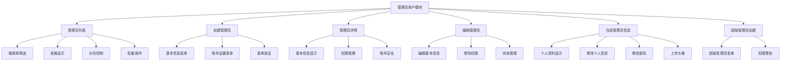
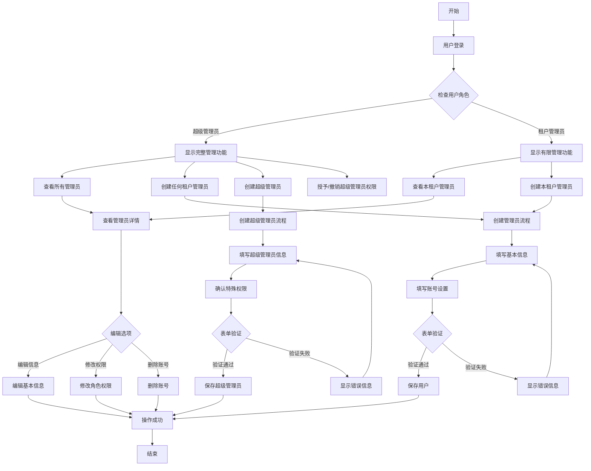
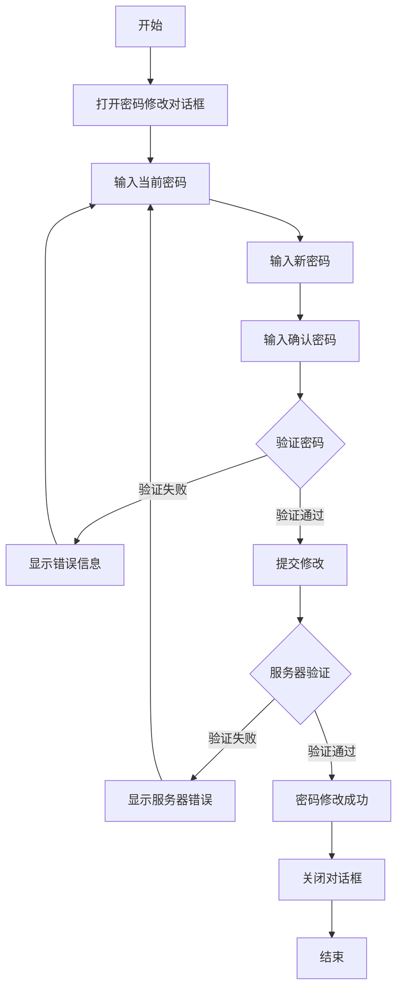
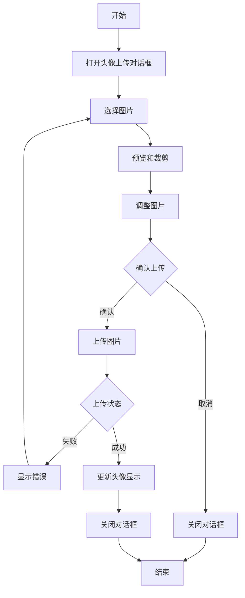

# 管理员用户管理模块 - 流程图

本文档提供管理员用户管理模块的主要流程图，帮助前端开发人员理解模块的结构和各页面间的关系。

## 模块结构图

下图展示了管理员用户管理模块的主要组成部分及其关系：

## 用户操作流程图

下图展示了管理员用户常见操作的流程：

## 密码修改流程图

下图展示了管理员修改密码的流程：

## 头像上传流程图

下图展示了管理员上传头像的流程：

这些流程图提供了管理员用户模块主要功能的操作流程，帮助前端开发人员理解用户交互和页面跳转逻辑。 