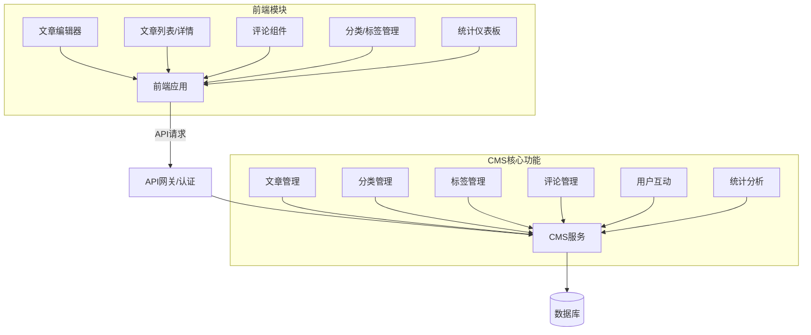

# CMS系统前端集成概述

## 系统概述

内容管理系统(CMS)提供完整的内容创建、管理和发布功能，支持文章、分类、标签和评论等核心功能。本文档旨在帮助前端开发人员理解如何与CMS API进行集成，快速构建内容管理和展示界面。

## 系统架构

## 认证与授权

### 认证方式

CMS系统使用JWT(JSON Web Token)进行API认证。所有API请求都需要在请求头中包含有效的JWT令牌。

### 租户识别

系统支持多租户架构，前端应用需要在每个请求中指定租户ID，有两种方式：

1. 请求头中添加租户ID
2. 通过JWT令牌中包含的租户信息（推荐）

### 权限控制

CMS系统实现了基于角色的权限控制：

- **游客**：可以查看已发布的公开内容，发表评论（需要审核）
- **注册用户**：可以互动（点赞、收藏）、发表评论、查看私有内容
- **内容创建者**：可以创建、编辑和删除自己的内容
- **编辑**：可以管理所有内容和评论
- **管理员**：拥有全部权限

前端应根据用户角色显示或隐藏相应功能，并在用户尝试进行未授权操作时提供适当的反馈。

## 基础API信息

### API基础URL

前端应用应使用 `/api/v1/cms/` 作为所有CMS相关API的基础URL。

### 主要资源端点

- 文章管理：文章相关的所有操作
- 分类管理：分类的创建、更新和管理
- 标签管理：标签的创建、更新和管理
- 标签组管理：管理标签分组
- 评论管理：评论的提交、审核和管理

### 响应格式

所有API响应遵循统一的格式，包含操作状态、状态码、消息和数据等字段。

对于分页数据，响应中会包含分页信息，如总记录数、下一页链接、上一页链接等。

### 错误处理

API使用标准HTTP状态码表示请求结果，常见错误状态码包括：

- 400: 请求参数错误
- 401: 未认证
- 403: 权限不足
- 404: 资源不存在
- 500: 服务器错误

错误响应中会包含详细的错误描述信息。

## 集成流程

### 1. 认证集成

1. 实现登录功能，获取JWT令牌
2. 配置全局请求拦截器，自动在所有请求中添加认证头和租户信息
3. 处理401错误，实现令牌刷新或重定向到登录页面

### 2. 内容展示模块

1. 实现文章列表与分页
2. 实现文章详情页
3. 集成分类和标签导航
4. 实现搜索功能

### 3. 内容管理模块

1. 实现文章创建/编辑界面
2. 集成Markdown/富文本编辑器
3. 实现分类和标签管理
4. 实现文章状态管理（草稿、发布、归档）

### 4. 评论模块

1. 实现评论列表展示
2. 实现评论提交功能
3. 实现评论回复功能
4. 集成评论审核流程（对有权限的用户）

### 5. 统计分析模块

1. 实现文章浏览统计
2. 实现用户互动统计（点赞、收藏）
3. 实现数据可视化展示

## 后续文档

- [文章管理前端集成指南](./01_article_frontend_integration.md)
- [评论系统前端集成指南](./02_comment_frontend_integration.md)
- [分类与标签管理前端集成指南](./03_category_tag_frontend_integration.md)
- [用户互动与统计前端集成指南](./04_interaction_statistics_frontend_integration.md) 