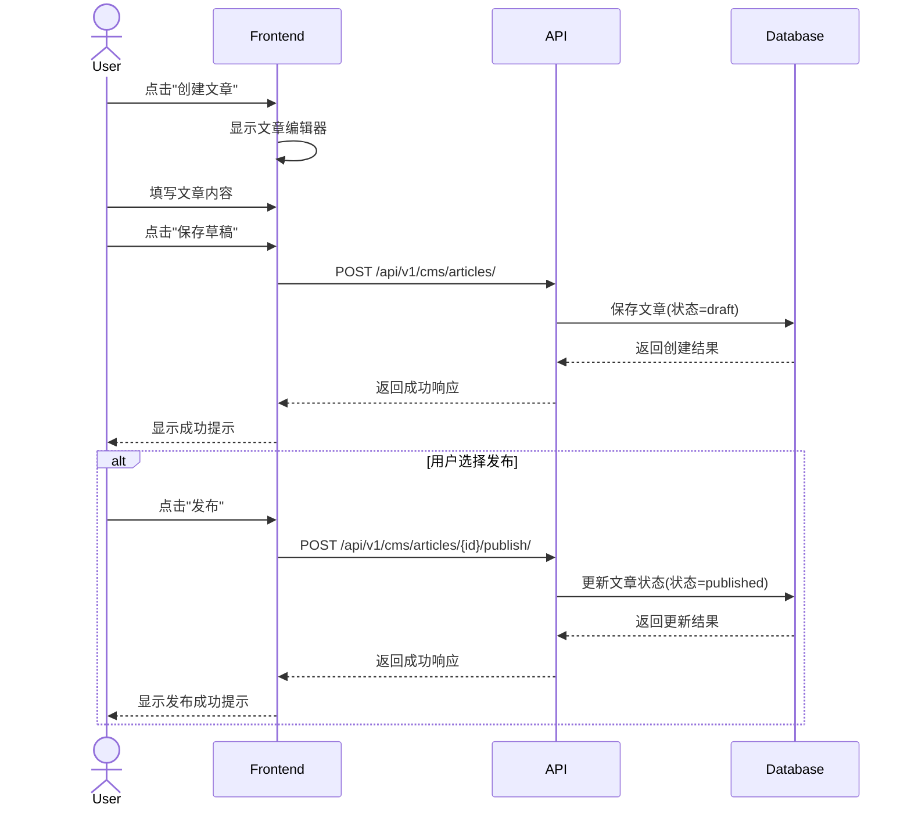
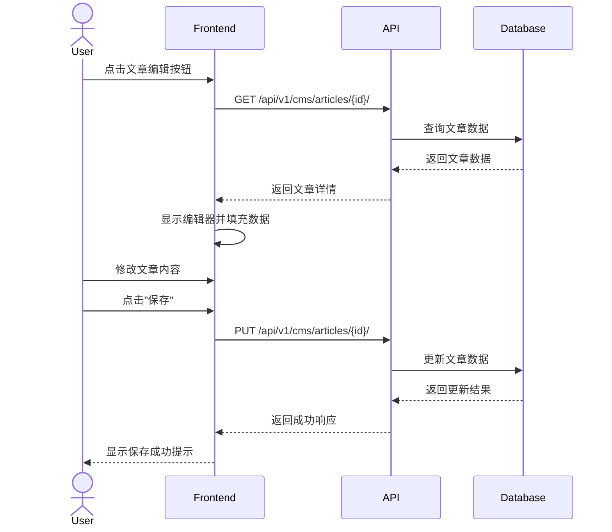

# 文章管理前端集成指南

## 概述

文章管理是CMS系统的核心功能，包括文章的创建、编辑、发布、归档等操作。本文档将指导前端开发人员如何集成文章管理功能，构建完整的内容创作和管理界面。

## 文章数据模型

### 文章基本信息

文章对象包含以下核心字段：
- 基本信息：ID、标题、别名(slug)、内容、内容类型等
- 作者信息：作者ID及相关信息
- 状态信息：草稿、待审核、已发布、已归档等
- 展示设置：是否特色、是否置顶、是否允许评论等
- 可见性设置：公开、仅登录用户、密码访问等
- 时间信息：创建时间、更新时间、发布时间等
- 关联数据：分类、标签、元数据、统计数据等

### 文章元数据

文章元数据包含SEO相关信息：
- SEO标题、描述、关键词
- Open Graph(OG)信息：标题、描述、图片
- 结构化数据标记
- 规范URL
- Robots指令
- 自定义元数据

### 文章统计数据

文章统计数据包含各类统计指标：
- 浏览量（总浏览和独立访客）
- 互动数据（点赞、踩、评论、分享、收藏）
- 阅读时间（平均阅读时长）
- 跳出率

## 前端实现指南

### 1. 文章列表页

#### 关键组件：

- 筛选区域：状态、分类、标签、日期范围
- 搜索栏：支持标题、内容搜索
- 文章列表：显示标题、状态、发布日期等关键信息
- 分页控件
- 批量操作：删除、修改状态等

#### 功能说明：

- 文章列表应支持多种筛选条件组合
- 列表项应显示文章基本信息和状态
- 分页控件应清晰显示当前页和总页数
- 批量操作需要二次确认机制
- 应支持按不同字段排序（如创建时间、发布时间、标题等）

### 2. 文章编辑器

#### 关键组件：

- 标题输入框
- Markdown/富文本编辑器
- 分类和标签选择器
- 封面图片上传器
- 文章属性设置：状态、可见性、评论设置等
- SEO设置：元标题、描述、关键词等
- 预览功能

#### 功能说明：

- 编辑器应支持Markdown和富文本两种模式
- 文章属性设置应包含所有必要的配置项
- 分类和标签选择器应支持多选和创建新项
- 封面图片上传器应支持图片预览和裁剪
- 预览功能应真实展示文章发布后的效果
- 应提供自动保存功能，防止意外丢失内容

### 3. 文章详情页

#### 关键组件：

- 文章标题和内容展示
- 作者信息
- 发布日期
- 分类和标签
- 评论区
- 社交分享按钮
- 相关文章推荐

#### 功能说明：

- 文章内容展示应支持多种格式（Markdown、HTML）
- 评论区应支持分页和回复功能
- 社交分享按钮应支持主流社交平台
- 相关文章推荐应基于标签或分类关联
- 页面应记录阅读时间和浏览数据
- 可根据用户登录状态显示不同的互动选项

### 4. 文章版本管理

#### 关键组件：

- 版本列表
- 版本对比工具
- 还原版本按钮

#### 功能说明：

- 版本列表应显示版本号、修改时间、修改人等信息
- 版本对比工具应高亮显示版本间的差异
- 还原功能应允许用户恢复到之前的版本
- 版本历史应保留完整的内容变更记录
- 应提供版本注释功能，说明每次修改的内容

## 用户交互流程

### 文章创建流程

### 文章编辑流程

## 最佳实践

1. **状态管理**
   - 使用状态管理库(Redux/Vuex等)管理文章数据，避免重复请求
   - 实现乐观更新，提升用户体验

2. **表单处理**
   - 实现表单实时保存功能，避免用户意外丢失内容
   - 添加表单验证，及时提示用户输入错误

3. **编辑器选择**
   - Markdown编辑器推荐：Monaco Editor, CodeMirror, SimpleMDE
   - 富文本编辑器推荐：TinyMCE, CKEditor, Quill

4. **性能优化**
   - 实现文章列表虚拟滚动
   - 大型编辑器懒加载
   - 图片懒加载和优化

5. **用户体验**
   - 添加操作确认对话框，防止误操作
   - 实现拖拽上传图片
   - 提供键盘快捷键

## 常见问题解决

1. **文章内容过大导致请求超时**
   - 考虑分段保存或使用专门的内容上传API
   - 实现自动保存功能，定期保存编辑内容

2. **图片管理**
   - 实现图片上传前的压缩和预览
   - 提供图片库功能，复用已上传的图片

3. **版本冲突**
   - 实现乐观锁或编辑锁定功能
   - 当检测到冲突时，提供版本对比和合并工具 