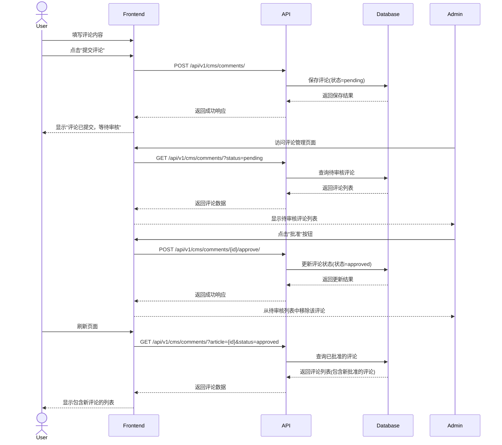
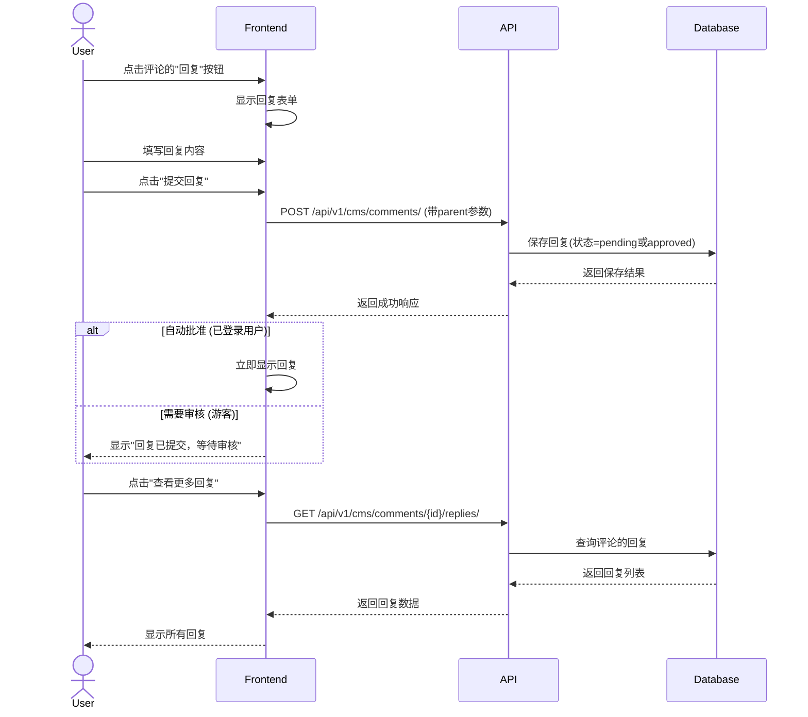

# 评论系统前端集成指南

## 概述

评论系统允许用户对文章内容进行互动和讨论，是内容管理系统中提升用户参与度的重要功能。本文档指导前端开发人员如何集成CMS评论系统，包括评论展示、提交、回复、点赞以及管理等功能。

## 评论数据模型

### 评论基本结构

评论对象包含以下核心字段：
- 关联信息：文章ID、父评论ID（用于回复）
- 用户信息：用户ID或游客信息（名称、邮箱、网站）
- 内容信息：评论正文
- 状态信息：待审核、已批准、垃圾评论、已删除
- 元数据：IP地址、用户代理、创建/更新时间
- 互动数据：是否置顶、点赞数、回复数

## 前端实现指南

### 1. 评论显示组件

#### 关键组件：

- 评论列表容器
- 评论项组件：显示评论内容、作者信息、时间戳
- 评论回复组件：显示回复内容、作者信息
- 分页控制器
- 评论排序选项：最新/最旧/最热门

#### 功能说明：

- 评论列表应按照设定的排序规则展示
- 回复应当嵌套显示，形成层级结构
- 评论作者信息应显示头像和用户名
- 分页控制器应清晰标识当前页和总页数
- 应支持按不同方式排序（如最新、最旧、最热门）
- 评论列表应实现懒加载，提高性能

### 2. 评论提交组件

#### 关键组件：

- 评论输入框
- 用户信息区域（针对游客评论）：名称、邮箱、网站
- 提交按钮
- 加载/成功/错误状态提示

#### 功能说明：

- 已登录用户应自动填充用户信息
- 游客评论应要求填写基本信息（名称、邮箱）
- 提交过程中应显示加载状态
- 提交成功后应显示成功提示或直接显示评论
- 对于需要审核的评论，应提示用户评论正在等待审核
- 提交前应进行基本的表单验证

### 3. 评论管理组件

#### 关键组件：

- 评论筛选器：按状态、日期、文章等
- 评论列表：显示详细信息和管理选项
- 批量操作工具：批准、拒绝、标记垃圾评论、删除
- 单条评论操作菜单：编辑、回复、批准、拒绝等

#### 功能说明：

- 评论列表应显示评论状态和详细信息
- 筛选器应支持多种筛选条件组合
- 批量操作应有二次确认机制
- 单条评论操作应包含所有必要的管理功能
- 评论管理界面应区分不同状态的评论
- 应提供搜索功能，支持按内容或作者搜索

## 用户交互流程

### 评论提交与审核流程

### 评论回复流程

## 最佳实践

1. **评论提交体验**
   - 实现无刷新评论提交
   - 提供清晰的状态反馈：提交中、成功、等待审核
   - 对已登录用户自动填充信息，减少输入步骤

2. **评论展示优化**
   - 使用懒加载减少初始加载时间
   - 实现评论高亮（当从通知点击进入时）
   - 提供多种排序方式：最新、最热门、最早

3. **游客评论处理**
   - 实现验证码或其他反垃圾措施
   - 提供清晰的隐私政策说明
   - 考虑使用cookie记住游客信息，减少重复输入

4. **评论管理效率**
   - 批量操作功能：批准、拒绝、删除多条评论
   - 评论过滤和搜索功能
   - 评论状态的视觉区分

5. **安全考虑**
   - 实施评论内容XSS过滤
   - 限制评论提交频率，防止滥用
   - 实现敏感词过滤

## 评论组件设计

### 嵌套式评论结构

对于支持多级回复的评论系统，推荐使用以下组件结构：

- 评论树组件：管理顶级评论及其回复
- 评论项组件：显示单条评论及其子回复
- 评论表单组件：提交评论或回复的表单

### 性能优化

对于评论数量较多的文章，推荐采用以下策略：

1. 初始只加载第一页顶级评论
2. 使用"加载更多"按钮分页加载评论
3. 评论回复默认折叠，点击"查看回复"时才加载
4. 考虑使用虚拟滚动技术处理大量评论

## 常见问题解决

1. **评论提交后不显示**
   - 检查评论状态是否为待审核
   - 验证前端过滤条件是否正确
   - 确认API请求是否成功

2. **游客评论处理**
   - 确保表单收集必要的游客信息
   - 明确告知用户评论需要审核
   - 考虑实现"记住我"功能

3. **多级嵌套性能问题**
   - 限制显示的嵌套级别（通常3-5级）
   - 使用"查看更多回复"按钮加载深层嵌套回复
   - 考虑展平深层嵌套，使用"回复@用户名"的方式 