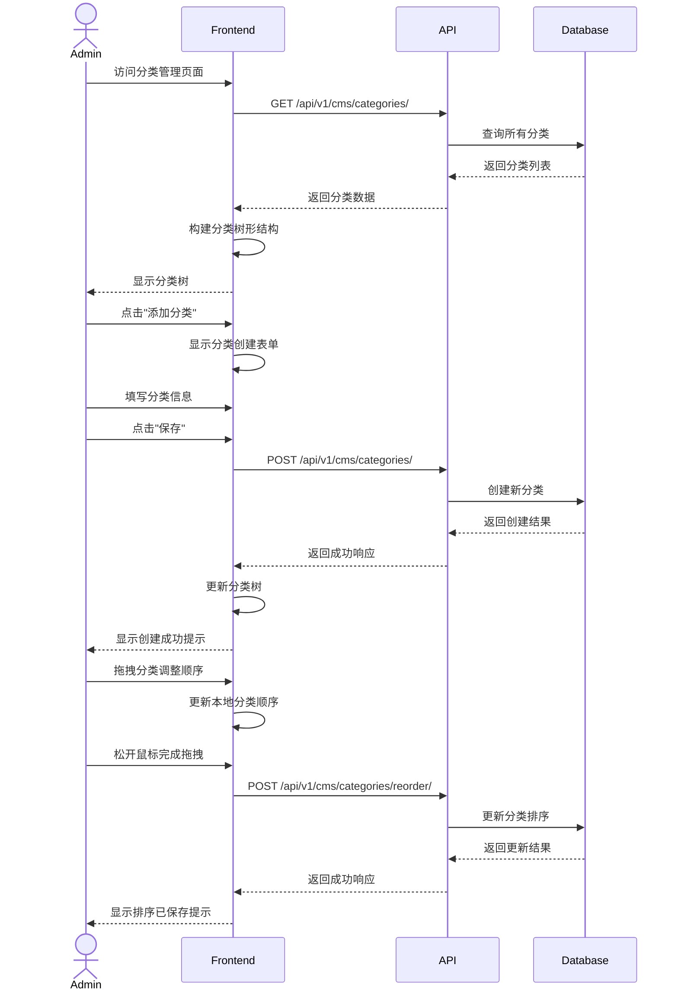
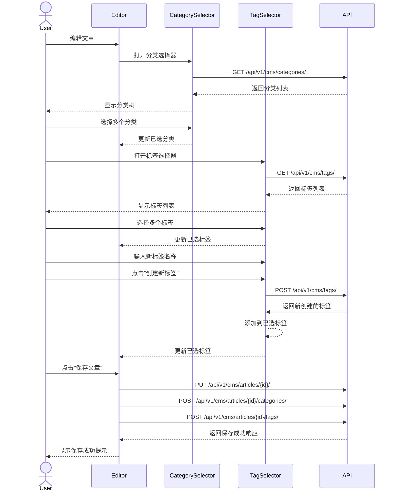

# 分类与标签管理前端集成指南

## 概述

分类与标签是内容管理系统中组织和检索内容的核心功能。本文档指导前端开发人员如何集成CMS系统的分类和标签管理功能，构建高效的内容分类与筛选界面。

## 数据模型

### 分类结构

分类对象包含以下核心字段：
- 基本信息：ID、名称、别名(slug)、描述
- 层级信息：父分类ID及信息
- 展示信息：封面图片
- 时间信息：创建时间、更新时间
- 排序信息：排序顺序
- 状态信息：是否激活
- SEO信息：SEO标题、描述
- 关联信息：文章数量、子分类列表

### 标签组结构

标签组对象包含以下核心字段：
- 基本信息：ID、名称、别名(slug)、描述
- 时间信息：创建时间、更新时间
- 状态信息：是否激活
- 关联信息：标签数量

### 标签结构

标签对象包含以下核心字段：
- 基本信息：ID、名称、别名(slug)、描述
- 分组信息：标签组ID及信息
- 时间信息：创建时间、更新时间
- 展示信息：颜色
- 状态信息：是否激活
- 关联信息：文章数量

## 前端实现指南

### 1. 分类管理界面

#### 关键组件：

- 分类树形结构显示
- 分类搜索框
- 分类创建/编辑表单
- 拖拽排序功能
- 批量操作工具：启用/禁用/删除

#### 功能说明：

- 分类树应清晰展示层级关系，支持展开/折叠操作
- 分类搜索应支持模糊匹配名称和描述
- 创建/编辑表单应包含所有必要字段
- 拖拽排序应直观且有即时反馈
- 批量操作应有确认机制，防止误操作
- 应显示每个分类关联的文章数量

### 2. 标签组管理界面

#### 关键组件：

- 标签组列表
- 标签组创建/编辑表单
- 按标签组筛选标签的功能

#### 功能说明：

- 标签组列表应显示每个组包含的标签数量
- 创建/编辑表单应包含必要的验证
- 标签组状态变更应有视觉反馈
- 应支持标签组的批量操作
- 应提供按标签组筛选标签的功能

### 3. 标签管理界面

#### 关键组件：

- 标签列表（支持分组视图和平铺视图）
- 标签搜索框
- 标签创建/编辑表单
- 标签颜色选择器
- 标签组筛选器

#### 功能说明：

- 标签列表应支持多种视图模式（分组/平铺）
- 标签搜索应支持模糊匹配和多条件筛选
- 标签颜色选择器应提供预设颜色和自定义选项
- 标签组筛选应允许快速切换不同组的标签
- 应显示每个标签关联的文章数量
- 批量编辑功能应支持移动标签到不同组

### 4. 分类与标签选择器组件

#### 关键组件：

- 分类树形选择器
- 标签多选组件（支持按组筛选）
- 标签创建表单（快速创建新标签）
- 已选分类和标签显示区域

#### 功能说明：

- 分类选择器应支持多选和层级显示
- 标签选择器应支持搜索和按组筛选
- 快速创建功能应允许用户在选择过程中创建新标签
- 已选项应清晰显示，并支持快速移除
- 选择器应在文章创建/编辑界面无缝集成
- 应支持保存常用组合，提高效率

## 用户交互流程

### 创建与管理分类流程

### 管理文章分类和标签流程

## 最佳实践

1. **分类树形结构**
   - 使用递归组件或专业树形控件实现多级分类展示
   - 实现拖拽排序功能，提升用户体验
   - 支持展开/折叠节点，便于管理大量分类

2. **标签管理**
   - 实现标签自动完成功能，避免重复创建
   - 提供标签颜色定制，增强视觉区分
   - 支持按标签组筛选，减少选择负担

3. **性能优化**
   - 使用缓存减少频繁API请求
   - 实现虚拟滚动处理大量标签
   - 分批加载分类和标签数据

4. **用户体验**
   - 提供搜索功能，快速定位分类和标签
   - 显示关联文章数量，帮助评估影响范围
   - 批量操作功能，提高管理效率

5. **数据验证**
   - 检查分类和标签名称唯一性
   - 验证slug格式，确保URL友好
   - 防止创建循环引用的分类结构

## 组件设计

### 分类树组件

分类树组件应包含以下属性和功能：
- 分类数据列表
- 选中项ID列表
- 选择回调函数
- 是否可编辑
- 是否可拖拽
- 拖拽完成回调

分类节点组件应包含：
- 分类数据
- 嵌套层级
- 选中状态
- 选择回调
- 编辑和拖拽状态

### 标签选择器组件

标签选择器组件应包含以下属性和功能：
- 标签数据列表
- 标签组数据列表
- 选中项ID列表
- 变更回调函数
- 是否允许创建新标签
- 创建标签回调

标签组筛选器组件应包含：
- 标签组数据列表
- 当前选中组ID
- 变更回调函数

## 常见问题解决

1. **分类层级过深**
   - 限制最大分类嵌套层级（通常建议不超过3-4层）
   - 提供扁平化视图选项，显示所有分类的平铺列表
   - 实现高级搜索功能，快速定位深层分类

2. **大量标签管理**
   - 实现标签分组和筛选功能
   - 提供批量编辑和删除功能
   - 显示使用频率和最近使用标签

3. **分类与标签重复**
   - 实现自动检测和建议合并功能
   - 显示相似分类和标签提示
   - 提供重命名和合并工具 