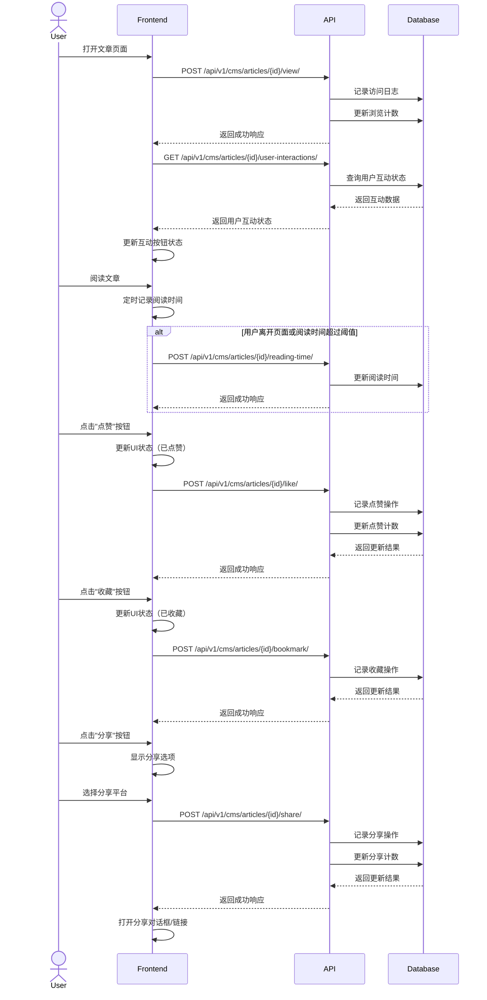
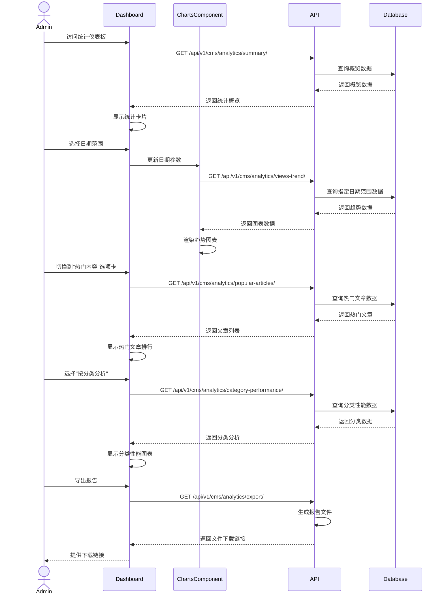

# 用户互动与统计前端集成指南

## 概述

用户互动与统计功能为内容管理系统提供了重要的用户参与度和内容受欢迎程度指标。本文档指导前端开发人员如何集成CMS系统的用户互动功能（如点赞、收藏、分享）和统计分析功能，帮助构建具有良好用户体验的内容平台和数据驱动的内容管理系统。

## 数据模型

### 文章统计数据

文章统计数据包含以下核心字段：
- 文章关联信息：文章ID
- 浏览数据：总浏览量、独立访客浏览量
- 互动数据：点赞数、踩数、评论数、分享数、收藏数
- 阅读指标：平均阅读时长（秒）、跳出率（百分比）
- 时间信息：最后更新时间

### 用户互动数据

用户互动记录包含以下核心字段：
- 用户信息：用户ID
- 文章信息：文章ID
- 互动类型：点赞、踩、收藏、分享
- 时间信息：创建时间、更新时间
- 设备信息：IP地址、用户代理
- 附加数据：可包含额外的互动信息

### 访问日志数据

访问日志记录包含以下核心字段：
- 文章信息：文章ID
- 用户信息：用户ID（可为空）、会话ID
- 设备信息：IP地址、用户代理、来源URL
- 时间信息：访问时间、阅读时长
- 地理信息：国家、区域、城市
- 设备详情：设备类型、浏览器、操作系统

## 前端实现指南

### 1. 文章互动组件

#### 关键组件：

- 点赞/踩按钮
- 收藏按钮
- 分享按钮（社交媒体分享）
- 互动计数器
- 互动状态指示器（已点赞/已收藏）

#### 功能说明：

- 互动按钮应提供明确的视觉反馈
- 点击互动按钮应立即更新UI状态（乐观更新）
- 未登录用户点击互动按钮应提示登录
- 计数器应实时更新，显示当前互动总数
- 分享按钮应支持主流社交平台和复制链接
- 互动状态应在页面加载时从服务器获取

### 2. 阅读统计组件

#### 关键组件：

- 阅读进度条
- 阅读时间记录器
- 页面停留追踪
- 滚动深度追踪

#### 功能说明：

- 阅读进度条应显示当前阅读位置相对于整篇文章的进度
- 阅读时间应在后台自动记录，定期发送到服务器
- 滚动深度应追踪用户阅读到文章的哪个位置
- 统计数据收集应尊重用户隐私，提供选择退出选项
- 数据收集应适应不同的阅读行为和设备特性

### 3. 统计仪表板

#### 关键组件：

- 浏览量趋势图
- 互动统计卡片（点赞、收藏、评论、分享）
- 用户来源分析
- 设备/浏览器分布
- 热门文章排行

#### 功能说明：

- 趋势图应支持不同时间范围的数据展示（日、周、月、年）
- 统计卡片应显示关键指标和环比变化
- 用户来源分析应展示流量来源渠道和占比
- 设备分布应以图表形式展示访问设备类型比例
- 热门文章排行应支持不同指标排序（浏览量、点赞数等）
- 仪表板应支持数据导出功能

### 4. 内容性能分析

#### 关键组件：

- 文章对比图表
- 内容类型分析
- 热门标签/分类分析
- 时间段性能比较
- 用户参与度指标

#### 功能说明：

- 文章对比应支持选择多篇文章进行指标对比
- 内容类型分析应展示不同类型内容的性能差异
- 热门标签/分类分析应显示表现最佳的内容分类
- 时间段比较应支持不同周期的数据对比
- 用户参与度指标应包括平均阅读时间、滚动深度等
- 应支持设置自定义时间范围进行深入分析

## 用户交互流程

### 文章互动流程

### 数据统计分析流程

## 最佳实践

1. **用户互动实现**
   - 使用乐观更新，提升反馈速度
   - 提供明确的视觉反馈（状态变化、动画效果）
   - 对未登录用户提供适当提示，引导登录

2. **统计数据收集**
   - 实现防抖动机制，避免频繁API调用
   - 使用本地存储记录会话数据，减少服务器负担
   - 考虑网络不稳定情况，实现离线数据缓存

3. **数据可视化**
   - 选择适合的图表类型展示不同指标
   - 提供数据筛选和对比功能
   - 优化移动设备上的图表展示

4. **性能优化**
   - 异步加载统计模块，不阻塞主内容显示
   - 分批加载大量数据，避免界面卡顿
   - 实现图表的懒加载

5. **隐私考虑**
   - 明确告知用户数据收集范围
   - 提供数据匿名化选项
   - 遵循相关法规（如GDPR）的要求

## 图表组件设计

### 统计卡片组件

统计卡片组件应包含以下属性和功能：
- 标题：指标名称
- 数值：当前指标值
- 对比值：上一周期的数值（用于计算变化率）
- 图标：指标相关的图标
- 趋势指示：上升、下降或持平
- 变化百分比：相比上一周期的变化率
- 颜色设置：根据指标性质设定的颜色
- 格式化功能：将数值格式化为适当的显示形式

### 趋势图组件

趋势图组件应包含以下属性和功能：
- 数据源：包含日期和数值的数据点数组
- 坐标轴设置：X轴（通常是日期）和Y轴（通常是指标值）
- 标题设置
- 高度设置
- 颜色设置
- 区域填充选项
- 时间周期选择：日、周、月、年等
- 周期变更回调
- 加载状态指示

### 热门内容组件

热门内容组件应包含以下属性和功能：
- 内容项列表：包含ID、标题、指标值、变化量等信息
- 指标类型：浏览量、点赞数、评论数等
- 指标变更回调
- 时间周期：日、周、月、年等
- 周期变更回调
- 加载状态指示

## 常见问题解决

1. **数据不准确**
   - 实现防重复计数机制（如使用cookie/localStorage标记）
   - 区分真实用户和爬虫访问
   - 定期清理异常数据（如极短时间内的大量请求）

2. **移动设备上的用户体验**
   - 优化移动端互动按钮尺寸和位置
   - 简化移动端统计图表，聚焦关键指标
   - 减少数据加载量，优化网络请求

3. **大数据量处理**
   - 实现数据聚合和分页加载
   - 考虑使用WebSocket获取实时更新
   - 客户端数据缓存和增量更新 