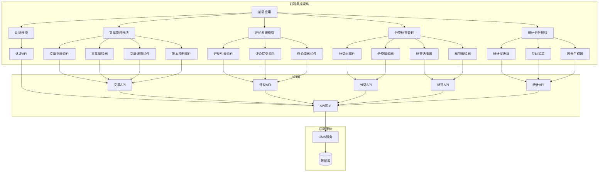

```mermaid
graph TD
    subgraph 前端集成架构
    Frontend[前端应用] --> Authentication[认证模块]
    Frontend --> ArticleManagement[文章管理模块]
    Frontend --> CommentSystem[评论系统模块]
    Frontend --> CategoryTagManagement[分类标签管理]
    Frontend --> Analytics[统计分析模块]
    
    Authentication --> AuthAPI[认证API]
    
    ArticleManagement --> ArticleList[文章列表组件]
    ArticleManagement --> ArticleEditor[文章编辑器]
    ArticleManagement --> ArticleDetail[文章详情组件]
    ArticleManagement --> VersionControl[版本控制组件]
    
    CommentSystem --> CommentList[评论列表组件]
    CommentSystem --> CommentForm[评论提交组件]
    CommentSystem --> CommentModeration[评论审核组件]
    
    CategoryTagManagement --> CategoryTree[分类树组件]
    CategoryTagManagement --> TagSelector[标签选择器]
    CategoryTagManagement --> CategoryEditor[分类编辑器]
    CategoryTagManagement --> TagEditor[标签编辑器]
    
    Analytics --> StatsDashboard[统计仪表板]
    Analytics --> InteractionTracking[互动追踪]
    Analytics --> ReportGenerator[报告生成器]
    end
    
    subgraph API层
    AuthAPI --> APIGateway[API网关]
    ArticleAPI[文章API] --> APIGateway
    CommentAPI[评论API] --> APIGateway
    CategoryAPI[分类API] --> APIGateway
    TagAPI[标签API] --> APIGateway
    AnalyticsAPI[统计API] --> APIGateway
    end
    
    subgraph 后端服务
    APIGateway --> CMS[CMS服务]
    CMS --> Database[(数据库)]
    end
    
    ArticleList --> ArticleAPI
    ArticleEditor --> ArticleAPI
    ArticleDetail --> ArticleAPI
    VersionControl --> ArticleAPI
    
    CommentList --> CommentAPI
    CommentForm --> CommentAPI
    CommentModeration --> CommentAPI
    
    CategoryTree --> CategoryAPI
    TagSelector --> TagAPI
    CategoryEditor --> CategoryAPI
    TagEditor --> TagAPI
    
    StatsDashboard --> AnalyticsAPI
    InteractionTracking --> AnalyticsAPI
    ReportGenerator --> AnalyticsAPI
``` 