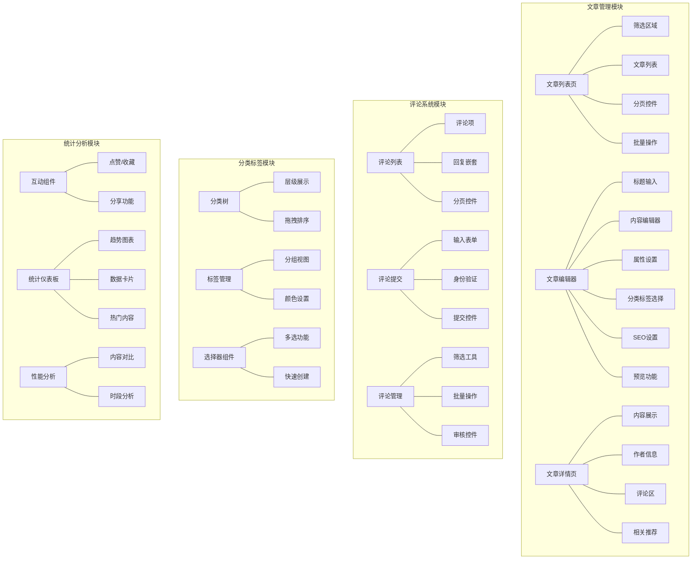

```mermaid
graph TD
    subgraph 文章管理模块
    A[文章列表页] --- B[筛选区域]
    A --- C[文章列表]
    A --- D[分页控件]
    A --- E[批量操作]
    
    F[文章编辑器] --- G[标题输入]
    F --- H[内容编辑器]
    F --- I[属性设置]
    F --- J[分类标签选择]
    F --- K[SEO设置]
    F --- L[预览功能]
    
    M[文章详情页] --- N[内容展示]
    M --- O[作者信息]
    M --- P[评论区]
    M --- Q[相关推荐]
    end
    
    subgraph 评论系统模块
    R[评论列表] --- S[评论项]
    R --- T[回复嵌套]
    R --- U[分页控件]
    
    V[评论提交] --- W[输入表单]
    V --- X[身份验证]
    V --- Y[提交控件]
    
    Z[评论管理] --- AA[筛选工具]
    Z --- AB[批量操作]
    Z --- AC[审核控件]
    end
    
    subgraph 分类标签模块
    AD[分类树] --- AE[层级展示]
    AD --- AF[拖拽排序]
    
    AG[标签管理] --- AH[分组视图]
    AG --- AI[颜色设置]
    
    AJ[选择器组件] --- AK[多选功能]
    AJ --- AL[快速创建]
    end
    
    subgraph 统计分析模块
    AM[互动组件] --- AN[点赞/收藏]
    AM --- AO[分享功能]
    
    AP[统计仪表板] --- AQ[趋势图表]
    AP --- AR[数据卡片]
    AP --- AS[热门内容]
    
    AT[性能分析] --- AU[内容对比]
    AT --- AV[时段分析]
    end
``` 