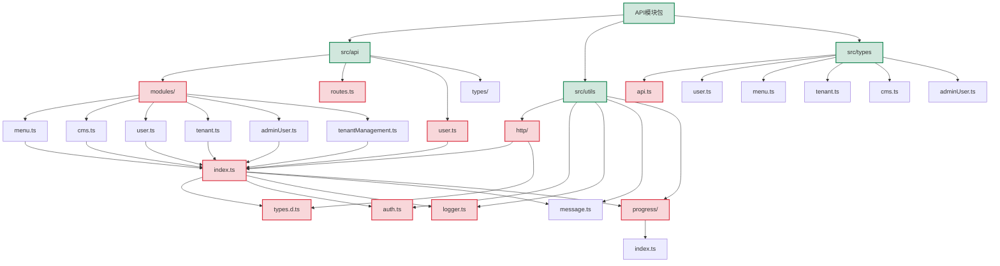
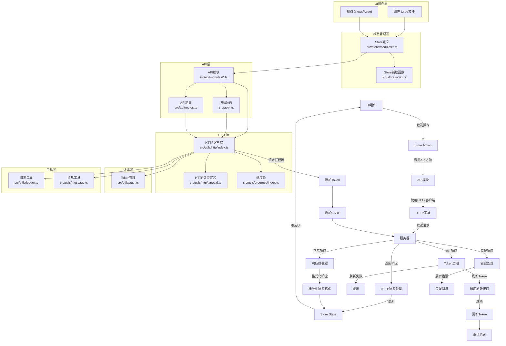
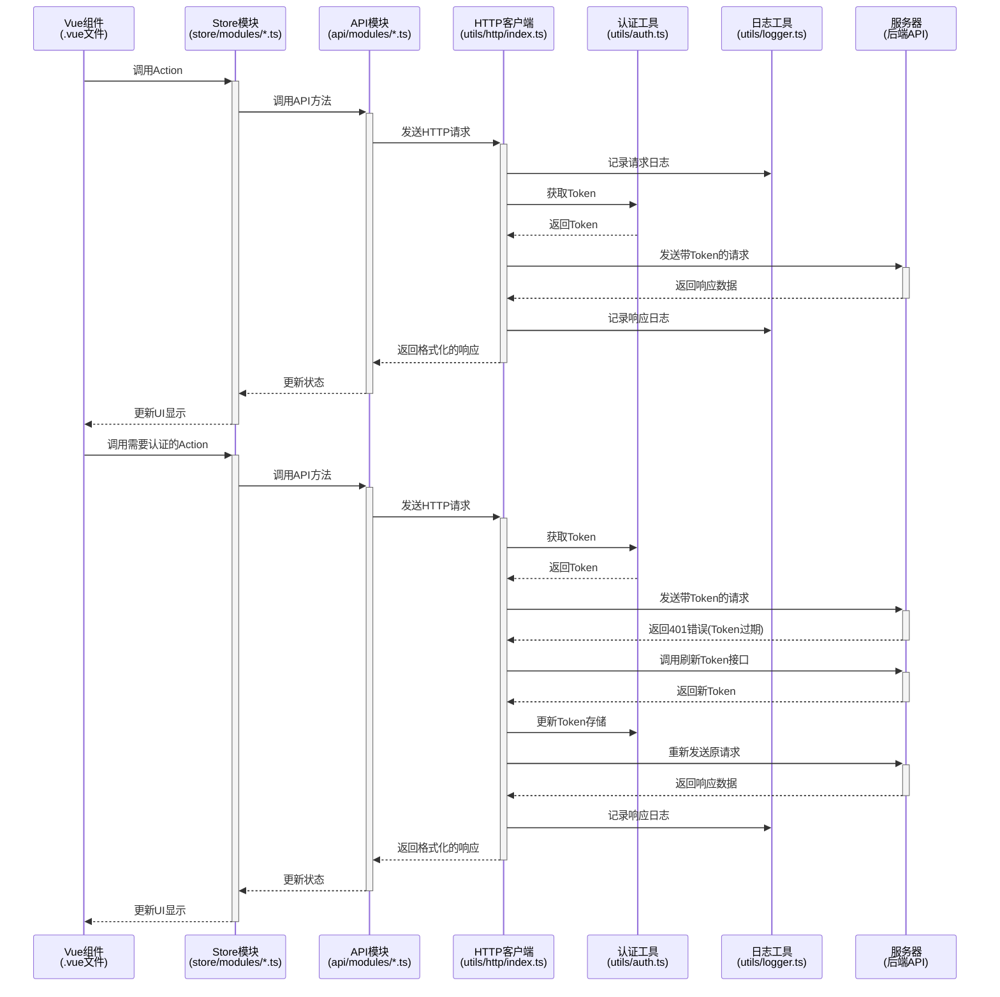
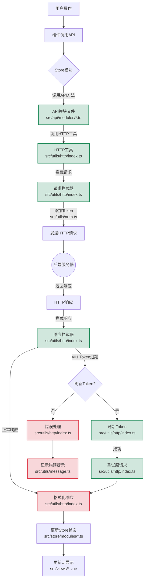

# API流程图

本文档提供了API调用系统的流程图，展示了API请求从UI组件到后端服务器的完整流程，以及相关文件之间的关系。

## 总体架构图

```mermaid
flowchart TD
    %% 主要模块
    ROOT[API模块包] --> API[src/api]
    ROOT --> UTILS[src/utils]
    ROOT --> TYPES[src/types]
    
    %% API模块详细结构
    API --> API_MODULES[modules/]
    API --> API_ROUTES[routes.ts]
    API --> API_USER[user.ts]
    API --> API_TYPES[types/]
    
    API_MODULES --> MOD_MENU[menu.ts]
    API_MODULES --> MOD_CMS[cms.ts]
    API_MODULES --> MOD_USER[user.ts]
    API_MODULES --> MOD_TENANT[tenant.ts]
    API_MODULES --> MOD_ADMINUSER[adminUser.ts]
    API_MODULES --> MOD_TENANTMANAGEMENT[tenantManagement.ts]
    
    %% 工具模块详细结构
    UTILS --> UTILS_HTTP[http/]
    UTILS --> UTILS_AUTH[auth.ts]
    UTILS --> UTILS_LOGGER[logger.ts]
    UTILS --> UTILS_MESSAGE[message.ts]
    UTILS --> UTILS_PROGRESS[progress/]
    
    UTILS_HTTP --> HTTP_INDEX[index.ts]
    UTILS_HTTP --> HTTP_TYPES[types.d.ts]
    
    UTILS_PROGRESS --> PROGRESS_INDEX[index.ts]
    
    %% 类型定义详细结构
    TYPES --> TYPES_API[api.ts]
    TYPES --> TYPES_USER[user.ts]
    TYPES --> TYPES_MENU[menu.ts]
    TYPES --> TYPES_TENANT[tenant.ts]
    TYPES --> TYPES_CMS[cms.ts]
    TYPES --> TYPES_ADMINUSER[adminUser.ts]
    
    %% 文件依赖关系
    MOD_MENU & MOD_CMS & MOD_USER & MOD_TENANT & MOD_ADMINUSER & MOD_TENANTMANAGEMENT --> HTTP_INDEX
    API_USER --> HTTP_INDEX
    HTTP_INDEX --> HTTP_TYPES
    HTTP_INDEX --> UTILS_AUTH
    HTTP_INDEX --> UTILS_LOGGER
    HTTP_INDEX --> UTILS_MESSAGE
    HTTP_INDEX --> UTILS_PROGRESS
    
    classDef primary fill:#d1e7dd,stroke:#198754,stroke-width:2px
    classDef secondary fill:#e2e3e5,stroke:#6c757d,stroke-width:1px
    classDef important fill:#f8d7da,stroke:#dc3545,stroke-width:2px
    
    class ROOT,API,UTILS,TYPES primary
    class API_MODULES,UTILS_HTTP,UTILS_AUTH,UTILS_LOGGER,UTILS_PROGRESS,TYPES_API important
    class API_ROUTES,API_USER,HTTP_INDEX,HTTP_TYPES important
```

## 详细调用流程图

```mermaid
flowchart TD
    %% 主要流程
    A[UI组件] -->|触发操作| B[Store Action]
    B -->|调用API方法| C[API模块]
    C -->|使用HTTP客户端| D[HTTP工具]
    D -->|发送请求| E[服务器]
    E -->|返回响应| F[HTTP响应处理]
    F -->|更新| G[Store State]
    G -->|响应UI| A

    %% 详细文件映射
    subgraph "UI组件层"
        A1["组件 (.vue文件)"]
        A2["视图 (views/*.vue)"]
    end
    
    subgraph "状态管理层"
        B1["Store定义<br>src/store/modules/*.ts"]
        B2["Store辅助函数<br>src/store/index.ts"]
    end
    
    subgraph "API层"
        C1["API模块<br>src/api/modules/*.ts"]
        C2["基础API<br>src/api/*.ts"]
        C3["API路由<br>src/api/routes.ts"]
    end
    
    subgraph "HTTP层"
        D1["HTTP客户端<br>src/utils/http/index.ts"]
        D2["HTTP类型定义<br>src/utils/http/types.d.ts"]
        D3["进度条<br>src/utils/progress/index.ts"]
    end
    
    subgraph "认证层"
        H1["Token管理<br>src/utils/auth.ts"]
    end
    
    subgraph "工具层"
        I1["日志工具<br>src/utils/logger.ts"]
        I2["消息工具<br>src/utils/message.ts"]
    end

    %% 连接关系
    A1 & A2 --> B1
    B1 --> B2
    B1 --> C1
    C1 --> C2
    C1 --> C3
    C1 & C2 & C3 --> D1
    D1 --> D2
    D1 --> D3
    D1 --> H1
    D1 --> I1
    D1 --> I2
    
    %% 认证流程
    D1 -->|请求拦截器| J1[添加Token]
    J1 --> J2[添加CSRF]
    J2 --> E
    E -->|401响应| K1[Token过期]
    K1 -->|刷新Token| K2[调用刷新接口]
    K2 -->|成功| K3[更新Token]
    K3 --> K4[重试请求]
    K1 -->|刷新失败| K5[登出]
    
    %% 数据处理流程
    E -->|正常响应| L1[响应拦截器]
    L1 -->|格式化响应| L2[标准化响应格式]
    L2 --> G
    E -->|错误响应| M1[错误处理]
    M1 -->|展示错误| M2[错误消息]
```

## 时序图（API调用流程）

```mermaid
sequenceDiagram
    participant UI as Vue组件<br>(.vue文件)
    participant Store as Store模块<br>(store/modules/*.ts)
    participant API as API模块<br>(api/modules/*.ts)
    participant HTTP as HTTP客户端<br>(utils/http/index.ts)
    participant Auth as 认证工具<br>(utils/auth.ts)
    participant Logger as 日志工具<br>(utils/logger.ts)
    participant Server as 服务器<br>(后端API)
    
    %% 正常请求流程
    UI->>+Store: 调用Action
    Store->>+API: 调用API方法
    API->>+HTTP: 发送HTTP请求
    HTTP->>Logger: 记录请求日志
    HTTP->>Auth: 获取Token
    Auth-->>HTTP: 返回Token
    HTTP->>+Server: 发送带Token的请求
    Server-->>-HTTP: 返回响应数据
    HTTP->>Logger: 记录响应日志
    HTTP-->>-API: 返回格式化的响应
    API-->>-Store: 更新状态
    Store-->>-UI: 更新UI显示
    
    %% Token过期流程
    UI->>+Store: 调用需要认证的Action
    Store->>+API: 调用API方法
    API->>+HTTP: 发送HTTP请求
    HTTP->>Auth: 获取Token
    Auth-->>HTTP: 返回Token
    HTTP->>+Server: 发送带Token的请求
    Server-->>-HTTP: 返回401错误(Token过期)
    HTTP->>+Server: 调用刷新Token接口
    Server-->>-HTTP: 返回新Token
    HTTP->>Auth: 更新Token存储
    HTTP->>+Server: 重新发送原请求
    Server-->>-HTTP: 返回响应数据
    HTTP->>Logger: 记录响应日志
    HTTP-->>-API: 返回格式化的响应
    API-->>-Store: 更新状态
    Store-->>-UI: 更新UI显示
```

## 基本API流程图

```mermaid
flowchart TD
    %% API请求流程
    START[用户操作] --> COMPONENT[组件调用API]
    COMPONENT --> STORE{Store模块}
    STORE -->|调用API方法| API[API模块文件<br>src/api/modules/*.ts]
    API -->|调用HTTP工具| HTTP[HTTP工具<br>src/utils/http/index.ts]
    
    %% HTTP处理流程
    HTTP -->|拦截请求| REQ_INTERCEPTOR[请求拦截器<br>src/utils/http/index.ts]
    REQ_INTERCEPTOR -->|添加Token<br>src/utils/auth.ts| REQ[发送HTTP请求]
    REQ --> SERVER((后端服务器))
    SERVER -->|返回响应| RES[HTTP响应]
    RES -->|拦截响应| RES_INTERCEPTOR[响应拦截器<br>src/utils/http/index.ts]
    RES_INTERCEPTOR -->|401 Token过期| TOKEN_REFRESH{刷新Token?}
    TOKEN_REFRESH -->|是| REFRESH[刷新Token<br>src/utils/http/index.ts]
    REFRESH -->|成功| RETRY[重试原请求<br>src/utils/http/index.ts]
    TOKEN_REFRESH -->|否| ERROR_HANDLE[错误处理<br>src/utils/http/index.ts]
    RES_INTERCEPTOR -->|正常响应| FORMAT[格式化响应<br>src/utils/http/index.ts]
    
    %% 响应处理
    FORMAT --> STORE_UPDATE[更新Store状态<br>src/store/modules/*.ts]
    STORE_UPDATE --> UI_UPDATE[更新UI显示<br>src/views/*.vue]
    ERROR_HANDLE --> UI_ERROR[显示错误提示<br>src/utils/message.ts]
    RETRY --> FORMAT
    
    %% 文件关联高亮
    classDef apiFiles fill:#d1e7dd,stroke:#198754,stroke-width:2px
    classDef utilsFiles fill:#f8d7da,stroke:#dc3545,stroke-width:2px
    
    class API,HTTP,REQ_INTERCEPTOR,RES_INTERCEPTOR,REFRESH,RETRY apiFiles
    class ERROR_HANDLE,FORMAT,UI_ERROR utilsFiles
``` 