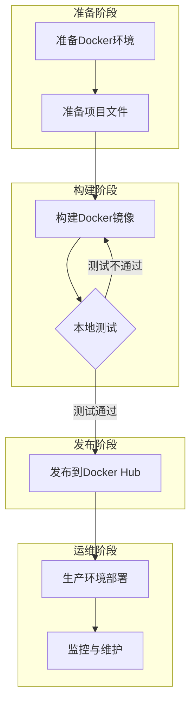
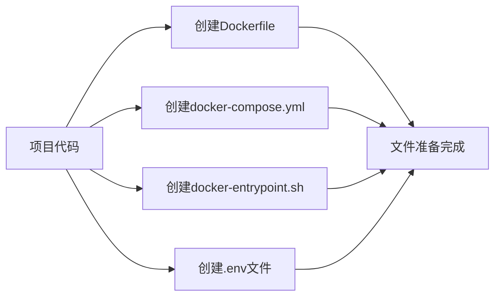
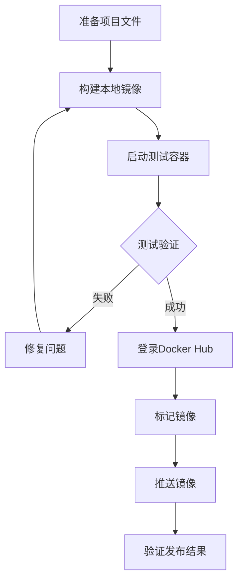
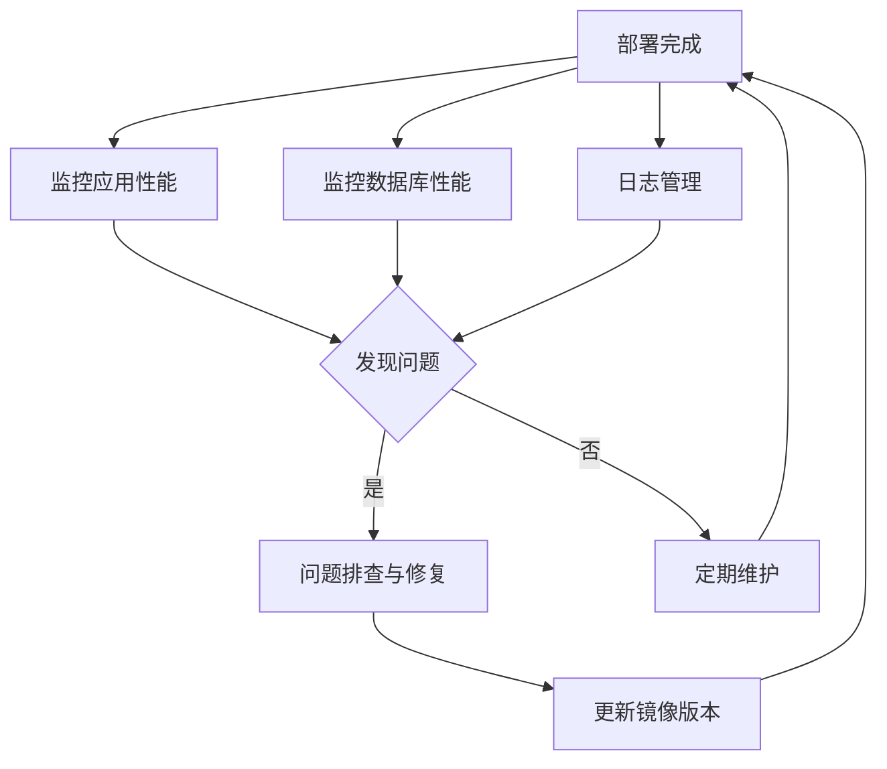

# Docker部署流程图

本文档通过图表方式展示项目从本地开发到Docker Hub部署的完整流程。

## 部署流程概览

以下流程图展示了将项目部署到Docker Hub并使用的完整流程：

## 文件准备流程

以下流程图展示了项目文件准备的具体步骤：

## Docker镜像构建与发布流程

以下流程图展示了Docker镜像的构建、测试和发布过程：

## 部署后运维流程

以下流程图展示了部署后的运维管理流程：

