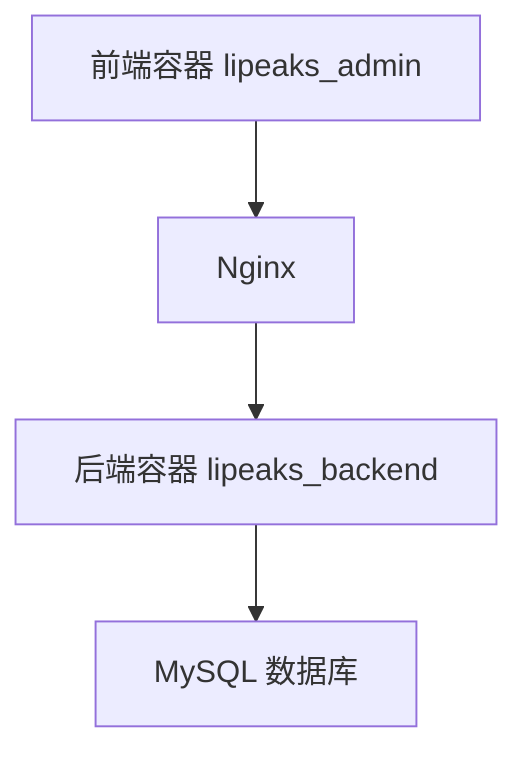

# Lipeaks Admin 前端 Docker 部署指南

本文档提供了将 Lipeaks Admin 前端项目部署到 Docker 并与后端 Django 容器连接的详细步骤。

## 部署架构

前端项目将作为独立的 Docker 容器运行，通过 Docker 网络与后端 Django 容器通信：



## 前置条件

- Docker 和 Docker Compose 已安装
- 后端 Django 项目已部署或准备部署
- 前端项目代码可用

## 部署步骤

### 1. 准备前端 Dockerfile

项目根目录已包含适用于生产环境的 Dockerfile，使用多阶段构建优化镜像大小：

```dockerfile
FROM node:20-alpine as build-stage

WORKDIR /app
RUN corepack enable
RUN corepack prepare pnpm@latest --activate

RUN npm config set registry https://registry.npmmirror.com

COPY .npmrc package.json pnpm-lock.yaml ./
RUN pnpm install --frozen-lockfile

COPY . .
RUN pnpm build

FROM nginx:stable-alpine as production-stage

COPY --from=build-stage /app/dist /usr/share/nginx/html
COPY ./nginx/default.conf /etc/nginx/conf.d/default.conf
EXPOSE 80

CMD ["nginx", "-g", "daemon off;"]
```

### 2. 创建 Nginx 配置文件

在项目根目录创建 nginx 目录和配置文件：

```
mkdir -p nginx
```

创建 `nginx/default.conf` 文件：

```nginx
server {
    listen 80;
    server_name localhost;
    
    # 静态资源路径
    location / {
        root /usr/share/nginx/html;
        index index.html;
        try_files $uri $uri/ /index.html;
    }
    
    # API 请求代理
    location /api/ {
        proxy_pass http://web:8000/api/;
        proxy_set_header Host $host;
        proxy_set_header X-Real-IP $remote_addr;
        proxy_set_header X-Forwarded-For $proxy_add_x_forwarded_for;
        proxy_set_header X-Forwarded-Proto $scheme;
    }
    
    # 静态文件代理
    location /static/ {
        proxy_pass http://web:8000/static/;
    }
    
    location /media/ {
        proxy_pass http://web:8000/media/;
    }
    
    error_page 500 502 503 504 /50x.html;
    location = /50x.html {
        root /usr/share/nginx/html;
    }
}
```

### 3. 构建 Docker 镜像

您可以通过以下两种方法构建前端Docker镜像：

#### 方法1：使用 docker 命令构建

在前端项目根目录执行以下命令直接构建镜像：

```bash
# 构建镜像
docker build -t lipeaks_admin:latest .

# 查看构建的镜像
docker images | grep lipeaks_admin
```

#### 方法2：使用 docker-compose 构建（推荐）

使用 docker-compose 构建可以更好地管理配置和依赖关系：

```bash
# 在包含 docker-compose.yml 的目录下构建
docker-compose build frontend
```

#### 前后端分离部署场景

如果前端和后端项目需要分开部署，您需要：

```bash
# 1. 在开发环境构建镜像
docker build -t lipeaks_admin:latest .

# 2A. 推送到Docker仓库
docker tag lipeaks_admin:latest your-registry/lipeaks_admin:latest
docker push your-registry/lipeaks_admin:latest

# 或者 2B. 导出镜像文件
docker save lipeaks_admin:latest > lipeaks_admin.tar

# 3. 在生产环境加载镜像
# 如果使用Docker仓库
docker pull your-registry/lipeaks_admin:latest

# 或者加载导出的镜像文件
docker load < lipeaks_admin.tar
```

### 4. 更新 docker-compose.yml

将前端服务添加到现有的 `docker-compose.yml` 文件中：

```yaml
version: '3.8'

services:
  # 现有服务...
  
  frontend:
    image: lipeaks_admin:latest
    build:
      context: .
      dockerfile: Dockerfile
    restart: always
    ports:
      - "80:80"
    volumes:
      - ./nginx/default.conf:/etc/nginx/conf.d/default.conf
    depends_on:
      - web
```

### 5. 构建和启动服务

在包含 docker-compose.yml 的目录中执行：

```bash
# 构建镜像
docker-compose build

# 启动服务
docker-compose up -d
```

也可以只构建和启动前端服务：

```bash
# 只构建前端服务
docker-compose build frontend

# 只启动前端服务
docker-compose up -d frontend
```

### 6. 验证部署

- 前端: http://localhost 或服务器IP
- 后端API: http://localhost/api/ 或 http://服务器IP/api/

## 环境配置

如需为前端配置不同的API地址，可以在项目中修改 `public/platform-config.json` 文件：

```json
{
  "apiBaseUrl": "/api"
}
```

## 常见问题解决

1. **跨域问题**
   - 已在Nginx配置中处理API代理，避免跨域问题

2. **静态资源加载问题**
   - 确保Nginx配置中的路由规则正确
   - 检查前端应用中的资源路径是否使用了相对路径

3. **容器间通信问题**
   - 确保docker-compose.yml中的服务名称正确
   - 使用服务名作为主机名进行容器间通信

## 生产环境优化

1. 添加SSL/TLS配置
2. 配置Nginx缓存策略
3. 实现健康检查
4. 配置容器资源限制

## 维护流程

### 更新前端应用
```bash
# 拉取最新代码
git pull

# 重新构建并启动
docker-compose build frontend
docker-compose up -d frontend
``` 