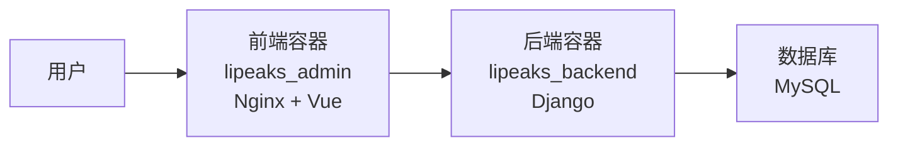

# Lipeaks Admin 前端 Docker 部署文档

欢迎使用 Lipeaks Admin 前端 Docker 部署文档。本文档集合提供了将前端应用部署到 Docker 环境并与后端 Django 应用集成的全面指南。

## 文档索引

### 入门文档

1. [快速入门指南](./quick_start.md) - 快速部署前端应用的步骤
2. [完整部署指南](./frontend_deployment_guide.md) - 详细的部署过程文档
3. [部署检查清单](./deployment_checklist.md) - 确保部署成功的检查项

### 配置文件

1. [Nginx 配置](./nginx_default.conf) - Nginx 默认配置文件示例
2. [Docker Compose 配置](./docker-compose.yml) - 完整的 docker-compose.yml 示例

### 高级主题

1. [故障排除指南](./troubleshooting_guide.md) - 常见问题解决方案
2. [性能优化](./frontend_deployment_guide.md#生产环境优化) - 生产环境性能优化建议

## 部署架构概述

Lipeaks Admin 前端应用作为独立的 Docker 容器运行，通过 Docker 网络与后端 Django 容器通信：

## 快速部署步骤

1. 准备 Nginx 配置文件
2. 确保 Dockerfile 包含必要的设置
3. 更新 docker-compose.yml 添加前端服务
4. 构建并启动服务
5. 验证部署成功

详细步骤请参考[快速入门指南](./quick_start.md)。

## 版本兼容性

| 前端版本 | 后端版本 | Docker 版本 | Docker Compose 版本 |
|---------|---------|------------|-------------------|
| v1.0.0+ | v1.0.0+ | 20.10.0+   | 2.0.0+            |

## 常见问题

- [前端容器无法连接后端](./troubleshooting_guide.md#3-前端可以访问但-api-请求失败)
- [静态资源加载错误](./troubleshooting_guide.md#4-静态资源加载错误)
- [容器间通信问题](./troubleshooting_guide.md#5-容器间通信问题)

## 维护与更新

请参阅[完整部署指南](./frontend_deployment_guide.md#维护流程)了解如何更新前端应用。 