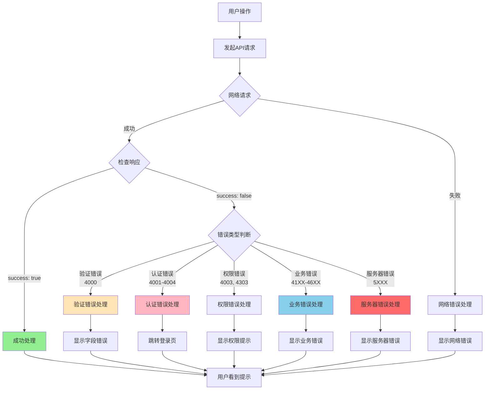
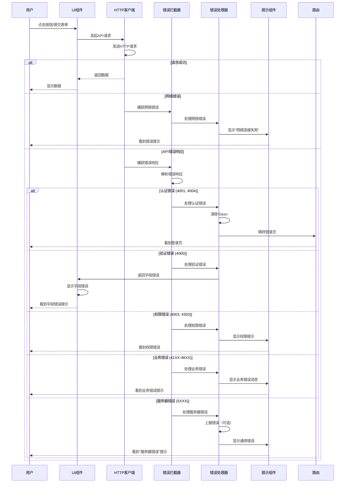
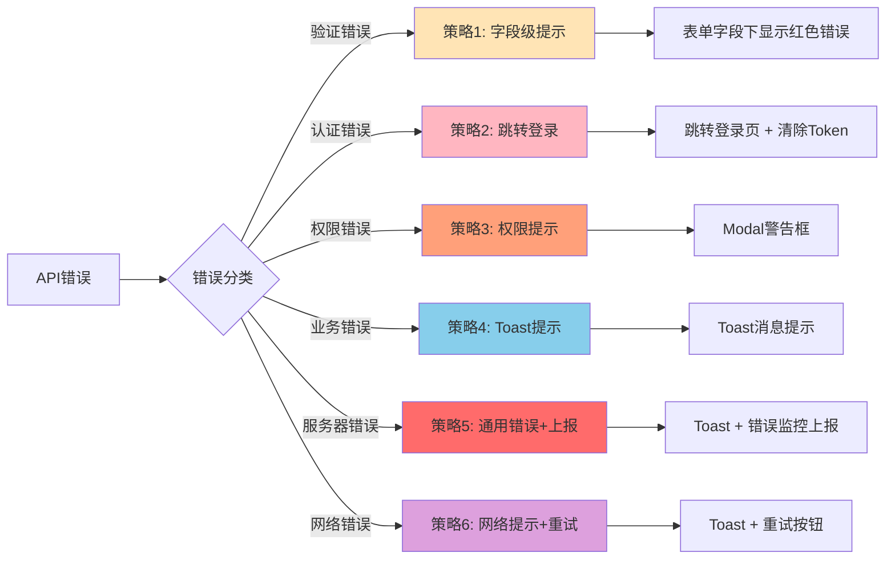
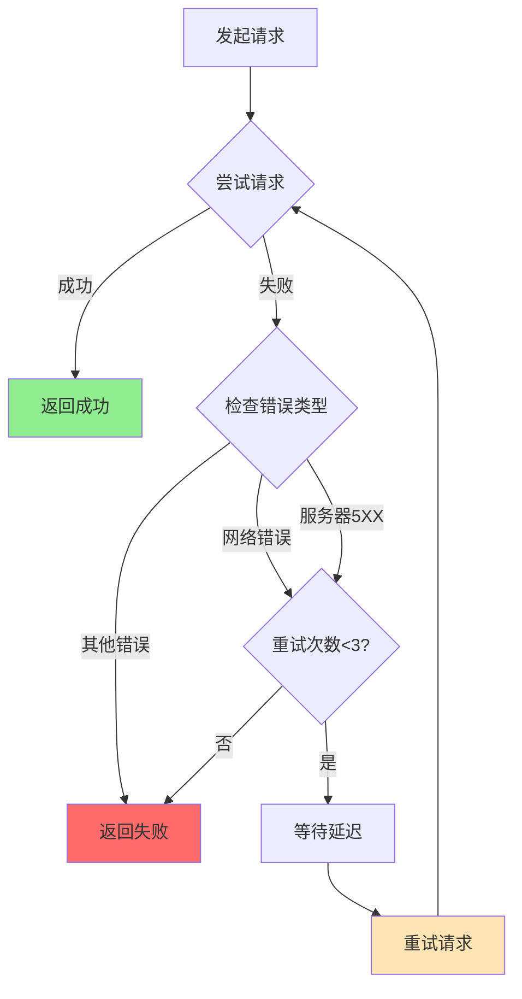
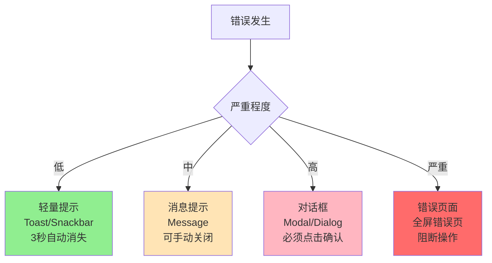
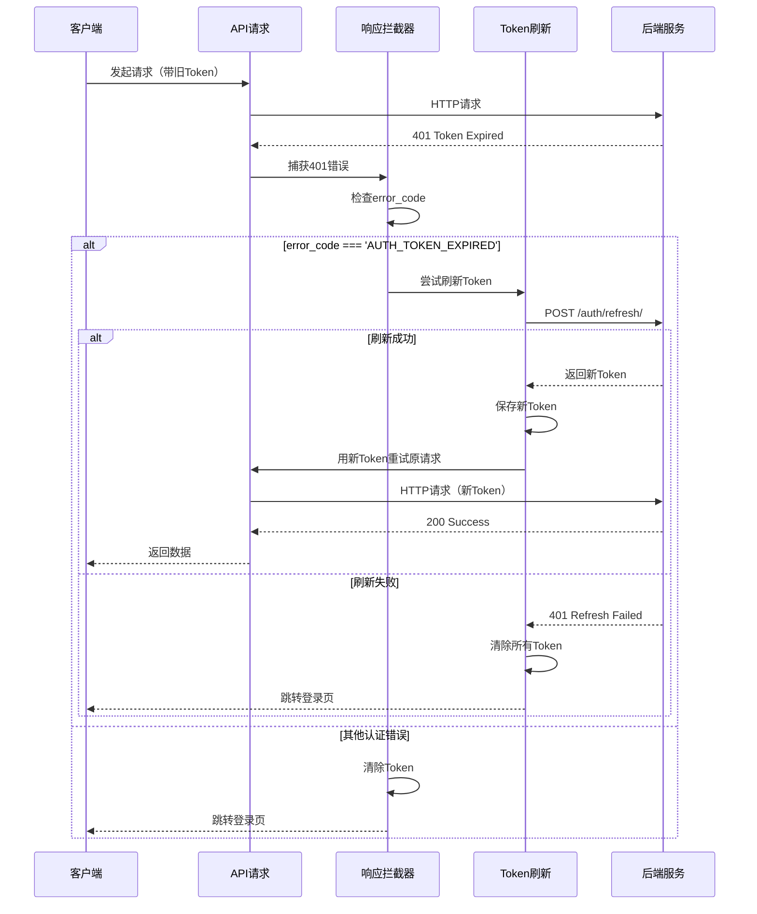

# 前端错误处理架构

## 概述

本文档介绍前端应用如何架构统一的错误处理系统，**与具体的前端框架和编程语言无关**，提供通用的架构设计原则。

## 整体架构图



## 前端错误处理流程图



## 错误处理层次架构

### 三层架构

```
┌─────────────────────────────────────────────┐
│  第一层：拦截层（Interceptor Layer）          │
│  - HTTP客户端响应拦截器                      │
│  - 捕获所有HTTP错误                          │
│  - 初步分类                                  │
└──────────────────┬──────────────────────────┘
                   │
┌──────────────────▼──────────────────────────┐
│  第二层：处理层（Handler Layer）             │
│  - 错误分类器                                │
│  - 错误处理器集合                            │
│  - 日志记录                                  │
└──────────────────┬──────────────────────────┘
                   │
┌──────────────────▼──────────────────────────┐
│  第三层：展示层（Presentation Layer）        │
│  - Toast提示                                 │
│  - Modal对话框                               │
│  - 字段错误显示                              │
│  - 页面级错误显示                            │
└──────────────────────────────────────────────┘
```

### 层次职责说明

**第一层：拦截层**
- **职责**：拦截HTTP响应，区分成功和失败
- **实现位置**：HTTP客户端的拦截器/回调函数
- **输入**：HTTP响应对象
- **输出**：传递错误响应给处理层

**第二层：处理层**
- **职责**：分类错误，调用对应的处理器
- **实现位置**：错误处理函数/模块
- **输入**：错误响应对象（包含code, message, error_code）
- **输出**：调用展示层显示错误

**第三层：展示层**
- **职责**：向用户显示错误信息
- **实现位置**：UI组件（Toast、Modal、表单组件等）
- **输入**：格式化的错误消息
- **输出**：用户看到的UI提示

## 错误分类器设计

### 按错误码范围分类

```
错误分类逻辑:

FUNCTION classifyError(errorResponse):
  code = errorResponse.code
  error_code = errorResponse.error_code
  
  // 网络错误
  IF 没有响应对象:
    RETURN '网络错误'
  
  // 验证错误
  IF error_code === 'VALIDATION_ERROR':
    RETURN '验证错误'
  
  // 认证错误
  IF code in [4001, 4002, 4004]:
    RETURN '认证错误'
  
  // 权限错误
  IF code in [4003, 4303]:
    RETURN '权限错误'
  
  // 租户错误
  IF code >= 4100 AND code < 4200:
    RETURN '租户错误'
  
  // 许可证错误
  IF code >= 4200 AND code < 4300:
    RETURN '许可证错误'
  
  // 用户错误
  IF code >= 4300 AND code < 4400:
    RETURN '用户错误'
  
  // 积分错误
  IF code >= 4400 AND code < 4500:
    RETURN '积分错误'
  
  // CMS错误
  IF code >= 4500 AND code < 4600:
    RETURN 'CMS错误'
  
  // 服务器错误
  IF code >= 5000:
    RETURN '服务器错误'
  
  RETURN '未知错误'
```

## 错误处理策略图



## 错误处理器模式

### 处理器设计原则

每个错误处理器应该：

1. **单一职责** - 只处理一种类型的错误
2. **独立性** - 不依赖其他处理器
3. **可配置** - 可以自定义行为
4. **可测试** - 逻辑清晰，易于测试

### 处理器伪代码

**验证错误处理器：**
```
FUNCTION handleValidationError(response):
  IF response.data 存在 AND 是对象:
    FOR EACH 字段 in response.data:
      错误消息 = response.data[字段][0]  // 取第一条错误
      在表单中显示字段错误(字段, 错误消息)
    
    滚动到第一个错误字段
    显示全局提示: "请检查表单输入"
```

**认证错误处理器：**
```
FUNCTION handleAuthError(response):
  记录日志: "认证失败"
  
  清除本地存储:
    - Token
    - Refresh Token
    - 用户信息
    - 租户ID
  
  保存当前页面路径到 sessionStorage
  
  显示提示: "登录已过期，请重新登录"
  
  延迟1秒后跳转到登录页
```

**权限错误处理器：**
```
FUNCTION handlePermissionError(response):
  记录日志: "权限不足"
  
  显示对话框:
    标题: "权限不足"
    内容: response.message
    按钮: "我知道了"
```

**业务错误处理器：**
```
FUNCTION handleBusinessError(response):
  记录日志: response.error_code
  
  // 根据error_code做特殊处理
  SWITCH response.error_code:
    CASE 'LICENSE_QUOTA_EXCEEDED':
      显示对话框:
        标题: "配额已满"
        内容: response.message
        确认按钮: "升级套餐"
        点击后跳转: /upgrade
    
    CASE 'LICENSE_EXPIRED':
      显示对话框:
        标题: "许可证已过期"
        内容: response.message
        确认按钮: "立即续费"
        点击后跳转: /renew
    
    DEFAULT:
      显示Toast提示: response.message
```

**服务器错误处理器：**
```
FUNCTION handleServerError(response):
  记录错误日志:
    类型: "server_error"
    错误码: response.code
    错误消息: response.message
    时间戳: 当前时间
  
  显示用户友好提示: "服务器暂时不可用，请稍后重试"
  
  IF 是生产环境:
    上报到错误监控系统
```

## 错误处理器链模式

### 责任链设计

```
错误处理器链:
  注册多个处理器，按优先级排序
  
  FUNCTION handleError(response):
    FOR EACH handler in handlerChain:
      IF handler.canHandle(response):
        handler.handle(response)
        RETURN  // 找到处理器后停止
    
    // 没有处理器能处理，使用默认处理
    defaultHandler.handle(response)
```

### 处理器优先级

```
优先级列表（数字越小优先级越高）:
  1. 验证错误处理器（优先级：1）
  2. 认证错误处理器（优先级：2）
  3. 权限错误处理器（优先级：3）
  4. 业务错误处理器（优先级：4）
  5. 服务器错误处理器（优先级：5）
  6. 默认错误处理器（优先级：99）
```

## 错误重试机制

### 自动重试架构



### 重试策略

```
重试决策逻辑:

FUNCTION shouldRetry(error, attemptCount):
  IF attemptCount >= maxRetries:
    RETURN false  // 达到最大重试次数
  
  // 网络错误 - 重试
  IF 没有响应对象:
    RETURN true
  
  code = error.response.code
  
  // 服务器错误 (5XXX) - 重试
  IF code >= 5000:
    RETURN true
  
  // 429 配额超限 - 重试
  IF code in [4029, 4103, 4203]:
    RETURN true
  
  // 其他错误 - 不重试
  RETURN false


重试延迟策略（指数退避）:
  第1次重试: 延迟 1秒
  第2次重试: 延迟 2秒
  第3次重试: 延迟 4秒
```

## 错误日志记录

### 日志级别策略

```
日志级别判断:

FUNCTION getLogLevel(errorCode):
  // 认证/权限错误 - INFO（正常业务流程）
  IF errorCode in [4001, 4003]:
    RETURN 'INFO'
  
  // 客户端错误 - WARN
  IF errorCode >= 4000 AND errorCode < 5000:
    RETURN 'WARN'
  
  // 服务器错误 - ERROR
  IF errorCode >= 5000:
    RETURN 'ERROR'
  
  RETURN 'WARN'
```

### 日志内容

```
错误日志应包含:
  - 时间戳
  - 请求URL
  - 请求方法（GET/POST/PUT等）
  - HTTP状态码
  - 业务错误码
  - 错误消息
  - 错误标识符
  - 当前用户信息（如果已登录）
  - 用户代理（浏览器信息）
```

## 状态管理集成

### 全局错误状态

```
全局状态结构:
  - currentError: 当前错误对象（或null）
  - errorHistory: 最近10个错误的历史记录
  - isShowingError: 是否正在显示错误

操作方法:
  - setError(error): 设置当前错误
  - clearError(): 清除当前错误
  - getErrorHistory(): 获取错误历史
```

### 组件级错误状态

```
组件本地状态:
  - loading: 是否正在加载
  - error: 错误对象（或null）
  - data: 数据对象（或null）

状态流转:
  初始状态: loading=false, error=null, data=null
  
  开始请求:
    loading = true
    error = null
  
  请求成功:
    loading = false
    data = 响应数据
  
  请求失败:
    loading = false
    error = 错误对象
```

## 错误上下文传递

### 组件级自定义处理

```
场景: 表单提交时需要特殊处理验证错误

伪代码:
  FUNCTION submitForm():
    TRY:
      发起API请求
      
      IF 响应成功:
        显示成功提示
        重置表单
      
    CATCH error:
      IF error是验证错误:
        // 组件级特殊处理
        显示字段错误在表单下
        高亮错误字段
        不调用全局错误处理器
      
      ELSE:
        // 其他错误交给全局处理器
        调用全局错误处理器(error)
```

## 用户提示策略

### 提示方式选择



### 严重程度判断

```
FUNCTION getErrorSeverity(error):
  code = error.code
  
  // 认证错误 - 高（需要跳转）
  IF code in [4001, 4004]:
    RETURN '高'
  
  // 验证错误 - 低（字段提示即可）
  IF code === 4000:
    RETURN '低'
  
  // 权限错误 - 中（需要用户注意）
  IF code in [4003, 4303]:
    RETURN '中'
  
  // 业务错误 - 中
  IF code >= 4100 AND code < 5000:
    RETURN '中'
  
  // 服务器错误 - 高（可能影响使用）
  IF code >= 5000:
    RETURN '高'
  
  RETURN '中'
```

### 提示内容设计

```
提示消息原则:
  1. 简洁明了 - 一句话说清问题
  2. 用户友好 - 避免技术术语
  3. 可操作 - 提供下一步建议
  4. 不暴露敏感信息 - 不显示内部错误
```

## Token管理流程

### Token刷新流程图



### Token管理逻辑

```
Token刷新逻辑:

FUNCTION handleTokenExpired():
  IF 正在刷新Token:
    等待刷新完成
    RETURN 新Token
  
  设置状态: refreshing = true
  
  TRY:
    获取 refreshToken 从本地存储
    
    IF refreshToken 不存在:
      抛出错误
    
    发送刷新请求:
      POST /api/v1/auth/refresh/
      Body: { refresh: refreshToken }
    
    IF 刷新成功:
      保存新Token到本地存储
      RETURN 新Token
    
    ELSE:
      抛出错误
  
  CATCH 错误:
    清除所有认证信息
    跳转到登录页
    RETURN null
  
  FINALLY:
    设置状态: refreshing = false
```

## 实施检查清单

### 架构实施清单

**拦截层：**
- [ ] HTTP客户端配置了响应拦截器
- [ ] 能够捕获所有HTTP错误响应
- [ ] 正确解析JSON响应体
- [ ] 区分网络错误和API错误

**处理层：**
- [ ] 实现了错误分类函数
- [ ] 为每种错误类型创建了处理器
- [ ] 处理器按优先级排序
- [ ] 实现了日志记录功能

**展示层：**
- [ ] 有Toast/Message组件显示轻量提示
- [ ] 有Modal/Dialog组件显示重要提示
- [ ] 表单能显示字段级错误
- [ ] 有错误页面组件（可选）

**Token管理：**
- [ ] 请求时自动注入Token
- [ ] Token过期时自动刷新
- [ ] 刷新失败时跳转登录
- [ ] 清除Token时清除所有认证信息

## 总结

### 架构核心要点

1. **三层架构** - 拦截层、处理层、展示层职责清晰
2. **责任链模式** - 多个处理器按优先级处理错误
3. **策略模式** - 不同错误类型使用不同展示策略
4. **上下文传递** - 支持组件级自定义处理
5. **日志记录** - 完整的错误日志和监控

### 设计原则

- ✅ **单一职责** - 每个处理器只处理一种错误
- ✅ **开闭原则** - 易于添加新的错误处理器
- ✅ **用户友好** - 清晰的错误提示和操作指引
- ✅ **框架无关** - 适用于任何前端技术栈
- ✅ **可测试性** - 逻辑清晰，易于测试

---

**下一步**: 阅读 [错误处理策略](./03_error_handling_strategies.md)

**维护者**: Lipeaks Frontend Team  
**最后更新**: 2025-01-08
