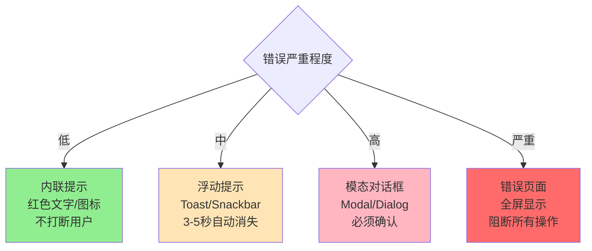

# 错误处理策略

## 概述

本文档详细说明不同类型错误的处理策略，帮助前端团队设计用户友好的错误处理方案。

## 错误分级处理

### 严重程度分级

| 级别 | 错误码范围 | 说明 | 提示方式 | 用户影响 |
|------|----------|------|---------|---------|
| **低** | 4000（验证错误） | 表单输入错误 | 字段下红色文字 | 可继续操作 |
| **中** | 4100-4699（业务错误） | 业务规则限制 | Toast消息提示 | 需要修正后继续 |
| **高** | 4001, 4004（认证） | 登录失效 | 跳转+提示 | 需要重新登录 |
| **严重** | 5000+（服务器） | 系统故障 | Modal对话框 | 无法继续操作 |

### 提示方式决策树



## 具体错误类型的处理策略

### 1. 验证错误（4000）

**特征：**
- 错误码：4000
- error_code: 'VALIDATION_ERROR'
- data字段包含字段错误信息

**处理策略：**
```
1. 解析data字段中的字段错误
   data = {
     "name": ["该字段不能为空"],
     "email": ["请输入有效的邮箱地址"]
   }

2. 在对应字段下显示错误
   - 红色文字
   - 字段边框变红
   - 显示错误icon

3. 滚动到第一个错误字段

4. 可选：显示全局提示
   Toast: "请检查表单输入"
```

**UI示例：**
```
输入框: [          ]  ← 正常状态
        ___________

输入框: [          ]  ← 错误状态（红色边框）
        ━━━━━━━━━━━
        ❌ 该字段不能为空
```

### 2. 认证错误（4001, 4002, 4004）

**特征：**
- 错误码：4001（未认证）、4002（Token无效）、4004（Token过期）
- 用户Session失效

**处理策略：**
```
1. 清除本地存储
   - Token
   - Refresh Token  
   - 用户信息
   - 租户ID
   - 其他认证相关数据

2. 保存当前页面路径
   sessionStorage.set('returnUrl', currentPath)

3. 显示提示（不阻塞）
   Toast: "登录已过期，请重新登录"

4. 延迟跳转（让用户看到提示）
   延迟1秒后跳转到登录页

5. 登录成功后
   跳转回之前保存的页面
```

**注意事项：**
- 不要在多个地方同时显示"未登录"提示
- 拦截器统一处理，避免组件重复提示

### 3. 权限错误（4003, 4303）

**特征：**
- 错误码：4003（系统权限）、4303（用户权限）
- 用户无权执行某操作

**处理策略：**
```
1. 显示Modal对话框
   标题: "权限不足"
   内容: 后端返回的message
   按钮: "我知道了"

2. 记录权限错误日志
   便于后续分析是否需要调整权限

3. 可选：提供申请权限入口
   IF error_code === 'USER_PERMISSION_DENIED':
     提供"申请权限"按钮
     点击后跳转到权限申请页面
```

**分类处理：**
```
根据具体场景:
  - 访问页面权限不足 → 显示403错误页
  - 操作按钮权限不足 → Modal提示
  - 查看数据权限不足 → 隐藏或置灰相关内容
```

### 4. 租户错误（4100-4199）

**常见错误码：**
- 4101: 租户不存在
- 4102: 租户未激活
- 4103: 租户配额超限
- 4104: 租户访问拒绝

**处理策略：**
```
CASE 4101 (租户不存在):
  显示提示: response.message
  操作: 返回租户列表页

CASE 4102 (租户未激活):
  显示Modal:
    标题: "账户已被禁用"
    内容: response.message
    按钮: "联系管理员"

CASE 4103 (配额超限):
  显示Modal:
    标题: "配额已满"
    内容: response.message
    按钮: "升级套餐"
    点击后: 跳转到升级页面

CASE 4104 (访问拒绝):
  显示提示: "无法访问其他租户的资源"
  操作: 返回首页或上一页
```

### 5. 许可证错误（4200-4299）

**常见错误码：**
- 4201: 许可证过期
- 4202: 许可证不存在
- 4203: 许可证配额超限
- 4206: 已拥有许可证

**处理策略：**
```
CASE 4201 (许可证过期):
  显示Modal:
    标题: "许可证已过期"
    内容: "您的许可证已于 {date} 过期"
    主按钮: "立即续费"
    次按钮: "稍后处理"
    点击主按钮: 跳转到续费页面

CASE 4203 (配额超限):
  显示Modal:
    标题: "配额已满"
    内容: response.message
    主按钮: "升级套餐"
    点击后: 跳转到升级页面

CASE 4206 (已拥有许可证):
  显示Modal:
    标题: "温馨提示"
    内容: "您已经拥有该产品的许可证"
    按钮: "查看我的许可证"
    点击后: 跳转到许可证列表
```

### 6. 积分错误（4400-4499）

**常见错误码：**
- 4401: 积分不足
- 4402: 积分过期
- 4404: 每日积分上限

**处理策略：**
```
CASE 4401 (积分不足):
  显示Modal:
    标题: "积分不足"
    内容: "当前可用: {available}，需要: {required}"
    主按钮: "获取积分"
    次按钮: "取消"
    点击主按钮: 跳转到积分获取页面

CASE 4404 (每日上限):
  显示Modal:
    标题: "今日已达上限"
    内容: response.message
    按钮: "明天再来"
```

### 7. 服务器错误（5000+）

**特征：**
- 错误码：5000+
- 系统内部错误，非用户原因

**处理策略：**
```
1. 用户友好提示
   Toast或Modal: "服务器暂时不可用，请稍后重试"

2. 记录详细错误日志
   包含: URL, 错误码, 错误消息, 时间戳, 用户信息

3. 上报到监控系统（生产环境）
   发送到: 错误监控服务（如Sentry）

4. 提供重试选项
   IF 是页面加载失败:
     显示"重试"按钮
   
   IF 是操作失败:
     自动重试1-3次（指数退避）

5. 不暴露技术细节
   不显示: 堆栈信息、SQL错误、内部路径等
```

## 错误恢复机制

### 可恢复vs不可恢复

```
可恢复的错误:
  - 网络错误 → 提供重试
  - 服务器错误 (5XXX) → 提供重试
  - 超时错误 → 提供重试
  - 配额超限 (部分) → 提供升级入口

不可恢复的错误:
  - 认证错误 → 必须重新登录
  - 权限错误 → 需要权限变更
  - 资源不存在 (404) → 无法恢复
  - 业务规则错误 → 需要修改操作
```

### 自动恢复策略

```
自动重试逻辑:

FUNCTION autoRetry(request, error):
  IF 不应该重试(error):
    RETURN 失败
  
  重试次数 = 0
  最大重试次数 = 3
  
  WHILE 重试次数 < 最大重试次数:
    等待延迟 = 计算延迟(重试次数)  // 指数退避
    等待(延迟)
    
    TRY:
      结果 = 重新发送请求(request)
      RETURN 成功(结果)
    CATCH 错误:
      重试次数++
  
  RETURN 失败


计算延迟(重试次数):
  RETURN (2 ^ 重试次数) * 1000 毫秒
  // 第1次: 1秒
  // 第2次: 2秒
  // 第3次: 4秒
```

## 用户引导策略

### 提供操作建议

```
为不同错误提供下一步操作建议:

认证错误:
  提示: "登录已过期"
  建议: "重新登录"
  操作: 自动跳转登录页

权限错误:
  提示: "您没有权限"
  建议: "联系管理员申请权限"
  操作: 提供联系方式或申请入口

配额超限:
  提示: "配额已满"
  建议: "升级到更高套餐"
  操作: 跳转到升级页面

资源不存在:
  提示: "租户不存在"
  建议: "返回列表重新选择"
  操作: 返回上一页或列表页

积分不足:
  提示: "积分余额不足"
  建议: "完成任务获取积分"
  操作: 跳转到任务中心

服务器错误:
  提示: "服务器暂时不可用"
  建议: "稍后重试或联系客服"
  操作: 提供重试按钮
```

## 错误消息优化

### 原则

1. **简洁明了** - 一句话说清楚问题
2. **用户视角** - 使用用户能理解的语言
3. **可操作** - 告诉用户下一步怎么做
4. **不暴露技术细节** - 不显示错误堆栈、SQL等

### 消息改写示例

| 后端消息 | 优化后的前端消息 |
|---------|---------------|
| "租户ID 123 不存在" | "该租户不存在，请返回列表重新选择" |
| "积分余额不足，当前可用: 100，需要: 500" | "积分不足（还需400分），完成任务可获取积分" |
| "许可证已于 2024-01-15 过期" | "许可证已过期，立即续费可继续使用" |
| "服务器内部错误" | "系统繁忙，请稍后重试" |

### 不同场景的消息策略

**表单提交失败：**
```
原始: "数据验证失败"
优化: "请检查以下字段：{字段列表}"
```

**权限不足：**
```
原始: "用户权限不足"
优化: "您没有权限执行此操作，如有需要请联系管理员"
```

**资源不存在：**
```
原始: "租户不存在"
优化: "未找到该租户，可能已被删除或不存在"
```

## Loading状态管理

### Loading与错误的配合

```
状态组合矩阵:

| Loading | Error | Data | 显示内容 |
|---------|-------|------|---------|
| true    | null  | null | Loading骨架屏 |
| false   | 错误  | null | 错误提示+重试 |
| false   | null  | null | 空状态提示 |
| false   | null  | 数据 | 正常数据显示 |
```

### Loading策略

```
Loading显示时机:
  1. 请求开始时: 立即显示Loading
  2. 短时间请求(<500ms): 不显示Loading，避免闪烁
  3. 长时间请求(>3s): 显示进度提示
  4. 请求完成: 立即隐藏Loading

Loading显示方式:
  - 首次加载: 骨架屏/全屏Loading
  - 刷新数据: 局部Loading/旋转图标
  - 提交操作: 按钮Loading状态
  - 分页切换: 表格Loading遮罩
```

## 错误恢复和重试

### 重试策略

```
重试决策流程:

FUNCTION determineRetryStrategy(error):
  errorCode = error.code
  
  // 网络错误 - 自动重试3次
  IF 无响应:
    RETURN { 
      shouldRetry: true,
      maxRetries: 3,
      delay: [1000, 2000, 4000]
    }
  
  // 服务器错误 - 自动重试2次
  IF errorCode >= 5000:
    RETURN {
      shouldRetry: true,
      maxRetries: 2,
      delay: [1000, 2000]
    }
  
  // 429限流错误 - 延迟后重试1次
  IF errorCode in [4029, 4103, 4203]:
    RETURN {
      shouldRetry: true,
      maxRetries: 1,
      delay: [5000]  // 等待5秒
    }
  
  // 其他错误 - 不自动重试
  RETURN {
    shouldRetry: false
  }
```

### 手动重试UI

```
错误显示中的重试按钮:

适用场景:
  - 页面加载失败
  - 列表加载失败
  - 服务器错误

UI设计:
  [错误提示]
  "加载失败：服务器暂时不可用"
  
  [重试按钮]  [返回首页]
```

## 防抖和节流

### 防止重复提交

```
防抖策略（表单提交）:

状态: 
  submitting = false

提交流程:
  IF submitting === true:
    显示提示: "请勿重复提交"
    RETURN
  
  submitting = true
  禁用提交按钮
  
  TRY:
    发送请求
    处理响应
  FINALLY:
    submitting = false
    启用提交按钮
```

### 搜索防抖

```
搜索防抖策略:

变量:
  searchTimer = null
  lastKeyword = ""

搜索逻辑:
  FUNCTION onSearchInput(keyword):
    清除之前的定时器(searchTimer)
    
    IF keyword === lastKeyword:
      RETURN  // 相同关键词不重复搜索
    
    searchTimer = 延迟执行(500ms, function():
      lastKeyword = keyword
      发起搜索请求(keyword)
    )
```

## 批量操作错误处理

### 部分成功的处理

```
批量操作结果:
  成功: 5个
  失败: 2个
  失败详情: [
    { id: 123, message: "租户已被使用，无法删除" },
    { id: 456, message: "权限不足" }
  ]

显示策略:
  IF 全部成功:
    Toast: "成功删除5个租户"
  
  ELSE IF 全部失败:
    Modal: 
      标题: "操作失败"
      内容: 失败原因列表
  
  ELSE IF 部分成功:
    Modal:
      标题: "批量操作完成"
      内容: |
        成功: 5个
        失败: 2个
        
        失败详情:
        - ID 123: 租户已被使用，无法删除
        - ID 456: 权限不足
```

## 错误预防策略

### 前端预检查

```
提交前检查，减少不必要的API调用:

示例1: 积分兑换
  IF 用户积分 < 所需积分:
    前端直接提示: "积分不足"
    不发送API请求
  ELSE:
    发送API请求（后端还会再次验证）

示例2: 表单验证
  先进行前端验证:
    - 必填字段检查
    - 格式验证（邮箱、手机号）
    - 长度限制
  
  IF 前端验证通过:
    发送API请求
  ELSE:
    显示前端验证错误
    不发送请求

示例3: 权限检查
  IF 用户角色不足:
    禁用或隐藏操作按钮
    不允许发送请求
```

### 双重验证原则

```
前后端都要验证:

前端验证:
  - 提供即时反馈
  - 减少无效请求
  - 改善用户体验

后端验证:
  - 确保数据安全
  - 防止恶意请求
  - 最终的数据验证

流程:
  1. 用户输入
  2. 前端验证（即时反馈）
  3. 发送请求
  4. 后端验证（最终验证）
  5. 返回结果
```

## 错误显示时机

### 何时显示错误

```
立即显示:
  - 表单提交的验证错误
  - 操作按钮触发的错误
  - 登录失败

延迟显示:
  - 后台数据加载失败（不打断用户）
  - 轮询请求失败（静默处理）

不显示:
  - 预加载失败（非关键数据）
  - 被取消的请求
  - 重试中的错误（最后一次失败才显示）
```

### 错误持续时间

```
Toast提示:
  - 轻微错误: 2-3秒
  - 重要错误: 4-5秒
  - 不自动消失: 用户手动关闭

Modal对话框:
  - 必须用户点击确认
  - 不自动消失

错误页面:
  - 持续显示直到用户操作
  - 提供"返回"或"重试"按钮
```

## 错误消息国际化

### 多语言支持

```
国际化策略:

方案1: 使用后端返回的消息（推荐）
  - 后端根据Accept-Language返回对应语言
  - 前端直接显示
  - 优点: 消息集中管理
  - 缺点: 需要后端支持

方案2: 前端维护翻译字典
  - 根据error_code从字典获取翻译
  - 降级到后端消息
  
  伪代码:
    翻译字典 = {
      'zh': {
        'TENANT_NOT_FOUND': '租户不存在',
        'LICENSE_EXPIRED': '许可证已过期'
      },
      'en': {
        'TENANT_NOT_FOUND': 'Tenant not found',
        'LICENSE_EXPIRED': 'License has expired'
      }
    }
    
    FUNCTION getErrorMessage(error, locale):
      翻译 = 翻译字典[locale][error.error_code]
      
      IF 翻译存在:
        RETURN 翻译
      ELSE:
        RETURN error.message  // 降级到后端消息
```

## 总结

### 核心策略

1. **分级处理** - 根据严重程度选择不同提示方式
2. **用户友好** - 清晰的错误消息和操作建议
3. **智能重试** - 可恢复的错误自动重试
4. **预防为主** - 前端预检查减少错误发生
5. **双重验证** - 前后端都验证，安全可靠

### 实施要点

- [ ] 定义错误严重程度分级
- [ ] 为每种错误设计处理策略
- [ ] 实现自动重试机制
- [ ] 优化错误消息文案
- [ ] 提供操作指引和恢复入口
- [ ] 记录错误日志便于分析

---

**下一步**: 阅读 [HTTP客户端集成指南](./04_http_client_integration.md)

**维护者**: Lipeaks Frontend Team  
**最后更新**: 2025-01-08

