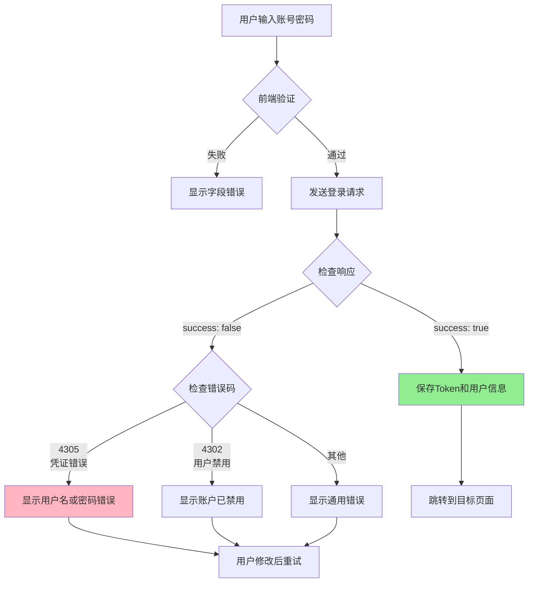
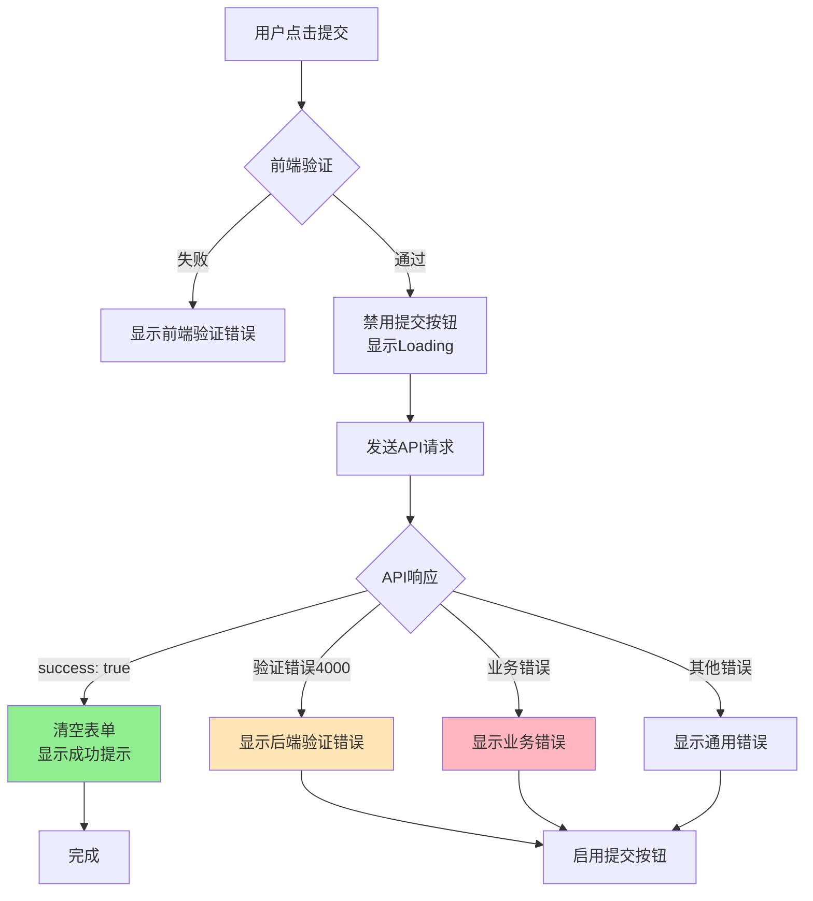
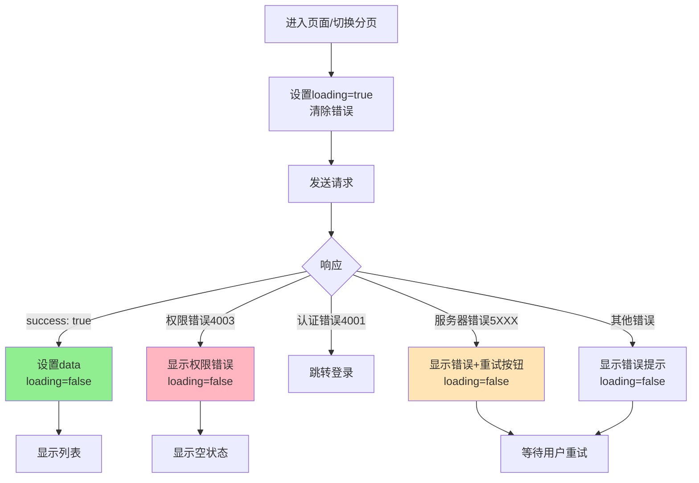
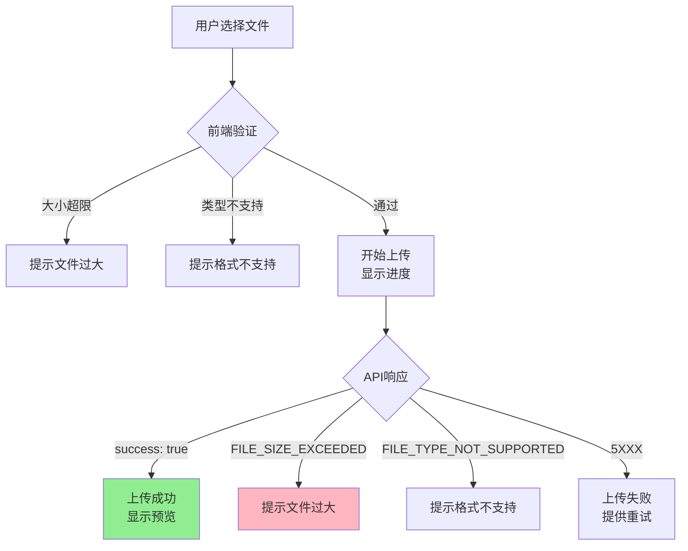
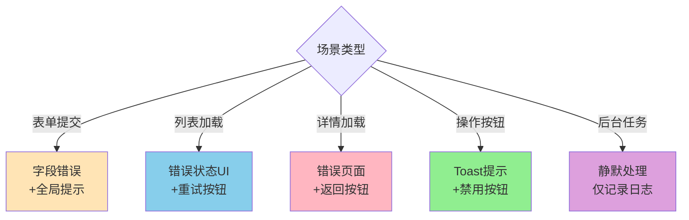

# 常见场景处理方案

## 概述

本文档提供常见业务场景的错误处理方案，**使用伪代码和流程图说明，不依赖具体编程语言**。

## 场景1：用户登录

### 业务流程



### 处理逻辑

```
登录错误处理:

FUNCTION handleLoginError(error):
  errorCode = error.error_code
  
  CASE errorCode:
    WHEN 'USER_INVALID_CREDENTIALS':
      在表单下显示: "用户名或密码错误"
      高亮: 用户名和密码字段
      
    WHEN 'USER_INACTIVE':
      显示Modal:
        标题: "账户已被禁用"
        内容: "您的账户已被管理员禁用，请联系管理员"
        按钮: "联系客服"
      
    WHEN 'USER_NOT_FOUND':
      在用户名字段下显示: "该用户不存在"
      
    DEFAULT:
      显示Toast: error.message
```

## 场景2：表单提交

### 表单验证流程



### 处理逻辑

```
表单提交错误处理:

FUNCTION submitForm(formData):
  // 1. 前端验证
  前端错误 = validateForm(formData)
  IF 前端错误存在:
    显示字段错误
    RETURN
  
  // 2. 禁用提交按钮，显示Loading
  submitting = true
  
  TRY:
    // 3. 发送请求
    response = POST /api/v1/tenants/
                Body: formData
    
    // 4. 检查响应
    IF response.success:
      显示Toast: "创建成功"
      清空表单
      跳转或刷新列表
    
  CATCH error:
    apiError = error.response.data
    
    // 后端验证错误
    IF apiError.error_code === 'VALIDATION_ERROR':
      FOR EACH 字段 in apiError.data:
        错误消息 = apiError.data[字段][0]
        在字段下显示错误(字段, 错误消息)
        字段边框变红
      
      滚动到第一个错误字段
      显示Toast: "请检查表单输入"
    
    // 业务错误
    ELSE:
      显示Toast: apiError.message
  
  FINALLY:
    // 5. 恢复按钮状态
    submitting = false
```

## 场景3：列表加载

### 加载流程



### 处理逻辑

```
列表加载错误处理:

FUNCTION loadList(page, pageSize):
  // 1. 设置状态
  loading = true
  error = null
  
  TRY:
    // 2. 发送请求
    response = GET /api/v1/tenants/
                Params: { page, page_size: pageSize }
    
    IF response.success:
      // 成功
      data = response.data.results
      total = response.data.count
      loading = false
    
  CATCH error:
    loading = false
    apiError = error.response.data
    
    // 分类处理
    CASE apiError.code:
      WHEN 4003:  // 权限不足
        error = "您没有权限查看租户列表"
        // 不显示Toast，在页面上显示错误状态
        
      WHEN 4001:  // 未认证
        // 交给全局处理器，会自动跳转登录
        
      WHEN >= 5000:  // 服务器错误
        error = apiError.message
        // 显示错误状态和重试按钮
        
      DEFAULT:
        error = apiError.message

UI显示逻辑:
  IF loading:
    显示: Loading骨架屏
  
  ELSE IF error:
    显示: 错误提示 + 重试按钮
  
  ELSE IF data为空:
    显示: 空状态提示（"暂无数据"）
  
  ELSE:
    显示: 数据列表
```

## 场景4：详情页加载

### 加载流程

```
详情页加载流程:

页面初始化:
  从URL获取ID参数
  
  loading = true
  
  TRY:
    response = GET /api/v1/tenants/{id}/
    
    IF response.success:
      显示详情数据
    
  CATCH error:
    errorCode = error.response.data.code
    
    CASE errorCode:
      WHEN 4101:  // 租户不存在
        显示404错误页:
          "该租户不存在或已被删除"
          [返回列表] 按钮
      
      WHEN 4003:  // 权限不足
        显示403错误页:
          "您没有权限查看此租户"
          [返回列表] 按钮
      
      WHEN >= 5000:  // 服务器错误
        显示错误提示和重试按钮
      
      DEFAULT:
        显示通用错误
  
  FINALLY:
    loading = false
```

## 场景5：文件上传

### 上传流程



### 处理逻辑

```
文件上传错误处理:

FUNCTION uploadFile(file):
  // 1. 前端验证
  IF file.size > 10MB:
    显示错误: "文件大小不能超过10MB"
    RETURN
  
  IF file.type 不在允许列表:
    显示错误: "不支持的文件格式"
    RETURN
  
  // 2. 开始上传
  uploading = true
  progress = 0
  
  TRY:
    response = POST /api/v1/upload/
                Body: FormData包含file
                OnProgress: (loaded, total) => {
                  progress = (loaded / total) * 100
                  更新进度条
                }
    
    IF response.success:
      显示Toast: "上传成功"
      显示文件预览
    
  CATCH error:
    apiError = error.response.data
    
    CASE apiError.error_code:
      WHEN 'FILE_SIZE_EXCEEDED':
        显示错误: "文件过大: " + apiError.message
        
      WHEN 'FILE_TYPE_NOT_SUPPORTED':
        显示错误: "不支持的文件类型: " + apiError.message
        
      DEFAULT:
        显示错误: "上传失败: " + apiError.message
        提供重试按钮
  
  FINALLY:
    uploading = false
    progress = 0
```

## 场景6：批量操作

### 批量删除流程

```
批量删除逻辑:

FUNCTION batchDelete(selectedIds):
  // 1. 确认对话框
  用户确认 = 显示确认对话框:
    "确定要删除选中的 {count} 个项目吗？"
  
  IF 用户取消:
    RETURN
  
  // 2. 执行批量删除
  processing = true
  成功数 = 0
  失败数 = 0
  失败列表 = []
  
  FOR EACH id in selectedIds:
    TRY:
      response = DELETE /api/v1/tenants/{id}/
      
      IF response.success:
        成功数++
      ELSE:
        失败数++
        失败列表.push({ id, message: response.message })
    
    CATCH error:
      失败数++
      失败列表.push({ id, message: error.message })
    
    // 更新进度
    进度 = (成功数 + 失败数) / selectedIds.length * 100
    显示进度: "{进度}%"
  
  // 3. 显示结果
  IF 失败数 === 0:
    显示Toast: "成功删除{成功数}个项目"
  
  ELSE IF 成功数 === 0:
    显示Modal:
      标题: "删除失败"
      内容: 失败列表
  
  ELSE:
    显示Modal:
      标题: "批量删除完成"
      内容: |
        成功: {成功数}个
        失败: {失败数}个
        
        失败详情:
        {失败列表}
  
  // 4. 刷新列表
  processing = false
  重新加载列表()
```

## 场景7：搜索和过滤

### 实时搜索

```
搜索防抖处理:

变量:
  searchTimer = null
  lastKeyword = ""
  searching = false

FUNCTION onSearchInput(keyword):
  // 1. 清除之前的定时器
  IF searchTimer 存在:
    清除定时器(searchTimer)
  
  // 2. 相同关键词不重复搜索
  IF keyword === lastKeyword:
    RETURN
  
  // 3. 空关键词清空结果
  IF keyword 为空:
    searchResults = []
    RETURN
  
  // 4. 延迟500ms执行搜索
  searchTimer = 延迟执行(500ms, FUNCTION():
    lastKeyword = keyword
    executeSearch(keyword)
  )

FUNCTION executeSearch(keyword):
  searching = true
  
  TRY:
    response = GET /api/v1/tenants/
                Params: { search: keyword }
    
    IF response.success:
      searchResults = response.data.results
  
  CATCH error:
    // 搜索错误静默处理，不打扰用户
    searchResults = []
    
    // 只在严重错误时提示
    IF error.code >= 5000:
      显示轻量提示: "搜索失败"
  
  FINALLY:
    searching = false
```

## 场景8：许可证申请

### 申请流程

```
许可证申请错误处理:

FUNCTION applyLicense(productId):
  applying = true
  
  TRY:
    response = POST /api/v1/licenses/member/apply/
                Body: { product_id: productId }
    
    IF response.success:
      licenseData = response.data
      
      显示成功对话框:
        标题: "申请成功"
        内容: |
          许可证密钥: {licenseData.license_key}
          有效期至: {licenseData.expires_at}
        按钮: "查看我的许可证"
        点击后: 跳转到 /licenses/my
    
  CATCH error:
    apiError = error.response.data
    errorCode = apiError.error_code
    
    CASE errorCode:
      WHEN 'LICENSE_ALREADY_ASSIGNED':
        显示提示对话框:
          标题: "温馨提示"
          内容: "您已经拥有该产品的许可证"
          按钮: "查看我的许可证"
          点击后: 跳转到许可证列表
      
      WHEN 'LICENSE_QUOTA_EXCEEDED':
        显示警告对话框:
          标题: "配额已满"
          内容: apiError.message
          主按钮: "了解配额规则"
          次按钮: "我知道了"
      
      WHEN 'APPLICATION_RATE_LIMIT_EXCEEDED':
        显示信息对话框:
          标题: "申请过于频繁"
          内容: apiError.message
          按钮: "我知道了"
      
      DEFAULT:
        显示Toast: apiError.message
  
  FINALLY:
    applying = false
```

## 场景9：积分兑换

### 兑换流程

```
积分兑换错误处理:

FUNCTION redeemPoints(rewardId):
  // 1. 前端预检查
  userPoints = 当前用户积分
  requiredPoints = 奖励所需积分
  
  IF userPoints < requiredPoints:
    显示提示对话框:
      标题: "积分不足"
      内容: "需要 {required} 积分，当前可用 {available} 积分"
      主按钮: "去赚积分"
      点击后: 跳转到 /points/earn
    RETURN  // 不发送API请求
  
  // 2. 发送兑换请求
  redeeming = true
  
  TRY:
    response = POST /api/v1/points/redeem/
                Body: { reward_id: rewardId }
    
    IF response.success:
      newBalance = response.data.balance_after
      
      显示成功对话框:
        标题: "兑换成功"
        内容: "已扣除 {required} 积分，当前余额: {newBalance}"
      
      更新页面显示的积分余额
    
  CATCH error:
    apiError = error.response.data
    
    CASE apiError.error_code:
      WHEN 'POINTS_INSUFFICIENT':
        显示错误对话框:
          标题: "积分不足"
          内容: apiError.message
      
      WHEN 'POINTS_EXPIRED':
        显示警告对话框:
          标题: "积分已过期"
          内容: apiError.message
      
      WHEN 'POINTS_DAILY_LIMIT_EXCEEDED':
        显示信息对话框:
          标题: "今日兑换已达上限"
          内容: apiError.message
      
      DEFAULT:
        显示Toast: apiError.message
  
  FINALLY:
    redeeming = false
```

## 场景10：数据导出

### 导出流程

```
文件导出错误处理:

FUNCTION exportData(params):
  // 1. 显示导出提示
  显示Toast: "正在导出，请稍候..."
  exporting = true
  
  TRY:
    // 2. 发送请求（注意responseType）
    response = GET /api/v1/tenants/export/
                Params: params
                ResponseType: 'blob'  // 二进制数据
    
    // 3. 检查响应
    IF response是Blob类型:
      // 成功，触发下载
      创建下载链接
      设置文件名
      触发浏览器下载
      
      显示Toast: "导出成功"
    
  CATCH error:
    // Blob响应的错误需要特殊处理
    IF error.response.data 是 Blob:
      // 转换Blob为文本
      text = await blob.text()
      errorData = JSON.parse(text)
      显示错误: errorData.message
    ELSE:
      显示错误: error.message
  
  FINALLY:
    exporting = false
```

## 场景11：轮询和实时更新

### 轮询策略

```
轮询逻辑:

变量:
  pollingTimer = null
  errorCount = 0
  maxErrors = 3

FUNCTION startPolling(interval = 5000):
  // 立即执行一次
  fetchData()
  
  // 设置定时轮询
  pollingTimer = setInterval(fetchData, interval)

FUNCTION fetchData():
  TRY:
    response = GET /api/v1/licenses/{id}/status/
    
    IF response.success:
      更新页面数据
      errorCount = 0  // 重置错误计数
  
  CATCH error:
    errorCount++
    
    // 连续失败3次，停止轮询
    IF errorCount >= maxErrors:
      stopPolling()
      显示Toast: "数据更新失败，请刷新页面"

FUNCTION stopPolling():
  IF pollingTimer 存在:
    clearInterval(pollingTimer)
    pollingTimer = null

// 页面卸载时停止轮询
页面卸载时:
  stopPolling()
```

## 场景12：多步骤操作

### 向导式流程

```
多步骤操作错误处理:

步骤流程:
  步骤1: 填写基本信息
  步骤2: 配置选项
  步骤3: 确认提交

每一步的错误处理:

FUNCTION goToNextStep(currentStep):
  // 1. 验证当前步骤
  errors = validateStep(currentStep)
  
  IF errors 存在:
    显示字段错误
    RETURN
  
  // 2. 可选：保存草稿
  TRY:
    response = POST /api/v1/wizard/save-draft/
                Body: getCurrentStepData()
    
    IF response.success:
      currentStep++
      显示下一步
  
  CATCH error:
    // 保存草稿失败不阻止进入下一步
    记录日志: "草稿保存失败"
    currentStep++

最后一步提交:

FUNCTION submitWizard():
  // 收集所有步骤的数据
  allData = collectAllStepsData()
  
  submitting = true
  
  TRY:
    response = POST /api/v1/wizard/submit/
                Body: allData
    
    IF response.success:
      显示成功页面
      清空向导数据
  
  CATCH error:
    apiError = error.response.data
    
    IF apiError.error_code === 'VALIDATION_ERROR':
      // 找出错误字段所在的步骤
      errorStep = findStepByField(apiError.data)
      
      // 跳转回错误步骤
      currentStep = errorStep
      显示字段错误
      
      显示Toast: "第{errorStep}步有错误，请修改"
    
    ELSE:
      显示错误: apiError.message
  
  FINALLY:
    submitting = false
```

## 错误处理决策树

### 根据场景选择策略



## 总结

### 常见场景处理要点

| 场景 | 关键策略 | 提示方式 |
|------|---------|---------|
| 用户登录 | 区分凭证错误和账户状态 | 字段错误+Modal |
| 表单提交 | 前后端双重验证 | 字段错误+Toast |
| 列表加载 | 错误状态UI+重试 | 页面错误状态 |
| 详情加载 | 404/403专门处理 | 错误页面 |
| 文件上传 | 进度跟踪+格式验证 | 进度条+Toast |
| 批量操作 | 统计成功/失败 | Modal详情列表 |
| 搜索过滤 | 防抖+静默处理 | 轻量提示 |
| 许可证申请 | 业务引导 | Modal+操作按钮 |
| 积分兑换 | 前端预检查 | Modal+跳转 |
| 数据导出 | Blob特殊处理 | Toast提示 |
| 轮询更新 | 错误次数限制 | 静默处理 |
| 多步骤操作 | 步骤定位 | 跳转+字段错误 |

### 设计原则

1. ✅ **用户体验优先** - 清晰的提示和操作指引
2. ✅ **防错优先** - 前端预检查减少错误
3. ✅ **双重验证** - 前后端都验证确保安全
4. ✅ **智能重试** - 可恢复错误自动处理
5. ✅ **状态管理** - 正确处理Loading和错误状态

---

**下一步**: 阅读 [用户界面设计指南](./06_ui_design_guide.md)

**维护者**: Lipeaks Frontend Team  
**最后更新**: 2025-01-08

