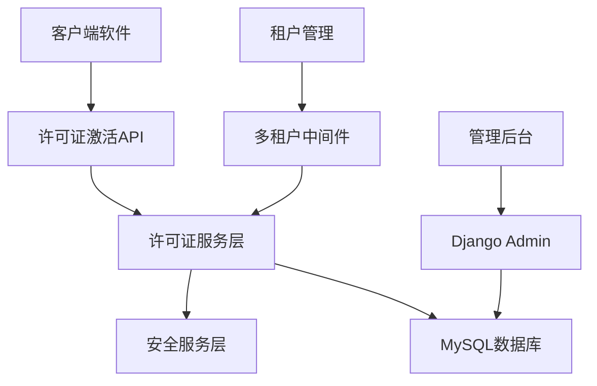

# 机器绑定许可证系统

## 项目概述

本系统是一个完整的机器绑定许可证管理系统，已集成到多租户Django REST API后端中。系统支持软件产品的许可证生成、机器绑定激活、使用监控和安全审计等完整生命周期管理。

## 系统架构

## 核心模块

- **许可证管理** - 软件产品、许可方案、许可证生命周期
- **机器绑定** - 硬件指纹识别、设备绑定管理
- **激活服务** - 在线/离线激活、验证、心跳检测
- **安全审计** - 操作记录、可疑行为检测
- **租户隔离** - 多租户数据隔离、配额管理

## 文档目录

1. [系统分析报告](./system_analysis_report.md) - 系统架构与模块分析
2. [架构设计方案](./architecture_design.md) - 整体架构和业务流程图
3. [数据库设计](./database_design.md) - MySQL表结构和字段说明
4. [API接口设计](./api_design.md) - RESTful API接口规范
5. [安全策略](./security_strategy.md) - 安全机制和防护要点
6. [实施计划](./implementation_plan.md) - 部署和使用指南
7. [部署指南](./deployment_guide.md) - 环境配置和部署步骤
8. [客户端集成](./client_integration_examples.md) - 客户端集成示例

## 技术特点

- **RSA数字签名** - 许可证密钥防伪验证
- **AES加密存储** - 敏感信息加密保护
- **硬件指纹** - 基于硬件特征的机器识别
- **多层验证** - 离线验证+在线心跳检测
- **可疑行为检测** - 异常激活模式识别
- **MySQL优化** - 索引优化和查询性能

## 快速上手

1. 查看 [系统分析报告](./system_analysis_report.md) 了解整体架构
2. 参考 [数据库设计](./database_design.md) 理解数据模型
3. 阅读 [API接口设计](./api_design.md) 了解接口调用
4. 按照 [部署指南](./deployment_guide.md) 配置环境

---

*创建日期：2025-09-05*
*设计团队：系统架构组*
