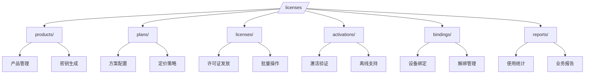

# 机器绑定许可证系统 REST API 设计方案

## 1. API架构设计理念

### 1.1 设计哲学与原则

机器绑定许可证系统的API设计遵循现代RESTful架构原则，与现有Django REST Framework基础设施深度集成。API设计强调简洁性、可扩展性和安全性，为多种客户端类型提供统一的服务接口。

**核心设计原则**:

- **资源导向设计**: 每个API端点代表特定的业务资源或操作
- **状态无关性**: API请求间无依赖关系，提升系统可伸缩性
- **统一接口规范**: 继承现有系统的响应格式和错误处理机制
- **分层架构**: 清晰的权限层次和访问控制边界

### 1.2 API版本化策略

**版本管理机制**:

系统采用URL路径版本化策略，所有API端点使用`/licenses/`前缀，为未来功能扩展和向后兼容提供基础支撑。版本化设计确保客户端升级的平滑过渡和API演进的灵活性。

### 1.3 响应格式标准化

**统一响应结构**:

API响应采用标准化的JSON格式，包含操作状态、状态码、描述信息和实际数据载荷。这种设计模式与现有系统保持一致，简化了客户端的响应处理逻辑。

## 2. API资源架构设计

### 2.1 资源层次结构

**核心资源分类**:

API设计围绕六个主要资源类别构建，每个类别代表许可证管理生命周期中的关键业务实体。资源设计遵循RESTful原则，通过HTTP动词和资源路径的组合实现完整的CRUD操作支持。

**资源映射关系**:

### 2.2 RESTful操作映射

**HTTP动词与业务操作对应**:

- **GET操作**: 资源查询、列表获取、状态检查
- **POST操作**: 资源创建、批量生成、激活验证
- **PUT/PATCH操作**: 资源更新、状态变更、配置修改
- **DELETE操作**: 资源删除、解绑操作、撤销许可

## 3. 管理端API功能架构

### 3.1 软件产品生命周期管理

**产品管理核心功能**:

软件产品管理API提供完整的产品生命周期管理能力，包括产品信息维护、密钥对管理、版本控制和平台支持配置。管理员可以通过统一接口创建和维护多个软件产品，每个产品都具有独立的RSA密钥对用于许可证签名验证。

**密钥管理安全机制**:

系统采用非对称加密体系，为每个软件产品生成独立的RSA密钥对。公钥存储在数据库中用于客户端验证，私钥仅在生成时返回给管理员，系统仅保存私钥的哈希值用于完整性校验。这种设计确保了即使数据库泄露，攻击者也无法伪造有效的许可证。

### 3.2 许可方案策略管理

**多层次方案体系**:

许可方案管理API支持灵活的分层定价策略，包括试用版、标准版、专业版和企业版等不同层次。每个方案可以独立配置激活限制、有效期、功能特性和定价信息。功能特性采用JSON格式存储，支持动态扩展和个性化配置。

**定价与特性关联**:

方案设计支持基于特性的差异化定价模式，管理员可以为不同方案配置不同的功能集合和价格策略。系统自动处理方案间的功能继承关系，确保高级方案包含低级方案的所有功能。

### 3.3 许可证发放与管理

**智能许可证生成**:

许可证生成系统采用智能算法生成唯一且安全的许可证密钥，密钥格式包含产品标识、方案类型和随机组件，确保密钥的可识别性和安全性。系统支持单个生成和批量生成模式，满足不同业务场景的需求。

**客户信息关联管理**:

每个许可证都可以关联详细的客户信息，包括联系方式、公司信息和业务备注。这些信息采用加密存储，为后续的客户服务和许可证管理提供数据支撑。系统还支持客户信息的脱敏显示，保护客户隐私。

## 4. 客户端激活系统架构

### 4.1 激活流程设计哲学

**双阶段验证机制**:

客户端激活系统采用双阶段验证架构，将初始激活和持续验证分离处理。初始激活阶段进行许可证有效性检查、机器绑定创建和激活证书生成；持续验证阶段则专注于许可证状态监控和使用数据收集。

**机器指纹技术**:

系统使用先进的机器指纹技术确保许可证与特定设备的强绑定关系。指纹算法综合考虑硬件UUID、序列号、网卡地址、操作系统信息等多维度标识，生成唯一且相对稳定的设备标识符。

### 4.2 激活证书与安全机制

**数字证书体系**:

激活成功后，系统生成加密的激活证书，包含许可证信息、机器绑定数据、有效期限和数字签名。证书采用RSA算法签名，确保无法被篡改或伪造。客户端可以通过验证证书签名来确认激活状态的真实性。

**动态验证策略**:

系统支持多种验证模式，包括实时在线验证、定期心跳检查和离线宽限期验证。验证间隔和离线宽限期可根据许可证类型和安全策略动态调整，平衡用户体验和安全控制。

### 4.3 离线使用支持机制

**离线证书技术**:

为了支持网络受限环境下的软件使用，系统提供离线验证证书功能。离线证书是预签名的时效性令牌，允许客户端在指定期间内无需网络连接即可验证许可证有效性。

**安全期限控制**:

离线证书具有严格的时间限制和使用范围限制，防止长期脱机使用导致的安全风险。证书过期后，客户端必须重新联网获取新的离线证书或进行在线验证。

## 5. 数据分析与报告系统

### 5.1 业务智能仪表板

**实时监控体系**:

管理统计API构建了全面的业务智能仪表板，提供许可证系统运营状况的实时洞察。仪表板整合了许可证发放、激活趋势、用户行为和系统性能等多维度数据，为业务决策提供数据支撑。

**关键业务指标**:

- **许可证生命周期指标**: 发放数量、激活率、到期预警
- **用户活跃度分析**: 设备使用频率、功能使用偏好
- **收入相关指标**: 方案销售分布、续费率统计
- **系统健康指标**: API响应时间、错误率监控

### 5.2 高级数据分析功能

**趋势分析与预测**:

系统提供深度的数据分析功能，包括激活趋势分析、用户行为模式识别和业务增长预测。分析引擎可以识别季节性变化、产品偏好变化和潜在的业务风险点。

**自定义报告生成**:

支持灵活的报告定制功能，管理员可以根据业务需求创建特定时间范围、特定产品或特定客户群体的专项报告。报告支持多种格式导出，便于进一步分析和分享。

## 6. 异常处理与容错机制

### 6.1 分层错误处理架构

**业务逻辑错误处理**:

系统采用分层的错误处理架构，将业务逻辑错误、系统运行错误和网络通信错误进行分类处理。每种错误类型都有对应的处理策略和用户反馈机制，确保系统在各种异常情况下的稳定运行。

**智能错误恢复机制**:

对于可恢复的错误，系统提供智能重试机制和备选方案建议。例如，当设备激活数量达到限制时，系统会提供设备管理建议和方案升级选项，帮助用户快速解决问题。

### 6.2 用户友好的错误反馈

**多语言错误信息**:

所有错误信息都支持国际化处理，根据用户的语言偏好提供相应的错误描述。错误信息不仅包含问题描述，还提供具体的解决建议和后续操作指导。

**错误上下文信息**:

系统在返回错误信息时，会包含相关的上下文信息，如许可证状态、剩余配额、到期时间等，帮助用户理解当前状况和采取相应行动。

## 7. API安全架构

### 7.1 多层认证授权体系

**分层访问控制**:

API安全架构采用分层的认证授权机制，根据接口类型和操作敏感度实施不同级别的安全控制。管理端API要求JWT认证和相应的管理员权限，确保只有授权用户才能执行系统管理操作。

**客户端接口安全策略**:

客户端激活API采用公开访问模式，但通过严格的频率限制和行为分析防止滥用。系统对每个IP地址和设备指纹实施独立的请求限制，确保正常用户不受影响的同时有效防止恶意攻击。

### 7.2 智能防护与限流机制

**动态频率控制**:

系统实施智能的动态频率控制策略，根据用户行为模式和系统负载情况自动调整请求限制。正常用户享有更宽松的限制，而检测到异常行为的请求将面临更严格的限制。

**数据隐私保护**:

所有API响应都经过数据脱敏处理，许可证密钥、机器信息和客户数据按照权限级别进行显示控制。敏感信息采用掩码显示或完全隐藏，确保数据隐私安全。

## 8. 自动化文档与集成

### 8.1 OpenAPI文档体系

**自动化文档生成**:

系统使用drf-spectacular框架实现OpenAPI 3.0标准的自动化文档生成。每个API端点都配置了详细的元数据信息，包括参数说明、响应示例和错误代码说明，确保文档的完整性和准确性。

**开发者友好的集成**:

API设计充分考虑了开发者的使用体验，提供丰富的示例代码、错误处理指南和最佳实践建议。文档支持交互式测试功能，开发者可以直接在文档界面中测试API调用。

### 8.2 系统集成特性

**与现有架构的无缝集成**:

API设计严格遵循现有系统的架构模式和编码规范，确保与Django多租户后端的完美集成。所有接口都支持租户隔离和统一的响应格式，保持系统的一致性和可维护性。

**扩展性与向后兼容**:

API架构支持版本控制和功能扩展，新功能的添加不会影响现有客户端的使用。系统设计考虑了未来的业务发展需求，为功能扩展和性能优化预留了充足的空间。

---

*设计完成时间: 2025-09-05*  
*设计原则: RESTful架构、统一响应格式、安全可靠*
