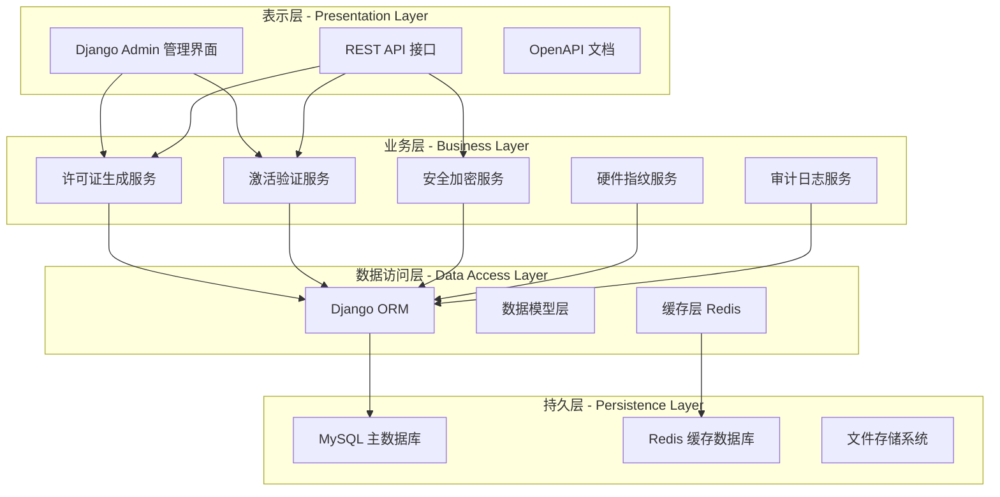
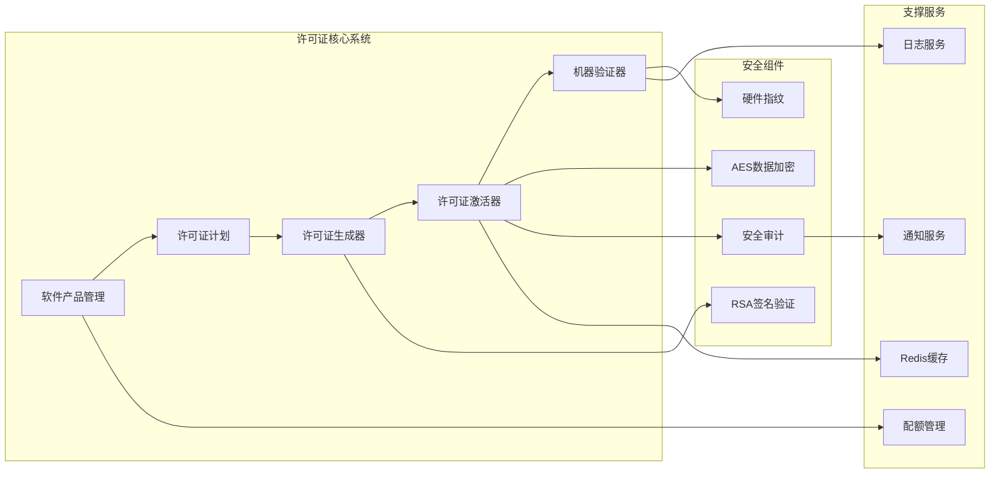
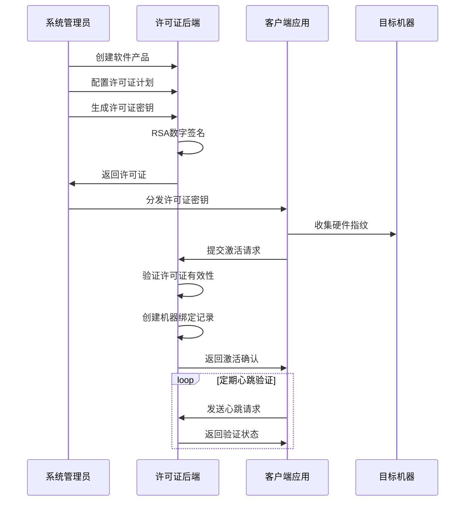
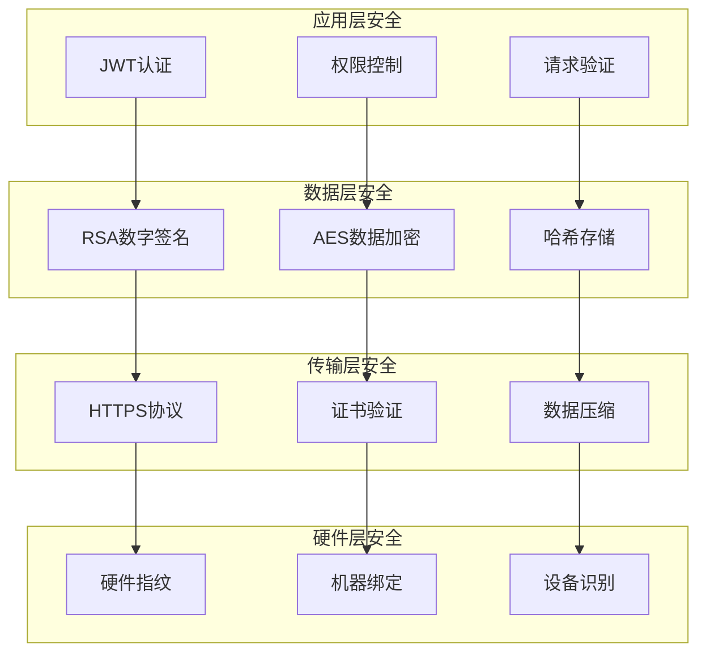
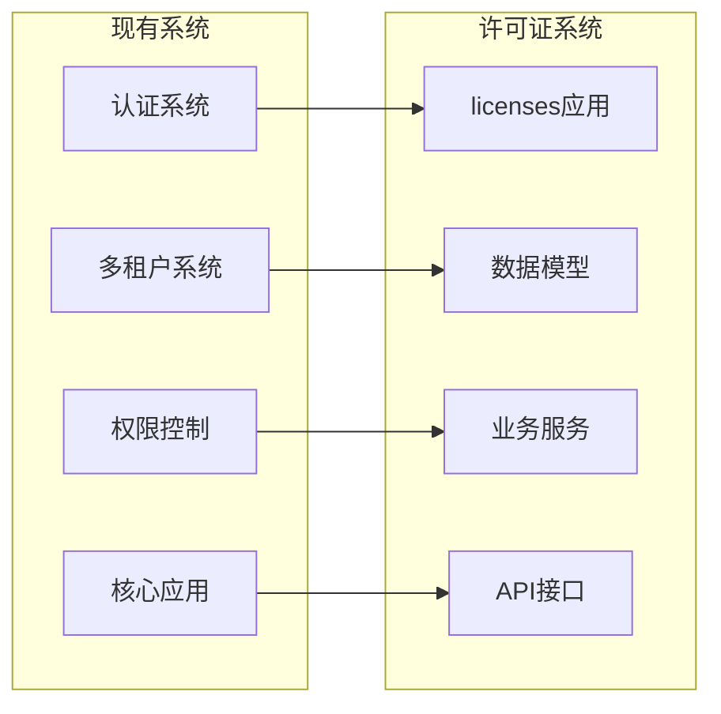
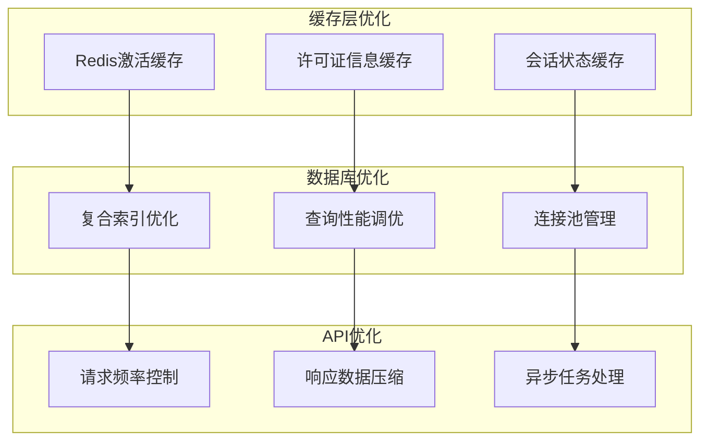

# 机器绑定许可证系统架构设计

## 1. 系统架构概述

机器绑定许可证系统基于Django REST Framework构建，采用现代化的微服务设计理念，实现了完整的许可证生命周期管理。系统通过多层架构设计确保高可用性、可扩展性和安全性。

## 2. 整体系统架构

### 2.1 分层架构设计

### 2.2 核心组件架构

## 3. 服务层架构设计

### 3.1 核心业务服务

系统采用服务层模式实现业务逻辑封装，确保代码的可维护性和可测试性。

```mermaid
graph TD
    subgraph "License Generation Service"
        LGS1[许可证密钥生成]
        LGS2[RSA数字签名]
        LGS3[客户信息绑定]
    end
    
    subgraph "Activation Service"
        AS1[激活请求处理]
        AS2[机器绑定验证]
        AS3[激活状态管理]
    end
    
    subgraph "Security Service"
        SS1[加密解密服务]
        SS2[硬件指纹生成]
        SS3[安全审计记录]
    end
    
    subgraph "Fingerprint Service"
        FS1[硬件信息收集]
        FS2[指纹算法计算]
        FS3[匹配度验证]
    end
    
    LGS1 --> LGS2
    LGS2 --> LGS3
    AS1 --> AS2
    AS2 --> AS3
    SS1 --> SS2
    SS2 --> SS3
    FS1 --> FS2
    FS2 --> FS3
```

### 3.2 服务间通信机制

各服务层采用依赖注入和事件驱动模式进行解耦，支持灵活的服务组合和扩展。每个服务专注于单一职责，通过标准化的接口进行交互，确保系统的模块化和可扩展性。

## 4. 数据流与业务流程

### 4.1 许可证生命周期流程

### 4.2 系统核心交互模式

系统采用请求-响应模式处理所有业务交互，确保数据一致性和操作原子性。每个关键操作都包含完整的验证链路和错误处理机制，保障系统的健壮性和可靠性。

## 5. 安全架构设计

### 5.1 多层安全防护体系

### 5.2 安全策略实施

系统实施纵深防御策略，从应用层到硬件层建立多重安全屏障。通过RSA数字签名确保许可证真实性，硬件指纹技术防止许可证滥用，多层加密保护敏感数据安全。

## 6. 系统集成设计

### 6.1 Django应用集成架构

### 6.2 中间件集成策略

许可证系统完全融入现有Django架构，通过中间件机制实现无缝集成。系统复用现有的认证、权限和多租户基础设施，确保架构一致性和维护效率。

## 7. 性能与扩展设计

### 7.1 系统性能优化架构

### 7.2 扩展性设计原则

系统采用微服务化设计思路，各功能模块低耦合高内聚。支持水平扩展和垂直扩展，能够根据业务增长灵活调整系统资源配置。

## 8. 监控与运维架构

### 8.1 全方位监控体系

系统建立完整的监控体系，从业务指标到技术指标全面覆盖：

- **业务监控**: 许可证激活率、使用统计、到期预警
- **性能监控**: API响应时间、数据库查询性能、系统吞吐量
- **安全监控**: 异常激活检测、安全事件追踪、访问行为分析
- **资源监控**: 服务器资源使用、存储容量、网络带宽

### 8.2 自动化运维支持

提供完整的自动化运维工具链，包括自动化部署、健康检查、故障恢复和性能调优，确保系统稳定可靠运行。

## 9. 架构设计总结

### 9.1 设计优势

本架构设计具备以下核心优势：

- **安全性**: 多层安全防护，RSA签名和硬件指纹双重保障
- **可扩展性**: 模块化设计支持功能快速迭代和系统扩展
- **高性能**: 缓存优化和数据库调优确保系统高效响应
- **易集成**: 标准化接口设计便于第三方系统对接
- **可维护性**: 清晰的架构层次和完善的文档支持

### 9.2 技术创新点

- **硬件指纹算法**: 创新的多维度硬件特征识别技术
- **离线验证机制**: 支持网络断连情况下的许可证验证
- **智能安全检测**: 基于行为分析的异常检测算法
- **弹性配额管理**: 动态调整的租户资源配额机制

---

*架构设计文档*  
*版本: v2.0*  
*设计完成: 2024年*  
*涵盖范围: 完整系统架构、安全设计、性能优化、集成方案*
