# 客户端集成架构设计指南

## 概述

本文档阐述机器绑定许可证系统的客户端集成架构设计、多平台适配策略、安全集成机制以及用户体验优化方案，为不同平台的客户端应用提供全面的集成指导和最佳实践。

## 1. 客户端集成架构设计

### 1.1 整体集成架构

**多层客户端架构**:

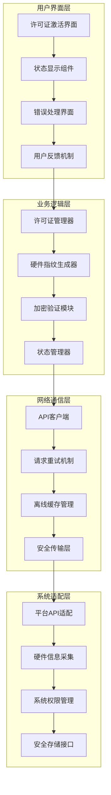

**架构设计原则**:

- **模块化设计**: 各功能模块独立封装，便于维护和测试
- **平台抽象**: 统一的接口设计，支持多平台适配
- **安全优先**: 内置安全机制，保护敏感信息和通信安全
- **用户体验**: 流畅的交互体验，清晰的状态反馈

### 1.2 核心组件架构

**许可证管理核心架构**:

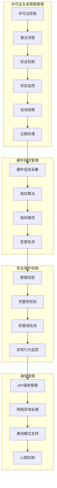

**组件职责划分**:

- **许可证管理器**: 负责许可证的完整生命周期管理和状态维护
- **硬件指纹生成器**: 负责收集硬件信息并生成唯一指纹标识
- **安全模块**: 负责数据加密、通信安全和防篡改保护
- **网络管理器**: 负责与服务端的通信和网络异常处理

### 1.3 多平台适配策略

**跨平台兼容架构**:

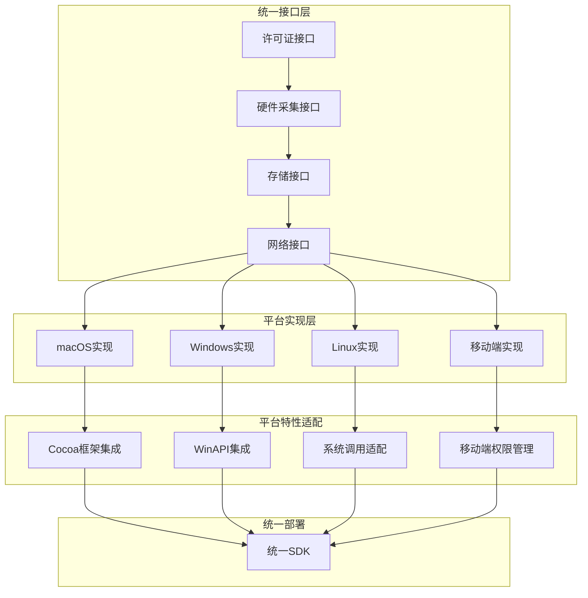

**平台适配重点**:

- **macOS平台**: 利用IOKit框架进行硬件信息采集，集成Keychain进行安全存储
- **Windows平台**: 使用WMI接口获取系统信息，利用DPAPI进行数据保护
- **Linux平台**: 通过/proc和/sys文件系统采集硬件信息，使用加密存储
- **移动端**: 适配iOS/Android权限模型，优化电池和网络使用

## 2. 安全集成机制设计

### 2.1 数据安全保护架构

**客户端安全保护体系**:

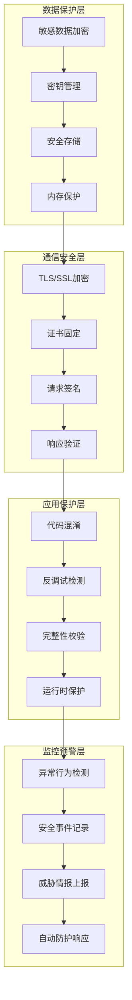

**安全机制实施**:

- **数据加密**: 使用AES-256加密敏感数据，密钥通过平台安全存储管理
- **通信安全**: 强制HTTPS通信，实施证书固定防止中间人攻击
- **完整性保护**: 应用签名验证，运行时完整性检查
- **防逆向**: 代码混淆、反调试、反Hook等多重保护机制

### 2.2 硬件指纹算法设计

**指纹生成算法架构**:

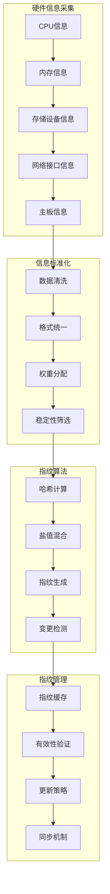

**指纹算法特性**:

- **唯一性**: 确保不同设备生成唯一指纹，避免碰撞
- **稳定性**: 在硬件配置不变情况下，指纹保持稳定
- **敏感性**: 硬件重大变更时能够及时检测
- **隐私保护**: 不收集用户个人隐私信息

### 2.3 离线模式支持机制

**离线工作架构**:

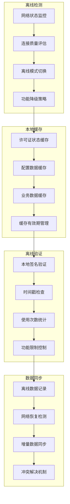

**离线策略设计**:

- **智能检测**: 多维度网络状态检测，准确判断离线状态
- **优雅降级**: 离线模式下保持核心功能可用，非关键功能暂停
- **数据一致性**: 网络恢复后自动同步离线期间的使用数据
- **安全保证**: 离线期间仍然维持必要的安全验证机制

### 3. 应用程序集成示例

```swift
import Cocoa

class AppDelegate: NSObject, NSApplicationDelegate {
    private let licenseManager = LicenseManager()
    private var activationCode: String?
    private var heartbeatTimer: Timer?
    
    func applicationDidFinishLaunching(_ aNotification: Notification) {
        // 检查许可证状态
        checkLicenseStatus()
    }
    
    func applicationWillTerminate(_ aNotification: Notification) {
        // 发送应用关闭事件
        if let activationCode = activationCode {
            licenseManager.sendHeartbeat(
                activationCode: activationCode,
                eventType: "shutdown"
            ) { _ in }
        }
        
        // 停止心跳定时器
        heartbeatTimer?.invalidate()
    }
    
    // 检查许可证状态
    private func checkLicenseStatus() {
        // 从Keychain或用户偏好设置中获取保存的激活码
        if let savedActivationCode = getSavedActivationCode() {
            verifyExistingLicense(activationCode: savedActivationCode)
        } else {
            // 显示许可证输入界面
            showLicenseInputDialog()
        }
    }
    
    // 验证现有许可证
    private func verifyExistingLicense(activationCode: String) {
        licenseManager.verifyActivation(activationCode: activationCode) { [weak self] result in
            switch result {
            case .success(let verificationResult):
                if verificationResult.valid {
                    self?.activationCode = activationCode
                    self?.startApplication()
                } else {
                    self?.showLicenseInputDialog()
                }
            case .failure(_):
                self?.showLicenseInputDialog()
            }
        }
    }
    
    // 显示许可证输入对话框
    private func showLicenseInputDialog() {
        let alert = NSAlert()
        alert.messageText = "许可证激活"
        alert.informativeText = "请输入您的许可证密钥："
        alert.addButton(withTitle: "激活")
        alert.addButton(withTitle: "退出")
        
        let textField = NSTextField(frame: NSRect(x: 0, y: 0, width: 300, height: 24))
        textField.placeholderString = "XXXXX-XXXXX-XXXXX-XXXXX"
        alert.accessoryView = textField
        
        let response = alert.runModal()
        if response == .alertFirstButtonReturn {
            let licenseKey = textField.stringValue.trimmingCharacters(in: .whitespacesAndNewlines)
            if !licenseKey.isEmpty {
                activateLicense(licenseKey: licenseKey)
            } else {
                showLicenseInputDialog()
            }
        } else {
            NSApplication.shared.terminate(self)
        }
    }
    
    // 激活许可证
    private func activateLicense(licenseKey: String) {
        // 显示进度指示器
        let progressAlert = createProgressAlert(message: "正在激活许可证...")
        
        licenseManager.activateLicense(licenseKey: licenseKey) { [weak self] result in
            progressAlert.close()
            
            switch result {
            case .success(let activationResult):
                // 保存激活码
                self?.saveActivationCode(activationResult.activationCode)
                self?.activationCode = activationResult.activationCode
                
                // 显示成功消息
                self?.showSuccessAlert(message: "许可证激活成功！")
                self?.startApplication()
                
            case .failure(let error):
                // 显示错误消息
                self?.showErrorAlert(error: error)
                self?.showLicenseInputDialog()
            }
        }
    }
    
    // 启动应用程序主要功能
    private func startApplication() {
        // 发送启动事件
        if let activationCode = activationCode {
            licenseManager.sendHeartbeat(
                activationCode: activationCode,
                eventType: "startup"
            ) { _ in }
        }
        
        // 启动定期心跳
        startHeartbeatTimer()
        
        // 这里启动您的主要应用程序逻辑
        print("应用程序已启动，许可证验证成功")
    }
    
    // 启动心跳定时器
    private func startHeartbeatTimer() {
        heartbeatTimer = Timer.scheduledTimer(withTimeInterval: 300.0, repeats: true) { [weak self] _ in
            guard let activationCode = self?.activationCode else { return }
            
            self?.licenseManager.sendHeartbeat(
                activationCode: activationCode,
                eventType: "heartbeat"
            ) { result in
                // 处理心跳响应
                switch result {
                case .success(let heartbeatResult):
                    if let warnings = heartbeatResult.warnings, !warnings.isEmpty {
                        // 处理警告（如许可证即将过期）
                        DispatchQueue.main.async {
                            self?.showWarningAlert(warnings: warnings)
                        }
                    }
                case .failure(_):
                    // 心跳失败，可能需要重新验证许可证
                    break
                }
            }
        }
    }
    
    // 辅助方法
    private func getSavedActivationCode() -> String? {
        return UserDefaults.standard.string(forKey: "ActivationCode")
    }
    
    private func saveActivationCode(_ code: String) {
        UserDefaults.standard.set(code, forKey: "ActivationCode")
    }
    
    private func createProgressAlert(message: String) -> NSAlert {
        let alert = NSAlert()
        alert.messageText = message
        alert.addButton(withTitle: "取消")
        // 在实际应用中，这里应该创建一个带进度指示器的自定义视图
        return alert
    }
    
    private func showSuccessAlert(message: String) {
        let alert = NSAlert()
        alert.alertStyle = .informational
        alert.messageText = "成功"
        alert.informativeText = message
        alert.addButton(withTitle: "确定")
        alert.runModal()
    }
    
    private func showErrorAlert(error: Error) {
        let alert = NSAlert()
        alert.alertStyle = .critical
        alert.messageText = "激活失败"
        alert.informativeText = error.localizedDescription
        alert.addButton(withTitle: "确定")
        alert.runModal()
    }
    
    private func showWarningAlert(warnings: [String]) {
        let alert = NSAlert()
        alert.alertStyle = .warning
        alert.messageText = "许可证警告"
        alert.informativeText = warnings.joined(separator: "\n")
        alert.addButton(withTitle: "确定")
        alert.runModal()
    }
}
```

## 🌐 HTTP客户端示例 (cURL)

### 1. 获取许可证信息

```bash
# 获取许可证基本信息
curl -X GET "https://your-api-domain.com/licenses/info/ABCD1-EFGH2-IJKL3-MNOP4/" \
  -H "User-Agent: MyMacApp/1.0.0"
```

### 2. 激活许可证

```bash
# 激活许可证
curl -X POST "https://your-api-domain.com/licenses/activate/" \
  -H "Content-Type: application/json" \
  -H "User-Agent: MyMacApp/1.0.0" \
  -d '{
    "license_key": "ABCD1-EFGH2-IJKL3-MNOP4",
    "hardware_info": {
      "system_info": {
        "os_version": "macOS 13.0",
        "hostname": "MacBook-Pro.local",
        "architecture": "arm64",
        "kernel_version": "22.1.0"
      },
      "cpu_info": {
        "brand": "Apple M2",
        "core_count": 8,
        "frequency": 3200000000
      },
      "memory_info": {
        "total_bytes": 17179869184,
        "total_gb": 16.0
      },
      "hardware_uuid": "12345678-1234-5678-9ABC-123456789ABC",
      "network_interfaces": [],
      "collected_at": "2024-01-15T10:30:00Z"
    },
    "client_info": {
      "app_version": "1.0.0",
      "platform": "macOS",
      "client_type": "native_app"
    }
  }'
```

### 3. 验证激活状态

```bash
# 验证激活状态
curl -X POST "https://your-api-domain.com/licenses/verify/" \
  -H "Content-Type: application/json" \
  -H "User-Agent: MyMacApp/1.0.0" \
  -d '{
    "activation_code": "ACT-12345678-ABCD-EFGH",
    "machine_fingerprint": "sha256:a1b2c3d4e5f6..."
  }'
```

### 4. 发送心跳

```bash
# 发送心跳
curl -X POST "https://your-api-domain.com/licenses/heartbeat/" \
  -H "Content-Type: application/json" \
  -H "User-Agent: MyMacApp/1.0.0" \
  -d '{
    "activation_code": "ACT-12345678-ABCD-EFGH",
    "event_type": "heartbeat",
    "event_data": {
      "feature_used": "export_data",
      "export_count": 5
    },
    "software_version": "1.0.0",
    "session_id": "session-12345",
    "system_status": {
      "cpu_usage": 45.2,
      "memory_usage": 62.8
    }
  }'
```

## 🛡️ 安全最佳实践

### 1. 密钥存储

```swift
import Security

class SecureStorage {
    
    // 安全存储激活码
    static func saveActivationCode(_ code: String) -> Bool {
        let data = code.data(using: .utf8)!
        
        let query: [String: Any] = [
            kSecClass as String: kSecClassGenericPassword,
            kSecAttrService as String: "MyMacApp",
            kSecAttrAccount as String: "ActivationCode",
            kSecValueData as String: data
        ]
        
        SecItemDelete(query as CFDictionary)
        return SecItemAdd(query as CFDictionary, nil) == errSecSuccess
    }
    
    // 安全读取激活码
    static func getActivationCode() -> String? {
        let query: [String: Any] = [
            kSecClass as String: kSecClassGenericPassword,
            kSecAttrService as String: "MyMacApp",
            kSecAttrAccount as String: "ActivationCode",
            kSecReturnData as String: true,
            kSecMatchLimit as String: kSecMatchLimitOne
        ]
        
        var dataTypeRef: AnyObject?
        let status = SecItemCopyMatching(query as CFDictionary, &dataTypeRef)
        
        if status == errSecSuccess {
            if let data = dataTypeRef as? Data {
                return String(data: data, encoding: .utf8)
            }
        }
        
        return nil
    }
}
```

### 2. 网络安全

```swift
// SSL证书验证
extension LicenseManager: URLSessionDelegate {
    func urlSession(_ session: URLSession, didReceive challenge: URLAuthenticationChallenge, completionHandler: @escaping (URLSession.AuthChallengeDisposition, URLCredential?) -> Void) {
        
        // 实施证书固定
        guard let serverTrust = challenge.protectionSpace.serverTrust else {
            completionHandler(.cancelAuthenticationChallenge, nil)
            return
        }
        
        // 验证证书链
        let policy = SecPolicyCreateSSL(true, "your-api-domain.com" as CFString)
        SecTrustSetPolicies(serverTrust, policy)
        
        var evaluation: SecTrustResultType = .invalid
        let status = SecTrustEvaluate(serverTrust, &evaluation)
        
        if status == errSecSuccess && (evaluation == .proceed || evaluation == .unspecified) {
            completionHandler(.useCredential, URLCredential(trust: serverTrust))
        } else {
            completionHandler(.cancelAuthenticationChallenge, nil)
        }
    }
}
```

### 3. 防篡改检测

```swift
// 应用程序完整性检查
class IntegrityChecker {
    
    static func verifyApplicationIntegrity() -> Bool {
        guard let bundlePath = Bundle.main.bundlePath as NSString? else {
            return false
        }
        
        // 检查代码签名
        return verifyCodeSignature(bundlePath: bundlePath.standardizingPath)
    }
    
    private static func verifyCodeSignature(bundlePath: String) -> Bool {
        var staticCode: SecStaticCode?
        let status = SecStaticCodeCreateWithPath(URL(fileURLWithPath: bundlePath) as CFURL, [], &staticCode)
        
        guard status == errSecSuccess, let code = staticCode else {
            return false
        }
        
        return SecStaticCodeCheckValidity(code, [], nil) == errSecSuccess
    }
}
```

## 📱 使用示例

```swift
// 在应用启动时使用
class ViewController: NSViewController {
    
    override func viewDidLoad() {
        super.viewDidLoad()
        
        // 检查应用完整性
        guard IntegrityChecker.verifyApplicationIntegrity() else {
            showIntegrityError()
            return
        }
        
        // 检查许可证
        checkLicense()
    }
    
    private func checkLicense() {
        if let activationCode = SecureStorage.getActivationCode() {
            // 验证现有许可证
            verifyLicense(activationCode: activationCode)
        } else {
            // 请求用户输入许可证
            requestLicenseInput()
        }
    }
    
    private func verifyLicense(activationCode: String) {
        // 实现许可证验证逻辑
    }
    
    private func requestLicenseInput() {
        // 实现许可证输入界面
    }
    
    private func showIntegrityError() {
        let alert = NSAlert()
        alert.messageText = "应用程序完整性验证失败"
        alert.informativeText = "应用程序可能已被篡改，请重新下载。"
        alert.runModal()
        exit(1)
    }
}
```

## 4. API通信协议设计

### 4.1 RESTful API集成规范

**API通信架构**:

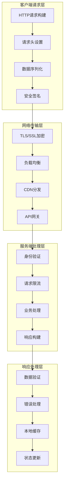

**API调用标准**:

- **统一端点**: 所有许可证相关操作通过统一的RESTful API端点
- **版本控制**: API版本控制确保向后兼容性和平滑升级
- **标准化格式**: JSON格式数据交换，统一的错误响应格式
- **安全传输**: 强制HTTPS传输，请求签名验证

### 4.2 数据交换格式标准

**请求/响应数据结构**:

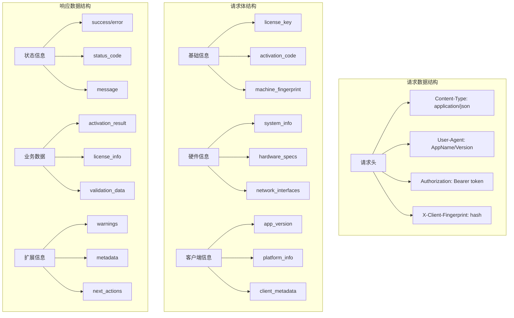

**数据标准化要求**:

- **字段命名**: 使用snake_case命名规范，保持一致性
- **数据类型**: 严格的数据类型定义，避免类型转换错误
- **必填字段**: 明确区分必填和可选字段，提供合理默认值
- **数据验证**: 客户端和服务端双重数据验证

### 4.3 错误处理和重试机制

**智能错误处理架构**:

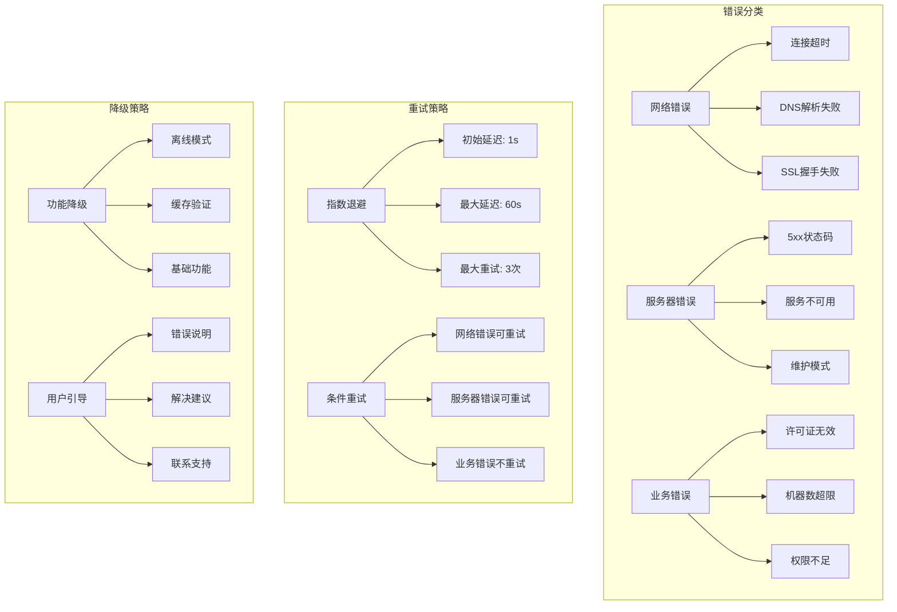

**重试机制设计**:

- **智能重试**: 根据错误类型和网络状况智能调整重试策略
- **退避算法**: 指数退避算法避免服务器压力，提高成功率
- **熔断保护**: 连续失败时启动熔断机制，保护系统稳定
- **用户反馈**: 实时反馈重试进度和状态，提升用户体验

## 5. 最佳实践和集成指南

### 5.1 开发集成最佳实践

**集成开发流程**:

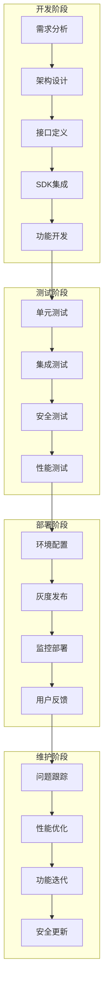

**开发规范要求**:

- **模块化设计**: 许可证功能模块化，便于集成和维护
- **接口抽象**: 定义清晰的接口，支持不同平台实现
- **异常处理**: 完善的异常处理机制，确保应用稳定性
- **日志记录**: 详细的操作日志，便于问题诊断和优化

### 5.2 性能优化策略

**性能优化架构**:

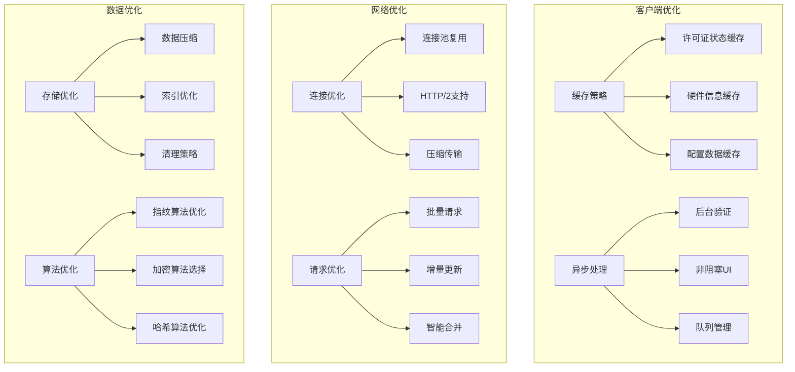

**性能监控指标**:

- **响应时间**: API调用响应时间监控和优化
- **成功率**: 许可证验证成功率统计和分析
- **资源使用**: CPU、内存使用率监控和优化
- **用户体验**: 界面响应速度和交互流畅度评估

### 5.3 安全集成规范

**安全集成检查清单**:

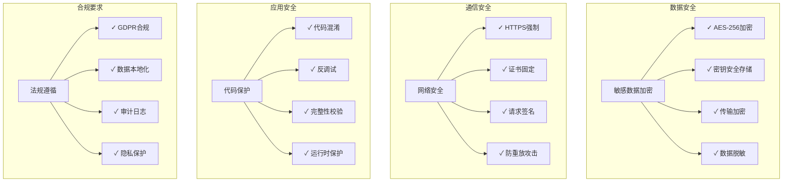

**安全实施要求**:

- **零信任架构**: 假设网络不安全，每次通信都需要验证
- **最小权限原则**: 应用只获取必要的系统权限和数据
- **深度防御**: 多层安全机制，单点失效不影响整体安全
- **持续监控**: 实时安全监控和威胁检测

## 6. 总结

本文档提供了机器绑定许可证系统的完整客户端集成架构设计，涵盖了从架构设计到具体实施的各个方面。通过模块化设计、多平台适配、安全集成和性能优化等策略，为开发者提供了构建稳定、安全、高效的许可证管理系统的指导框架。

**核心价值**:

- **架构清晰**: 分层架构设计，职责明确，易于维护和扩展
- **安全可靠**: 多重安全机制，保护用户数据和系统安全
- **用户友好**: 优秀的用户体验设计，简化操作流程
- **技术先进**: 采用现代化技术栈，支持未来技术演进

通过遵循本指南的架构设计和最佳实践，开发团队可以快速构建出符合企业级要求的许可证管理系统，为产品的商业化运营提供强有力的技术支撑.
