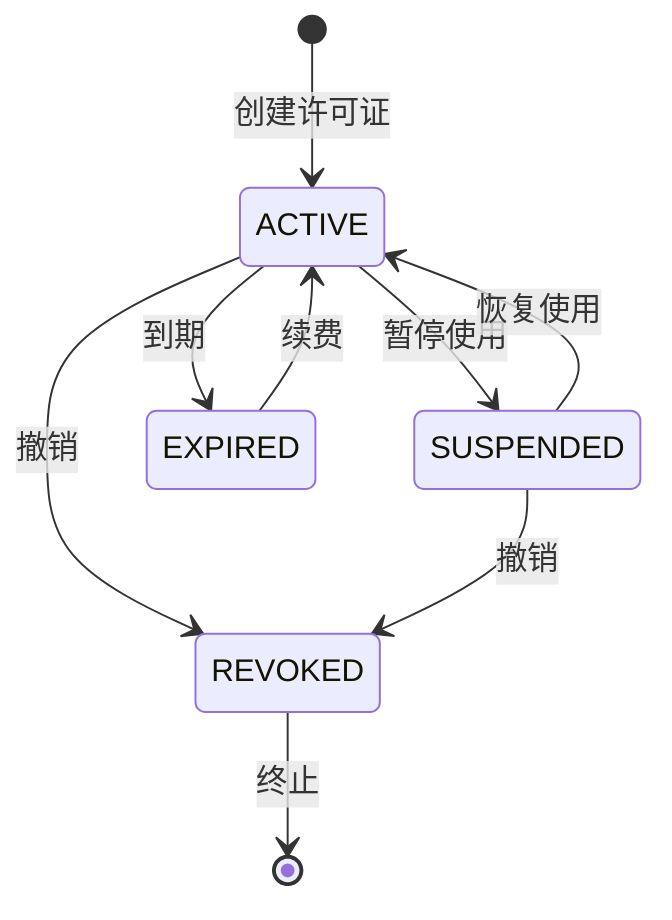
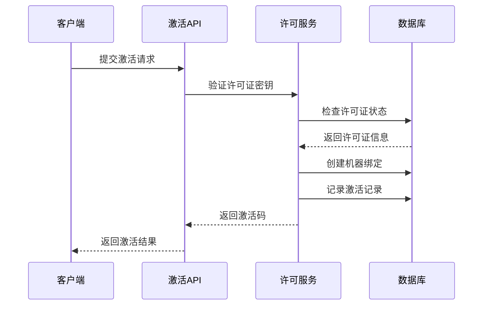

# 机器绑定许可证系统数据库设计

## 1. 数据库设计概述

机器绑定许可证系统数据库基于Django ORM设计，采用MySQL作为主数据库，完全继承现有系统的BaseModel架构。数据库设计遵循规范化原则，同时考虑性能优化和安全性要求，实现了完整的许可证生命周期数据管理。

### 1.1 设计核心原则

- **一致性原则**: 继承现有BaseModel设计模式，保持系统架构统一
- **安全性原则**: 敏感数据加密存储，关键操作完整审计
- **性能原则**: 合理索引设计，查询路径优化
- **扩展性原则**: 模块化表结构，支持业务功能扩展

## 2. 数据模型关系图

### 2.1 核心实体关系

```mermaid
erDiagram
    SoftwareProduct {
        bigint id PK
        bigint tenant_id FK
        string name
        string product_code
        string version
        text rsa_public_key
        text rsa_private_key
        int max_activations_per_license
        int offline_days_allowed
        boolean is_active
    }
    
    LicensePlan {
        bigint id PK
        bigint tenant_id FK
        bigint product_id FK
        string name
        string plan_code
        enum plan_type
        int max_machines
        int validity_days
        json features
        decimal price
        string currency
        boolean is_active
    }
    
    License {
        bigint id PK
        bigint tenant_id FK
        bigint product_id FK
        bigint plan_id FK
        string license_key UK
        string issued_to
        string customer_email
        int max_activations
        datetime expires_at
        enum status
        json metadata
    }
    
    MachineBinding {
        bigint id PK
        bigint license_id FK
        string machine_fingerprint UK
        json hardware_info
        string os_info
        enum status
        datetime bound_at
        datetime last_seen_at
    }
    
    LicenseActivation {
        bigint id PK
        bigint license_id FK
        bigint machine_binding_id FK
        string activation_code UK
        datetime activated_at
        datetime expires_at
        enum status
        json activation_data
    }
    
    SoftwareProduct ||--o{ LicensePlan : has
    SoftwareProduct ||--o{ License : belongs_to
    LicensePlan ||--o{ License : uses
    License ||--o{ MachineBinding : binds_to
    License ||--o{ LicenseActivation : activates
    MachineBinding ||--o{ LicenseActivation : creates
```

### 2.2 数据模型详细设计

系统采用8个核心数据表实现完整的许可证管理功能，每个表都继承BaseModel基础字段，支持软删除、审计字段和多租户隔离。

## 3. 数据表结构详解

### 3.1 软件产品管理

**SoftwareProduct 模型**负责管理软件产品的基础信息和RSA密钥对，是整个许可证系统的基础。每个产品包含唯一的产品代码、版本信息和加密密钥，支持多平台部署和多租户隔离。

**关键特性**:
- 租户级别的产品隔离和管理
- RSA密钥对的安全存储和管理
- 产品版本控制和状态管理
- 支持离线验证的天数配置

### 3.2 许可证计划体系

**LicensePlan 模型**定义了不同类型的许可证方案，包括试用版、标准版、专业版和企业版等。每个计划规定了激活限制、有效期、功能特性和价格策略。

**方案类型管理**:
- TRIAL: 试用版本，通常有时间和功能限制
- STANDARD: 标准版本，适合个人用户
- PROFESSIONAL: 专业版本，面向专业用户
- ENTERPRISE: 企业版本，提供高级功能和技术支持

### 3.3 许可证生命周期管理

**License 模型**是系统的核心，管理每个具体的许可证实例。每个许可证包含唯一的许可证密钥、客户信息、有效期和激活状态等信息。

**许可证状态流转**:

### 3.4 机器绑定与验证

**MachineBinding 模型**实现许可证与特定机器的绑定关系，通过硬件指纹技术确保许可证只能在授权设备上使用。

**硬件指纹组成**:
- CPU序列号和型号信息
- 主板BIOS标识
- 网卡MAC地址
- 操作系统唯一标识
- 组合SHA-256哈希生成唯一指纹

### 3.5 激活记录与审计

**LicenseActivation 模型**记录每次许可证激活操作的详细信息，提供完整的审计追踪和安全监控能力。

**激活验证流程**:

### 3.6 使用日志与监控

**LicenseUsageLog 模型**收集许可证使用情况的详细数据，支持业务分析、性能监控和异常检测。

**日志数据分类**:

- **访问日志**: 记录每次许可证验证请求
- **性能指标**: 响应时间、成功率统计
- **安全事件**: 异常激活、可疑行为检测
- **业务数据**: 功能使用情况、用户行为分析

### 3.7 租户配额与限制

**TenantLicenseQuota 模型**管理每个租户的许可证配额和使用限制，确保多租户环境下的资源隔离和公平使用。

**配额管理策略**:

- **产品级别配额**: 每个租户可创建的产品数量限制
- **许可证配额**: 每个产品的许可证发放上限
- **激活配额**: 同时激活的设备数量限制
- **存储配额**: 日志和数据存储空间限制

## 4. 数据库性能优化策略

### 4.1 索引设计原则

系统采用精心设计的索引策略，确保高频查询操作的最优性能：

**核心索引设计**:

- **唯一性约束**: 许可证密钥、机器指纹等关键字段的唯一性保证
- **复合索引**: 多字段组合查询的性能优化
- **时间范围索引**: 支持高效的时间范围查询
- **状态过滤索引**: 快速筛选活跃/过期许可证

### 4.2 分区策略

**使用日志分区设计**:

针对大量使用日志数据，系统采用按时间分区的策略，显著提升查询性能和数据管理效率。分区策略包括按月自动分区、历史数据归档和过期数据清理机制。

**分区优势**:

- **查询性能**: 时间范围查询只扫描相关分区
- **维护效率**: 独立的分区维护和优化
- **存储管理**: 历史数据归档和清理
- **并发性能**: 不同分区间的并行处理能力

### 4.3 缓存优化策略

**Redis缓存层设计**:

系统集成Redis作为高性能缓存层，有效减少数据库负载并提升响应速度。缓存策略包括许可证验证结果缓存、用户权限缓存、统计数据缓存和会话状态缓存。

**缓存数据类型**:

- **验证缓存**: 许可证激活状态和有效性检查结果
- **权限缓存**: 用户角色和权限信息
- **统计缓存**: 实时使用量和性能指标
- **会话缓存**: 用户登录状态和临时数据

### 4.4 数据一致性保证

**事务管理机制**:

系统在关键业务操作中使用数据库事务确保数据一致性，包括许可证激活、配额更新、状态变更等操作的原子性执行。
        
        系统在关键业务操作中使用数据库事务确保数据一致性，包括许可证激活、配额更新、状态变更等操作的原子性执行。
        
        ## 5. Django ORM集成设计
        
        ### 5.1 模型继承体系
        
        **LicenseBaseModel抽象基类**为所有许可证相关模型提供统一的基础功能，包括多租户支持、审计字段和软删除机制。
        
        ### 5.2 核心业务模型
        
        **SoftwareProduct模型特性**:
        
        - 支持多平台软件产品管理
        - RSA密钥对的安全存储和管理
        - 产品生命周期状态控制
        - 租户级别的数据隔离
        
        **LicensePlan模型设计**:
        
        - 灵活的许可证方案配置
        - 功能特性的JSON存储支持
        - 多层次的定价策略
        - 与产品的关联关系管理
        
        **License模型核心功能**:
        
        - 许可证密钥的生成和验证
        - 客户信息的安全存储
        - 激活状态的实时跟踪
        - 有效期管理和自动检查
        
        ## 6. 数据安全与合规
        
        ### 6.1 加密存储策略
        
        **敏感数据保护机制**:
        
        系统对关键敏感信息采用多层加密保护，确保数据安全性和隐私保护。绑定数据使用AES-256加密存储，私钥信息仅保存SHA-256哈希值，许可证密钥采用单向哈希算法优化查询性能。
        
        ### 6.2 数据完整性保障
        
        **约束机制设计**:
        
        - **外键约束**: 确保数据引用完整性和一致性
        - **唯一性约束**: 防止关键数据的重复创建
        - **检查约束**: 验证业务规则和数据有效性
        - **软删除保护**: 保留历史数据用于审计和恢复
        
        ## 7. 运维与监控支持
        
        ### 7.1 数据库维护策略
        
        **自动化维护机制**:
        
        系统设计包含完整的数据生命周期管理策略，支持历史数据自动归档、分区维护和性能监控。使用日志表采用按月分区策略，显著提升查询性能并简化数据管理复杂度。
        
        ### 7.2 性能监控指标
        
        **关键性能指标**:
        
        - **查询响应时间**: 许可证验证和激活操作的响应性能
        - **并发处理能力**: 系统在高负载下的稳定性表现
        - **存储空间利用**: 数据增长趋势和容量规划
        - **缓存命中率**: Redis缓存层的效率评估
        
        ## 8. 扩展性与兼容性
        
        ### 8.1 水平扩展支持
        
        系统数据库设计考虑了未来的扩展需求，支持读写分离、分库分表和多实例部署。关键业务表采用合理的分区策略，为大规模部署提供基础支撑。
        
        ### 8.2 向后兼容保证
        
        数据模型设计严格遵循现有系统的BaseModel模式，确保与现有多租户架构的无缝集成。所有表结构变更都通过Django迁移机制管理，保证数据一致性和系统稳定性。
        
        ---
        
        **设计总结**
        
        本数据库设计方案结合了现代软件许可证管理的最佳实践，在保证数据安全性的前提下，实现了高性能、高可用性和良好的扩展性。通过精心设计的索引策略、分区方案和缓存机制，系统能够支撑大规模的商业化应用场景，为企业级许可证管理提供可靠的数据基础。
