# 机器绑定许可证系统部署架构指南

## 概述

本文档阐述机器绑定许可证系统的企业级部署架构设计、环境拓扑规划、安全部署策略以及运维保障体系，为系统的高可用、高安全、可扩展部署提供全面指导。

## 1. 部署架构设计

### 1.1 整体部署拓扑

**多环境部署架构**:

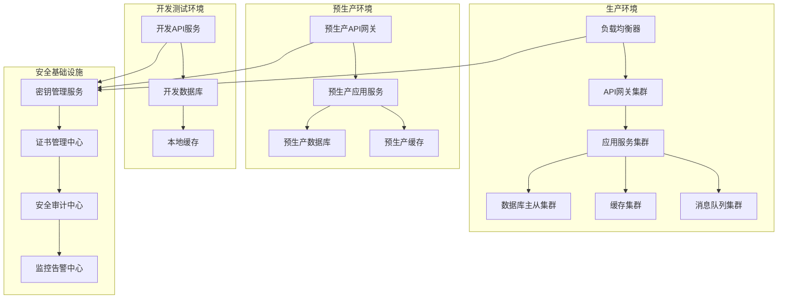

**环境隔离策略**:
- **网络隔离**: 不同环境使用独立的VPC和安全组，确保环境间网络隔离
- **数据隔离**: 各环境使用独立的数据库实例，避免数据污染和泄露风险  
- **服务隔离**: 应用服务、缓存、消息队列等均按环境独立部署
- **权限隔离**: 基于环境的访问控制策略，最小权限原则

### 1.2 服务层架构设计

**微服务部署模型**:

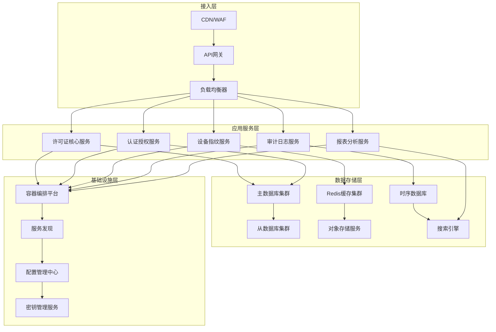

**部署单元设计**:
- **许可证核心服务**: 无状态设计，支持水平扩展，处理激活、验证等核心业务
- **认证授权服务**: 集成JWT和OAuth2.0，提供统一的身份认证和权限管理
- **设备指纹服务**: 专门处理硬件指纹识别和机器绑定逻辑
- **审计日志服务**: 异步处理审计事件，确保合规性和可追溯性
- **报表分析服务**: 处理业务统计和数据分析，支持决策支持

## 2. 容器化部署策略

### 2.1 Docker容器架构

**多阶段构建策略**:

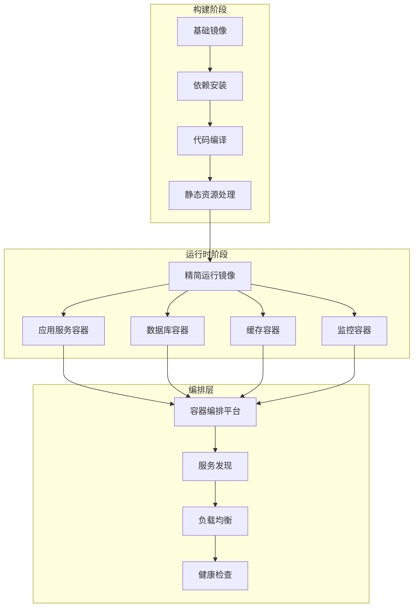

**容器化设计原则**:
- **镜像轻量化**: 采用Alpine Linux基础镜像，最小化镜像体积
- **多阶段构建**: 分离构建环境和运行环境，减少安全攻击面
- **无状态应用**: 应用容器设计为无状态，便于水平扩展和故障恢复
- **数据持久化**: 敏感数据和配置通过外部存储卷管理

### 2.2 Kubernetes部署架构

**K8s资源管理**:

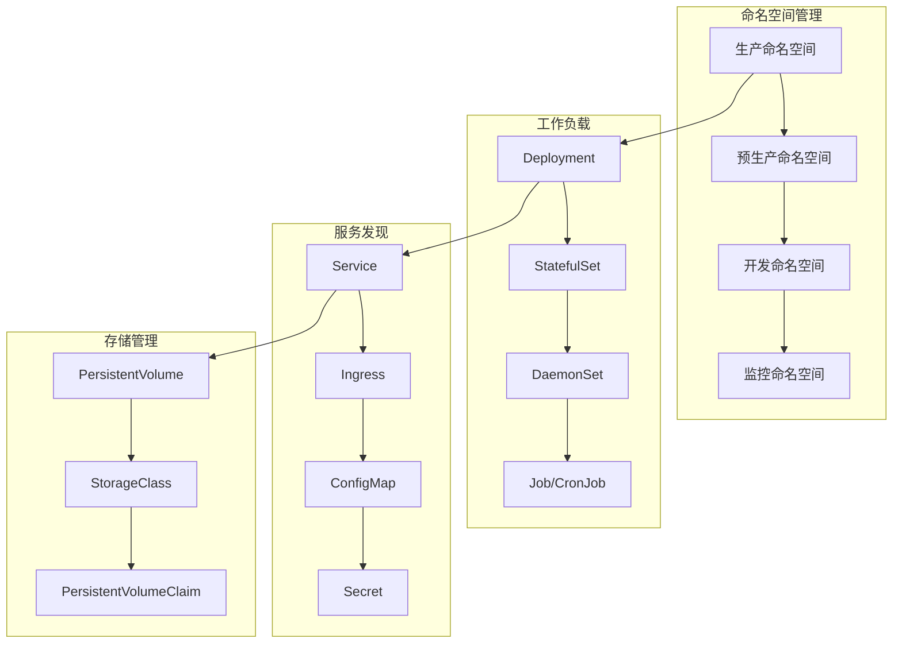

**资源配置策略**:
- **资源限制**: 为每个Pod设置合理的CPU和内存限制，防止资源耗尽
- **自动扩缩容**: 基于CPU、内存使用率的HPA配置，实现弹性扩展
- **滚动更新**: 零停机的滚动更新策略，确保服务连续性
- **健康检查**: 多层次健康检查机制，包括存活探针和就绪探针

### 2.3 数据层部署设计

**数据库集群架构**:

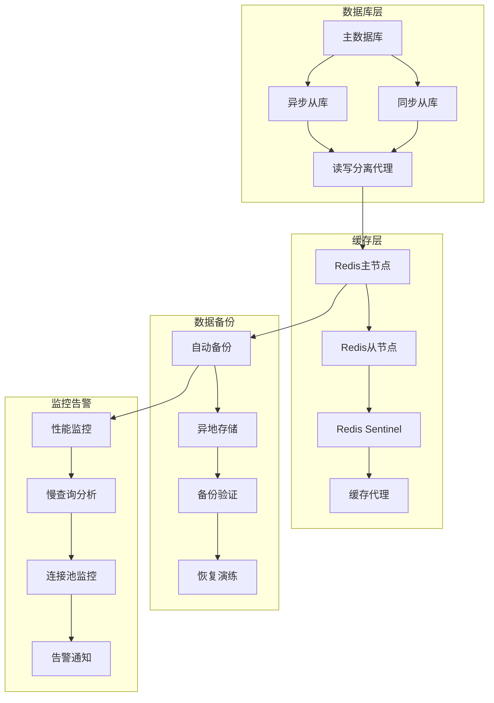

**数据安全策略**:
- **加密传输**: 所有数据库连接强制使用TLS加密
- **静态加密**: 数据库存储层面的透明数据加密(TDE)
- **访问控制**: 基于角色的细粒度数据库访问权限管理
- **审计日志**: 完整的数据库操作审计日志记录和分析

## 3. 安全部署架构

### 3.1 多层安全防护体系

**安全架构分层**:

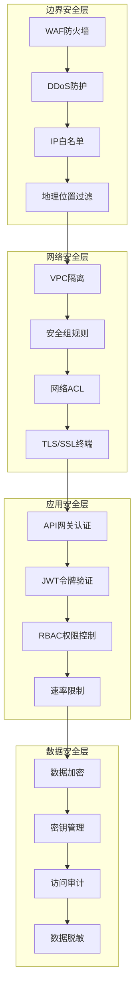

**安全控制策略**:
- **零信任架构**: 默认拒绝所有访问，基于身份和权限的细粒度授权
- **最小权限原则**: 应用和用户仅获得完成任务所需的最小权限
- **深度防御**: 多层安全控制，单点失效不影响整体安全性
- **持续监控**: 实时安全监控和异常检测，自动化安全响应

### 3.2 密钥管理与证书体系

**密钥管理架构**:

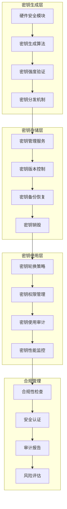

**证书管理策略**:
- **自动化证书管理**: 使用Let's Encrypt等自动化证书颁发和续期
- **证书透明度日志**: 监控证书颁发，防止恶意证书攻击
- **证书固定**: 应用层证书固定，防止中间人攻击
- **证书轮换**: 定期证书轮换和更新机制

### 3.3 访问控制与身份认证

**身份认证架构**:

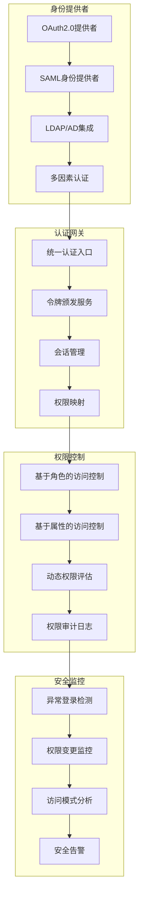

**访问控制策略**:
- **单点登录(SSO)**: 统一身份认证，简化用户体验同时增强安全性
- **多因素认证(MFA)**: 强制多因素认证，提高账户安全级别
- **会话管理**: 安全会话管理，包括会话超时和并发会话控制
- **权限最小化**: 基于业务需要的最小权限授权机制

## 4. 运维监控与自动化

### 4.1 全面监控体系架构

**监控系统架构**:

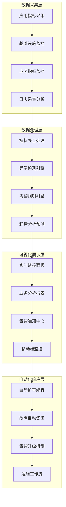

**监控覆盖范围**:
- **基础设施监控**: 服务器资源、网络状态、存储性能的全方位监控
- **应用性能监控**: API响应时间、吞吐量、错误率、可用性的实时监控
- **业务指标监控**: 许可证激活成功率、用户活跃度、收入指标的业务监控
- **安全监控**: 异常访问模式、安全事件、合规状态的安全监控

### 4.2 自动化运维架构

**CI/CD流水线架构**:

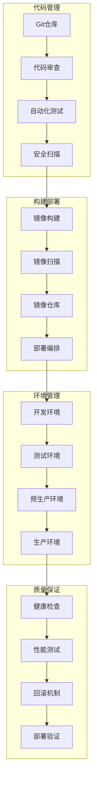

**自动化运维策略**:
- **基础设施即代码**: 使用Terraform等工具管理基础设施，确保环境一致性
- **配置管理自动化**: 使用Ansible等工具自动化配置管理和应用部署
- **监控告警自动化**: 自动化监控配置、告警规则管理和故障响应流程
- **容量管理自动化**: 基于历史数据和预测模型的自动容量规划和扩展

### 4.3 灾难恢复与业务连续性

**灾难恢复架构**:

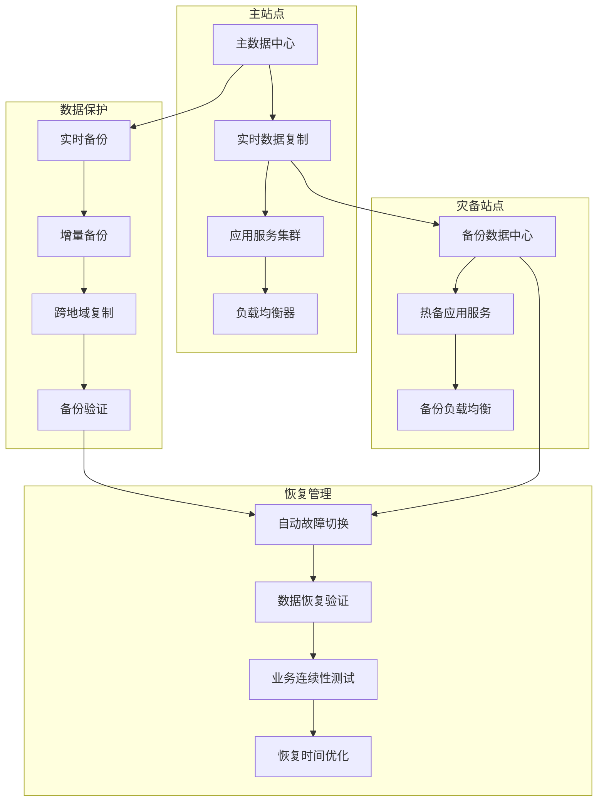

**灾难恢复策略**:
- **多地域部署**: 跨地域的服务部署，确保单点地域故障不影响业务连续性
- **自动化故障切换**: 基于健康检查的自动故障检测和切换机制
- **数据备份策略**: 多层次数据备份，包括实时备份、定时备份和异地备份
- **业务连续性计划**: 完善的灾难恢复预案和定期恢复演练

## 5. 性能优化与扩展策略

### 5.1 性能优化架构

**系统性能优化策略**:

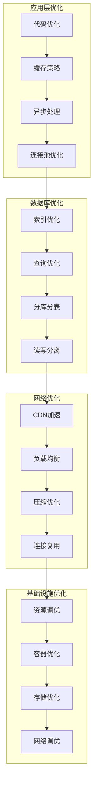

**性能优化重点**:
- **应用性能**: 代码层面的性能优化，包括算法优化、内存管理、并发处理
- **数据库性能**: 查询优化、索引策略、连接池配置、分区策略
- **网络性能**: CDN部署、负载均衡配置、压缩算法、连接优化
- **系统性能**: 操作系统参数调优、硬件资源配置、虚拟化优化

### 5.2 水平扩展架构

**可扩展性设计**:

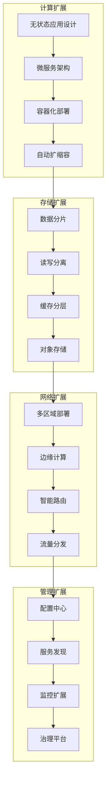

**扩展策略实施**:
- **水平扩展**: 支持节点的动态增减，应对业务增长和流量波动
- **垂直扩展**: 支持单节点资源的动态调整，优化资源利用率
- **地理扩展**: 支持多地域部署，提供就近服务和容灾能力
- **功能扩展**: 模块化架构设计，支持功能的快速迭代和扩展

### 5.3 成本优化策略

**成本控制架构**:

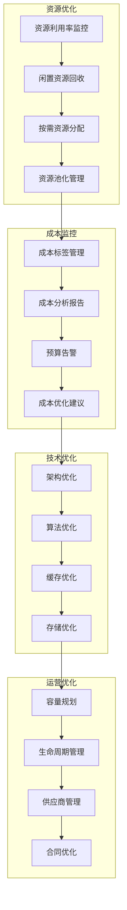

**成本优化措施**:
- **资源优化**: 提高资源利用率，减少资源浪费，优化资源配置
- **技术优化**: 通过技术手段降低系统资源消耗和运维成本
- **流程优化**: 优化运维流程，提高运维效率，降低人力成本
- **采购优化**: 优化云服务采购策略，选择最优的价格和服务组合

## 6. 合规与治理

### 6.1 合规管理体系

**合规治理架构**:

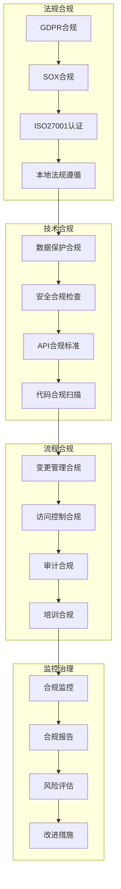

**合规实施策略**:
- **数据合规**: 确保数据处理、存储、传输符合相关法规要求
- **安全合规**: 建立符合行业标准的安全管理体系和技术措施
- **运营合规**: 建立标准化的运营流程和管理制度
- **审计合规**: 建立完善的审计跟踪和报告机制

### 6.2 质量保证体系

**质量管理框架**:

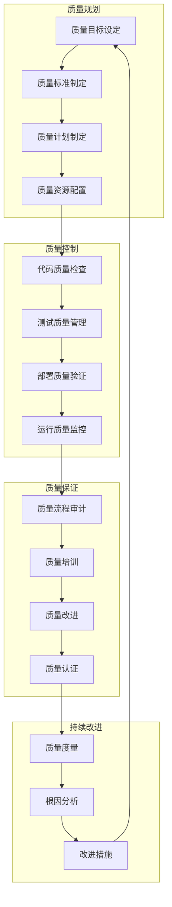

**质量保证措施**:
- **过程质量**: 建立标准化的开发、测试、部署流程
- **产品质量**: 通过多层次测试确保产品功能和性能质量
- **服务质量**: 建立服务质量标准和监控体系
- **管理质量**: 建立质量管理体系和持续改进机制

## 7. 总结

本部署架构指南基于企业级云原生部署理念，构建了完整的许可证系统部署体系。通过多层安全防护、容器化部署、自动化运维、全面监控等技术手段，确保系统的高可用、高安全、高性能运行。

**核心部署优势**:
- **架构先进**: 采用微服务、容器化、云原生架构，支持弹性扩展
- **安全可靠**: 多层安全防护体系，全面的安全监控和合规管理
- **高可用性**: 多地域部署、自动故障恢复、完善的灾备体系
- **运维智能**: 自动化运维、智能监控、预测性维护

**成功实施关键**:
- 严格按照架构设计和最佳实践进行部署
- 建立完善的监控告警和应急响应机制
- 持续优化性能和成本，确保系统可持续发展
- 保持技术栈的先进性和合规性

通过本指南的实施，将建立起业界领先的许可证管理系统部署架构，为业务发展提供坚实的技术保障。
