# 机器绑定许可证系统实施计划

## 1. 项目战略概览

### 1.1 业务目标与价值定位

**核心业务目标**:
构建企业级的软件许可证管理系统，为多租户SaaS平台提供安全可靠的软件授权服务。系统将无缝集成到现有Django架构中，为macOS软件产品提供完整的许可证生命周期管理能力。

**战略价值实现**:

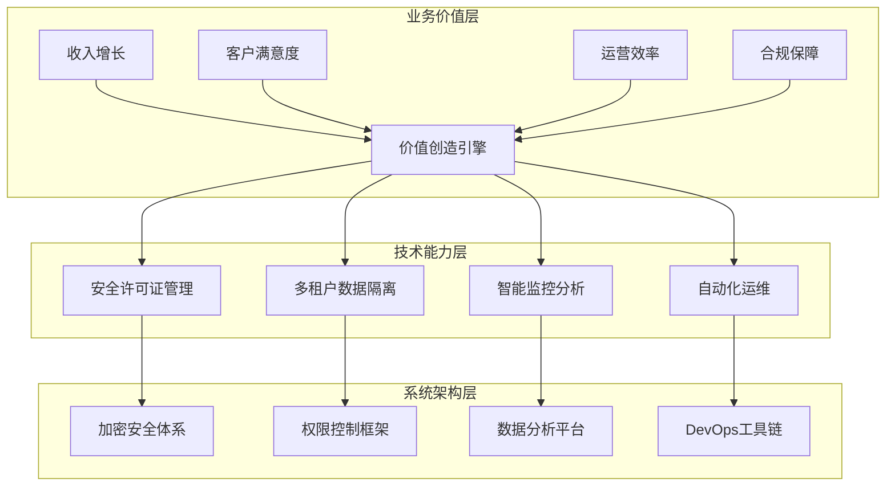
```mermaid
graph TB
    subgraph "业务价值层"
        A[收入增长] --> E[价值创造引擎]
        B[客户满意度] --> E
        C[运营效率] --> E
        D[合规保障] --> E
    end
    
    subgraph "技术能力层"
        E --> F[安全许可证管理]
        E --> G[多租户数据隔离]
        E --> H[智能监控分析]
        E --> I[自动化运维]
    end
    
    subgraph "系统架构层"
        F --> J[加密安全体系]
        G --> K[权限控制框架]
        H --> L[数据分析平台]
        I --> M[DevOps工具链]
    end
```

### 1.2 关键成功指标体系

**安全性指标**:
- 加密强度达到RSA-2048/AES-256标准
- 零许可证泄露事件
- 100%数字签名验证覆盖率
- 多层防护体系完整性验证

**可靠性指标**:
- 系统可用性≥99.9% (年停机时间<8.76小时)
- 灾难恢复能力RTO<4小时，RPO<15分钟
- 支持在线/离线双模式激活
- 故障自动检测和恢复机制

**性能指标**:
- 许可证激活响应时间P95<500ms
- 支持1000并发激活请求/分钟
- 验证请求响应时间P95<200ms
- 系统资源使用率<70%

**业务指标**:
- 与现有多租户系统100%兼容
- 支持unlimited租户和产品扩展
- 管理效率提升50%以上
- 客户集成时间缩短60%

### 1.3 项目范围边界管理

**核心功能范围**:

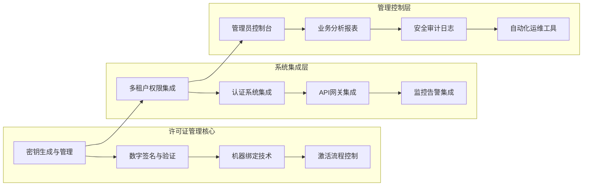
```mermaid
graph LR
    subgraph "许可证管理核心"
        A[密钥生成与管理] --> B[数字签名与验证]
        B --> C[机器绑定技术]
        C --> D[激活流程控制]
    end
    
    subgraph "系统集成层"
        E[多租户权限集成] --> F[认证系统集成]
        F --> G[API网关集成]
        G --> H[监控告警集成]
    end
    
    subgraph "管理控制层"
        I[管理员控制台] --> J[业务分析报表]
        J --> K[安全审计日志]
        K --> L[自动化运维工具]
    end
    
    A --> E
    E --> I
```

**明确排除范围**:
- macOS客户端SDK开发(由客户端团队负责)
- 支付系统集成(使用现有支付平台)
- 最终用户门户界面(使用现有客户平台)
- 第三方软件集成(通过API接口支持)

## 2. 分阶段实施战略

### 第一阶段：核心架构构建（2周）

**阶段目标**: 建立许可证系统的技术基础设施和核心业务模型，为后续功能开发奠定坚实基础。

#### 2.1 应用架构设计与实现

**架构设计原则**:

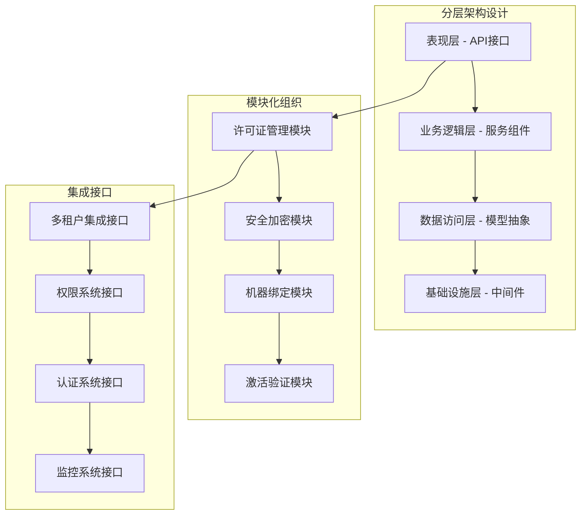
```mermaid
graph TB
    subgraph "分层架构设计"
        A[表现层 - API接口] --> B[业务逻辑层 - 服务组件]
        B --> C[数据访问层 - 模型抽象]
        C --> D[基础设施层 - 中间件]
    end
    
    subgraph "模块化组织"
        E[许可证管理模块] --> F[安全加密模块]
        F --> G[机器绑定模块]
        G --> H[激活验证模块]
    end
    
    subgraph "集成接口"
        I[多租户集成接口] --> J[权限系统接口]
        J --> K[认证系统接口]
        K --> L[监控系统接口]
    end
    
    A --> E
    E --> I
```

**组织结构策略**: 采用分层模块化的架构组织方式，每个模块具有明确的职责边界和接口定义。表现层专注于API接口设计，业务逻辑层实现核心业务规则，数据访问层提供统一的数据操作抽象，基础设施层提供横切关注点支持。

#### 2.2 领域模型设计与实现

**领域驱动设计应用**:

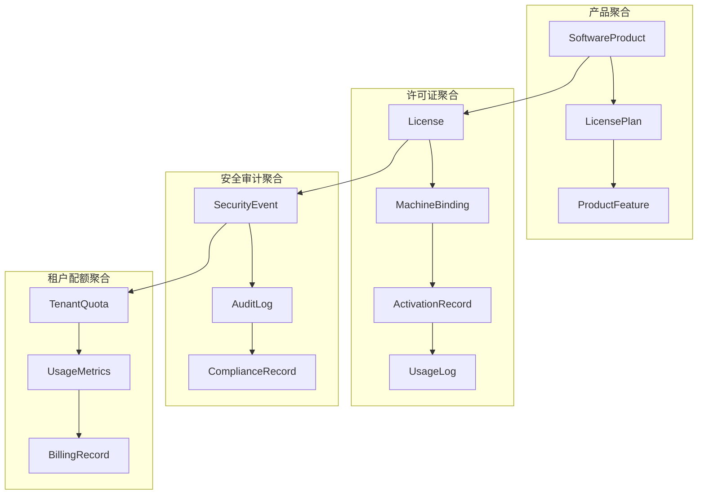
```mermaid
graph TB
    subgraph "产品聚合"
        A[SoftwareProduct] --> B[LicensePlan]
        B --> C[ProductFeature]
    end
    
    subgraph "许可证聚合"
        D[License] --> E[MachineBinding]
        E --> F[ActivationRecord]
        F --> G[UsageLog]
    end
    
    subgraph "安全审计聚合"
        H[SecurityEvent] --> I[AuditLog]
        I --> J[ComplianceRecord]
    end
    
    subgraph "租户配额聚合"
        K[TenantQuota] --> L[UsageMetrics]
        L --> M[BillingRecord]
    end
    
    A --> D
    D --> H
    H --> K
```

**数据一致性保障**: 通过聚合根模式确保业务规则的一致性，使用领域事件实现聚合间的解耦通信。每个聚合内部维护强一致性，聚合间通过最终一致性模式保证数据完整性。

#### 2.3 服务层架构设计

**业务服务分层策略**:

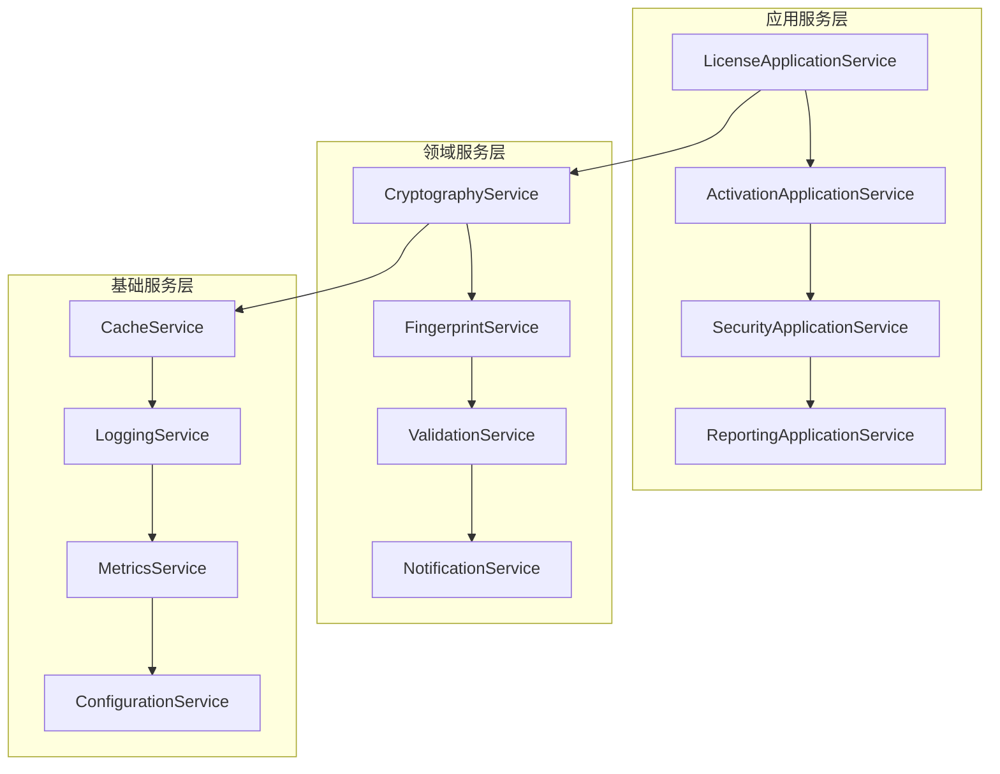
```mermaid
graph TB
    subgraph "应用服务层"
        A[LicenseApplicationService] --> B[ActivationApplicationService]
        B --> C[SecurityApplicationService]
        C --> D[ReportingApplicationService]
    end
    
    subgraph "领域服务层"
        E[CryptographyService] --> F[FingerprintService]
        F --> G[ValidationService]
        G --> H[NotificationService]
    end
    
    subgraph "基础服务层"
        I[CacheService] --> J[LoggingService]
        J --> K[MetricsService]
        K --> L[ConfigurationService]
    end
    
    A --> E
    E --> I
```

**服务协作模式**: 应用服务层编排业务流程，领域服务层实现核心业务逻辑，基础服务层提供技术能力支撑。服务间通过依赖注入实现松耦合，通过接口契约确保可测试性。

#### 2.4 安全中间件架构

**中间件处理管道**:

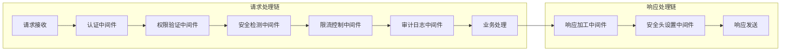
```mermaid
graph LR
    subgraph "请求处理链"
        A[请求接收] --> B[认证中间件]
        B --> C[权限验证中间件]
        C --> D[安全检测中间件]
        D --> E[限流控制中间件]
        E --> F[审计日志中间件]
        F --> G[业务处理]
    end
    
    subgraph "响应处理链"
        G --> H[响应加工中间件]
        H --> I[安全头设置中间件]
        I --> J[响应发送]
    end
```

**安全防护策略**: 通过多层次的中间件管道实现纵深防御，每个中间件专注于特定的安全关注点。认证中间件验证请求身份，权限中间件检查操作授权，安全检测中间件识别异常行为，限流中间件防止滥用攻击，审计中间件记录安全事件。

### 第二阶段：API接口架构设计（2周）

**阶段目标**: 构建完整的RESTful API生态系统，实现管理端和客户端的全面接口支持，确保API的可扩展性、安全性和易用性。

#### 2.1 管理平台API架构

**管理API设计理念**:

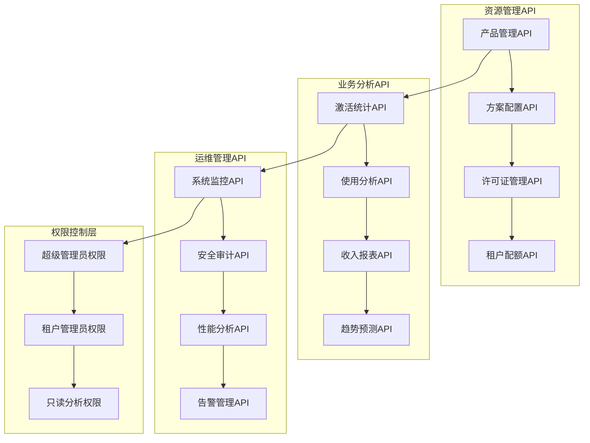
```mermaid
graph TB
    subgraph "资源管理API"
        A[产品管理API] --> B[方案配置API]
        B --> C[许可证管理API]
        C --> D[租户配额API]
    end
    
    subgraph "业务分析API"
        E[激活统计API] --> F[使用分析API]
        F --> G[收入报表API]
        G --> H[趋势预测API]
    end
    
    subgraph "运维管理API"
        I[系统监控API] --> J[安全审计API]
        J --> K[性能分析API]
        K --> L[告警管理API]
    end
    
    subgraph "权限控制层"
        M[超级管理员权限] --> N[租户管理员权限]
        N --> O[只读分析权限]
    end
    
    A --> E
    E --> I
    I --> M
```

**管理API特性**:
- **资源导向设计**: 每个业务实体对应独立的资源端点，支持完整的CRUD操作
- **批量操作支持**: 提供批量许可证生成、批量状态更新等高效操作接口
- **高级查询能力**: 支持复杂条件筛选、排序、分页和聚合查询
- **实时数据推送**: 通过WebSocket提供实时状态更新和监控数据推送

#### 2.2 客户端激活API架构

**激活流程API设计**:

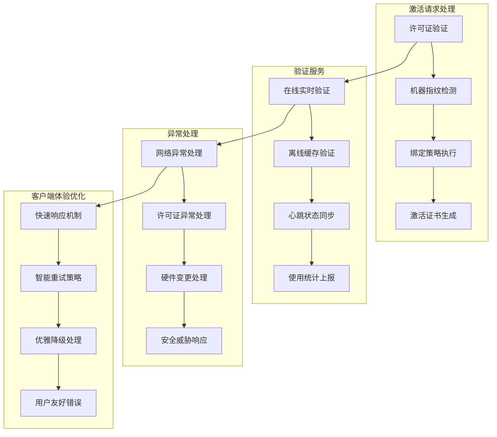
```mermaid
graph TB
    subgraph "激活请求处理"
        A[许可证验证] --> B[机器指纹检测]
        B --> C[绑定策略执行]
        C --> D[激活证书生成]
    end
    
    subgraph "验证服务"
        E[在线实时验证] --> F[离线缓存验证]
        F --> G[心跳状态同步]
        G --> H[使用统计上报]
    end
    
    subgraph "异常处理"
        I[网络异常处理] --> J[许可证异常处理]
        J --> K[硬件变更处理]
        K --> L[安全威胁响应]
    end
    
    A --> E
    E --> I
    
    subgraph "客户端体验优化"
        M[快速响应机制] --> N[智能重试策略]
        N --> O[优雅降级处理]
        O --> P[用户友好错误]
    end
    
    I --> M
```

**客户端API特性**:
- **高性能响应**: 激活请求P95响应时间<500ms，验证请求<200ms
- **离线支持**: 提供离线激活模式，支持3天离线宽限期
- **智能容错**: 自动处理网络异常、硬件变更和临时性错误
- **安全防护**: 请求签名验证、重放攻击防护、频率限制保护

#### 2.3 API治理与文档化

**API生命周期管理**:

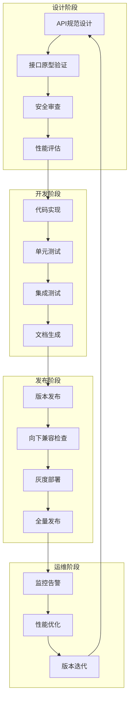
```mermaid
graph TB
    subgraph "设计阶段"
        A[API规范设计] --> B[接口原型验证]
        B --> C[安全审查]
        C --> D[性能评估]
    end
    
    subgraph "开发阶段"
        D --> E[代码实现]
        E --> F[单元测试]
        F --> G[集成测试]
        G --> H[文档生成]
    end
    
    subgraph "发布阶段"
        H --> I[版本发布]
        I --> J[向下兼容检查]
        J --> K[灰度部署]
        K --> L[全量发布]
    end
    
    subgraph "运维阶段"
        L --> M[监控告警]
        M --> N[性能优化]
        N --> O[版本迭代]
        O --> A
    end
```

**文档化策略**:
- **OpenAPI 3.0标准**: 使用drf-spectacular生成标准化API规范
- **交互式文档**: 提供Swagger UI和ReDoc双重文档界面
- **SDK生成支持**: 基于OpenAPI规范自动生成多语言客户端SDK
- **变更管理**: 完整的API变更记录和版本兼容性说明

### 第三阶段：企业级系统集成（1周）

**阶段目标**: 实现许可证系统与现有企业架构的深度集成，确保系统的安全性、可扩展性和运维友好性。

#### 3.1 权限控制系统集成架构

**多层权限集成策略**:

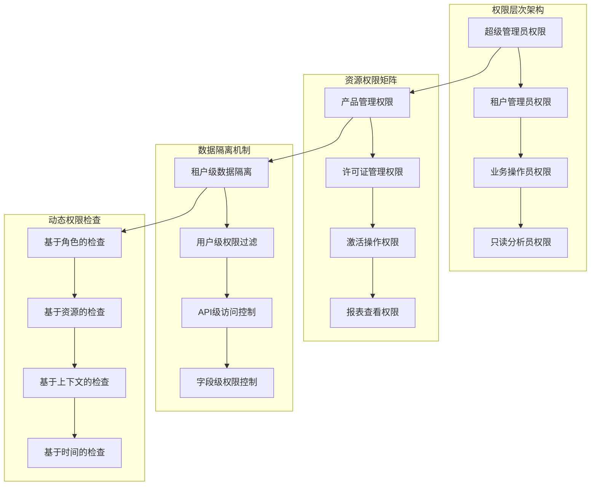
```mermaid
graph TB
    subgraph "权限层次架构"
        A[超级管理员权限] --> B[租户管理员权限]
        B --> C[业务操作员权限]
        C --> D[只读分析员权限]
    end
    
    subgraph "资源权限矩阵"
        E[产品管理权限] --> F[许可证管理权限]
        F --> G[激活操作权限]
        G --> H[报表查看权限]
    end
    
    subgraph "数据隔离机制"
        I[租户级数据隔离] --> J[用户级权限过滤]
        J --> K[API级访问控制]
        K --> L[字段级权限控制]
    end
    
    subgraph "动态权限检查"
        M[基于角色的检查] --> N[基于资源的检查]
        N --> O[基于上下文的检查]
        O --> P[基于时间的检查]
    end
    
    A --> E
    E --> I
    I --> M
```

**权限集成设计原则**:
- **最小权限原则**: 用户仅获得执行其职责所需的最低权限
- **职责分离**: 敏感操作需要多个权限组合才能完成
- **动态权限评估**: 基于用户角色、资源状态和业务上下文的实时权限计算
- **审计追踪**: 所有权限变更和权限检查都有完整的审计记录

#### 3.2 认证系统深度集成

**统一认证架构**:

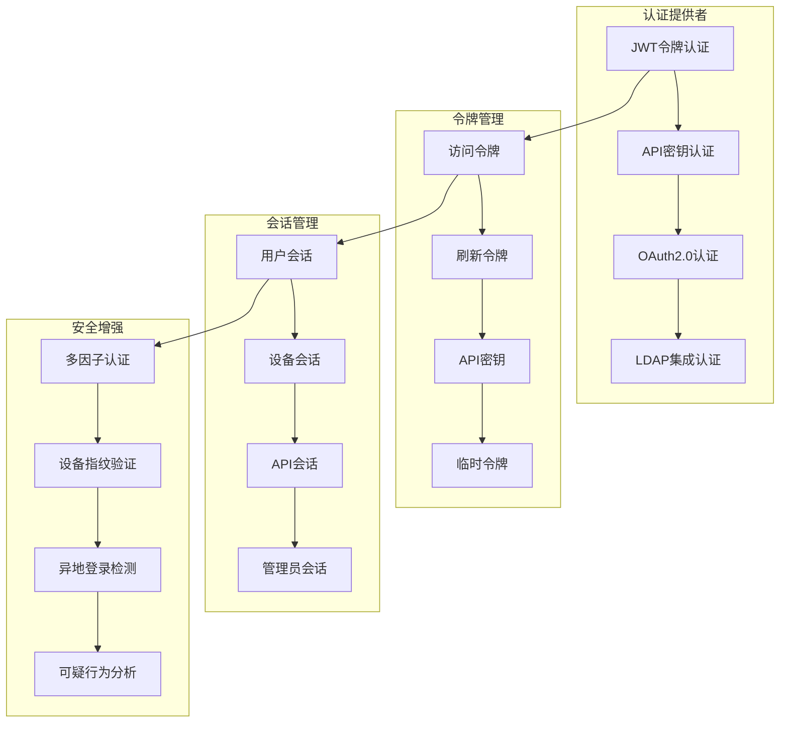
```mermaid
graph TB
    subgraph "认证提供者"
        A[JWT令牌认证] --> B[API密钥认证]
        B --> C[OAuth2.0认证]
        C --> D[LDAP集成认证]
    end
    
    subgraph "令牌管理"
        E[访问令牌] --> F[刷新令牌]
        F --> G[API密钥]
        G --> H[临时令牌]
    end
    
    subgraph "会话管理"
        I[用户会话] --> J[设备会话]
        J --> K[API会话]
        K --> L[管理员会话]
    end
    
    subgraph "安全增强"
        M[多因子认证] --> N[设备指纹验证]
        N --> O[异地登录检测]
        O --> P[可疑行为分析]
    end
    
    A --> E
    E --> I
    I --> M
```

**认证集成特性**:
- **多认证源支持**: 无缝集成JWT、OAuth2.0、LDAP等多种认证方式
- **令牌生命周期管理**: 支持访问令牌和刷新令牌的自动轮换和安全销毁
- **会话状态同步**: 跨服务的统一会话管理和状态同步机制
- **安全威胁防护**: 内置暴力破解防护、异常登录检测和账户锁定机制

#### 3.3 API网关与路由治理

**统一API网关架构**:

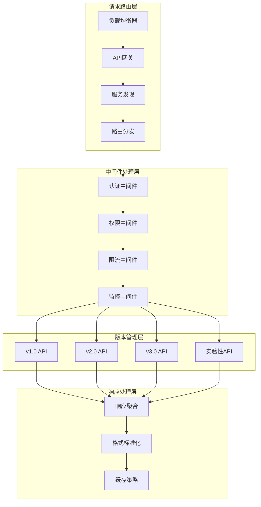
```mermaid
graph TB
    subgraph "请求路由层"
        A[负载均衡器] --> B[API网关]
        B --> C[服务发现]
        C --> D[路由分发]
    end
    
    subgraph "中间件处理层"
        D --> E[认证中间件]
        E --> F[权限中间件]
        F --> G[限流中间件]
        G --> H[监控中间件]
    end
    
    subgraph "版本管理层"
        H --> I[v1.0 API]
        H --> J[v2.0 API]
        H --> K[v3.0 API]
        H --> L[实验性API]
    end
    
    subgraph "响应处理层"
        I --> M[响应聚合]
        J --> M
        K --> M
        L --> M
        M --> N[格式标准化]
        N --> O[缓存策略]
    end
```

**路由治理策略**:
- **版本化管理**: 支持多版本API并存，平滑版本迁移和兼容性保证
- **智能路由**: 基于负载、延迟和健康状态的智能请求分发
- **灰度发布**: 支持基于用户、地理位置或随机比例的灰度发布策略
- **熔断保护**: 自动检测服务异常并实施熔断保护，防止级联故障

### 第四阶段：全面质量保证体系（2周）

**阶段目标**: 建立企业级的质量保证体系，通过多层次测试策略确保系统的可靠性、安全性和性能指标达成。

#### 4.1 测试金字塔策略实施

**分层测试架构**:

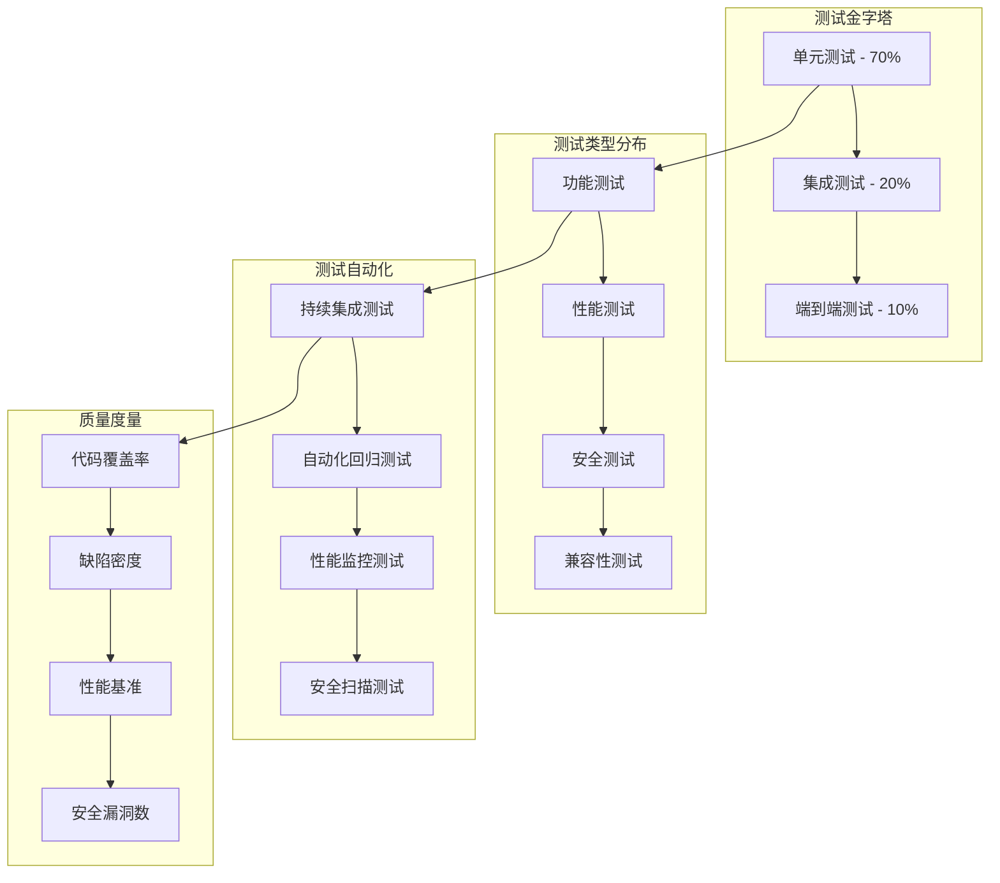
```mermaid
graph TB
    subgraph "测试金字塔"
        A[单元测试 - 70%] --> B[集成测试 - 20%]
        B --> C[端到端测试 - 10%]
    end
    
    subgraph "测试类型分布"
        D[功能测试] --> E[性能测试]
        E --> F[安全测试]
        F --> G[兼容性测试]
    end
    
    subgraph "测试自动化"
        H[持续集成测试] --> I[自动化回归测试]
        I --> J[性能监控测试]
        J --> K[安全扫描测试]
    end
    
    subgraph "质量度量"
        L[代码覆盖率] --> M[缺陷密度]
        M --> N[性能基准]
        N --> O[安全漏洞数]
    end
    
    A --> D
    D --> H
    H --> L
```

**测试策略重点**:
- **单元测试优先**: 70%的测试投入在单元测试层面，确保每个组件的独立正确性
- **集成测试覆盖**: 20%投入验证系统间的交互和数据流正确性
- **端到端测试验证**: 10%投入关键业务流程的完整性验证
- **持续质量监控**: 建立实时的质量度量体系和自动化反馈机制

#### 4.2 性能与可靠性测试架构

**性能测试体系**:

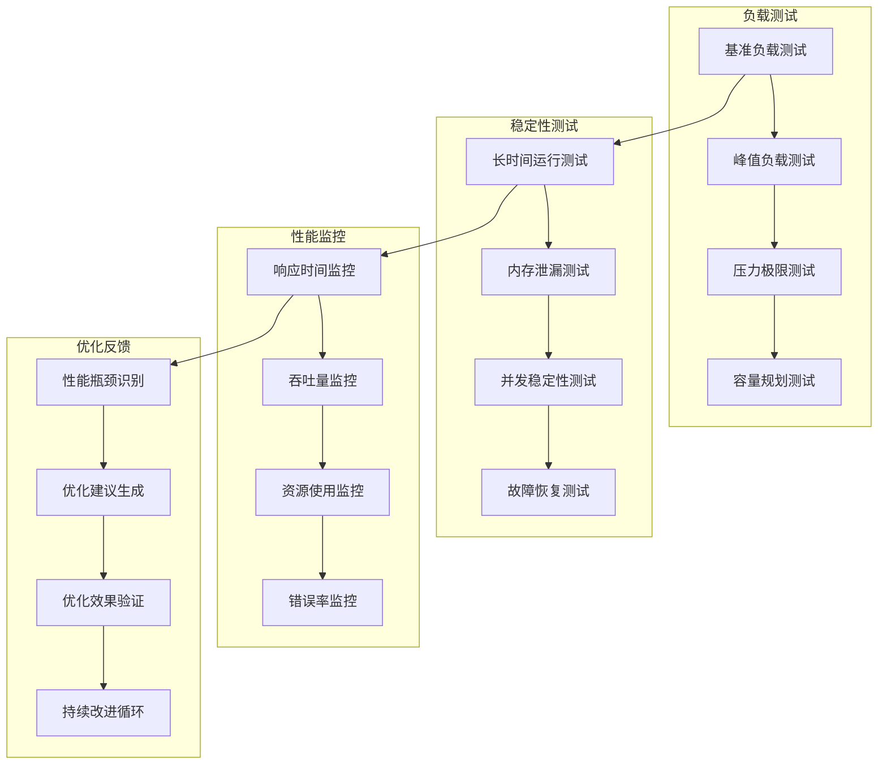
```mermaid
graph TB
    subgraph "负载测试"
        A[基准负载测试] --> B[峰值负载测试]
        B --> C[压力极限测试]
        C --> D[容量规划测试]
    end
    
    subgraph "稳定性测试"
        E[长时间运行测试] --> F[内存泄漏测试]
        F --> G[并发稳定性测试]
        G --> H[故障恢复测试]
    end
    
    subgraph "性能监控"
        I[响应时间监控] --> J[吞吐量监控]
        J --> K[资源使用监控]
        K --> L[错误率监控]
    end
    
    subgraph "优化反馈"
        M[性能瓶颈识别] --> N[优化建议生成]
        N --> O[优化效果验证]
        O --> P[持续改进循环]
    end
    
    A --> E
    E --> I
    I --> M
```

**性能测试指标体系**:
- **响应时间目标**: 激活API P95<500ms，验证API P95<200ms
- **并发处理能力**: 支持1000/分钟激活并发，10000/分钟验证并发
- **系统稳定性**: 7x24小时连续运行，故障恢复时间<5分钟
- **资源使用效率**: CPU使用率<70%，内存使用<4GB，数据库连接<50

#### 4.3 安全测试与合规验证

**全方位安全测试架构**:

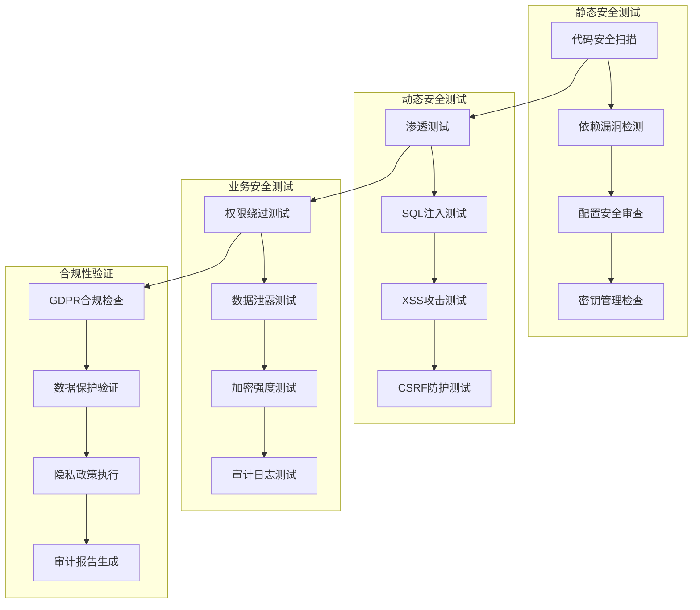
```mermaid
graph TB
    subgraph "静态安全测试"
        A[代码安全扫描] --> B[依赖漏洞检测]
        B --> C[配置安全审查]
        C --> D[密钥管理检查]
    end
    
    subgraph "动态安全测试"
        E[渗透测试] --> F[SQL注入测试]
        F --> G[XSS攻击测试]
        G --> H[CSRF防护测试]
    end
    
    subgraph "业务安全测试"
        I[权限绕过测试] --> J[数据泄露测试]
        J --> K[加密强度测试]
        K --> L[审计日志测试]
    end
    
    subgraph "合规性验证"
        M[GDPR合规检查] --> N[数据保护验证]
        N --> O[隐私政策执行]
        O --> P[审计报告生成]
    end
    
    A --> E
    E --> I
    I --> M
```

**安全测试覆盖范围**:
- **威胁建模验证**: 针对识别的安全威胁进行专项测试验证
- **加密算法测试**: RSA-2048和AES-256加密实现的正确性和安全性验证
- **认证授权测试**: 多租户环境下的权限隔离和访问控制有效性
- **数据保护测试**: 敏感数据的加密存储、传输和处理合规性验证

### 第五阶段：生产部署与上线（1周）

**阶段目标**: 实现零停机的生产部署，建立完善的运维监控体系，确保系统的高可用性和可观测性。

#### 5.1 云原生部署架构

**容器化部署策略**:

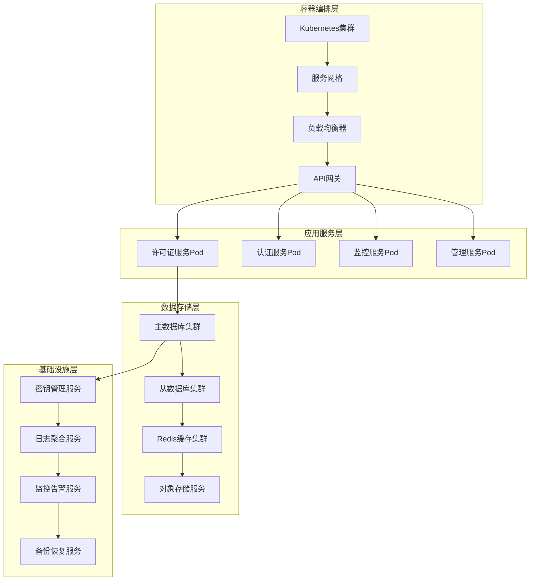
```mermaid
graph TB
    subgraph "容器编排层"
        A[Kubernetes集群] --> B[服务网格]
        B --> C[负载均衡器]
        C --> D[API网关]
    end
    
    subgraph "应用服务层"
        D --> E[许可证服务Pod]
        D --> F[认证服务Pod]
        D --> G[监控服务Pod]
        D --> H[管理服务Pod]
    end
    
    subgraph "数据存储层"
        I[主数据库集群] --> J[从数据库集群]
        J --> K[Redis缓存集群]
        K --> L[对象存储服务]
    end
    
    subgraph "基础设施层"
        M[密钥管理服务] --> N[日志聚合服务]
        N --> O[监控告警服务]
        O --> P[备份恢复服务]
    end
    
    E --> I
    I --> M
```

**部署策略特性**:
- **蓝绿部署**: 实现零停机部署，支持快速回滚和故障恢复
- **滚动更新**: 渐进式服务更新，确保服务连续性和稳定性
- **健康检查**: 多层次健康检查机制，自动故障检测和实例替换
- **弹性伸缩**: 基于负载和资源使用情况的自动扩缩容机制

#### 5.2 数据层部署与治理

**数据库高可用架构**:

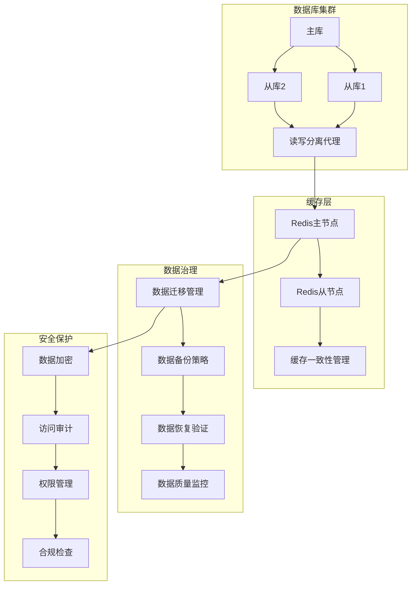
```mermaid
graph TB
    subgraph "数据库集群"
        A[主库] --> B[从库1]
        A --> C[从库2]
        B --> D[读写分离代理]
        C --> D
    end
    
    subgraph "缓存层"
        E[Redis主节点] --> F[Redis从节点]
        F --> G[缓存一致性管理]
    end
    
    subgraph "数据治理"
        H[数据迁移管理] --> I[数据备份策略]
        I --> J[数据恢复验证]
        J --> K[数据质量监控]
    end
    
    subgraph "安全保护"
        L[数据加密] --> M[访问审计]
        M --> N[权限管理]
        N --> O[合规检查]
    end
    
    D --> E
    E --> H
    H --> L
```

**数据管理策略**:
- **读写分离**: 主库负责写操作，从库承担读负载，提升系统整体性能
- **自动备份**: 全量备份+增量备份策略，RTO<4小时，RPO<15分钟
- **数据加密**: 静态数据加密+传输加密，符合GDPR等合规要求
- **灾难恢复**: 跨地域数据复制，支持异地容灾和快速切换

#### 5.3 运维监控与告警体系

**全栈监控架构**:

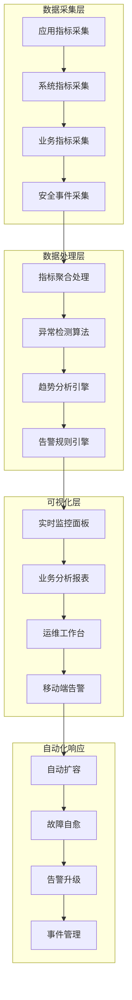
```mermaid
graph TB
    subgraph "数据采集层"
        A[应用指标采集] --> B[系统指标采集]
        B --> C[业务指标采集]
        C --> D[安全事件采集]
    end
    
    subgraph "数据处理层"
        D --> E[指标聚合处理]
        E --> F[异常检测算法]
        F --> G[趋势分析引擎]
        G --> H[告警规则引擎]
    end
    
    subgraph "可视化层"
        H --> I[实时监控面板]
        I --> J[业务分析报表]
        J --> K[运维工作台]
        K --> L[移动端告警]
    end
    
    subgraph "自动化响应"
        L --> M[自动扩容]
        M --> N[故障自愈]
        N --> O[告警升级]
        O --> P[事件管理]
    end
```

**监控维度覆盖**:
- **基础设施监控**: CPU、内存、网络、存储等资源使用情况
- **应用性能监控**: 响应时间、吞吐量、错误率、可用性指标
- **业务指标监控**: 激活成功率、许可证使用统计、收入相关指标
- **安全监控**: 异常访问、安全事件、合规状态、审计日志分析

## 6. 风险管理与缓解策略

### 6.1 技术风险管控

**风险识别与评估框架**:

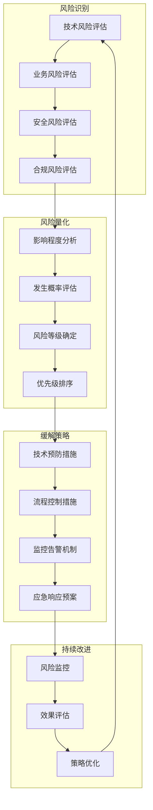
```mermaid
graph TB
    subgraph "风险识别"
        A[技术风险评估] --> B[业务风险评估]
        B --> C[安全风险评估]
        C --> D[合规风险评估]
    end
    
    subgraph "风险量化"
        D --> E[影响程度分析]
        E --> F[发生概率评估]
        F --> G[风险等级确定]
        G --> H[优先级排序]
    end
    
    subgraph "缓解策略"
        H --> I[技术预防措施]
        I --> J[流程控制措施]
        J --> K[监控告警机制]
        K --> L[应急响应预案]
    end
    
    subgraph "持续改进"
        L --> M[风险监控]
        M --> N[效果评估]
        N --> O[策略优化]
        O --> A
    end
```

**关键风险控制点**:

- **技术债务风险**: 采用模块化架构设计，定期技术重构，建立代码质量门禁
- **性能风险**: 建立性能基准测试，实施渐进式性能优化，预留系统扩容能力  
- **安全风险**: 多层安全防护体系，定期安全审计，漏洞管理流程
- **集成风险**: API版本控制策略，向后兼容性保证，灰度发布机制

### 6.2 项目交付保障

**质量保证体系**:

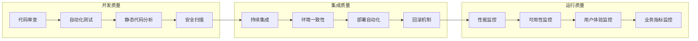
```mermaid
graph LR
    subgraph "开发质量"
        A[代码审查] --> B[自动化测试]
        B --> C[静态代码分析]
        C --> D[安全扫描]
    end
    
    subgraph "集成质量"
        D --> E[持续集成]
        E --> F[环境一致性]
        F --> G[部署自动化]
        G --> H[回滚机制]
    end
    
    subgraph "运行质量"
        H --> I[性能监控]
        I --> J[可用性监控]
        J --> K[用户体验监控]
        K --> L[业务指标监控]
    end
```

**交付里程碑控制**:
- **阶段性验收**: 每个实施阶段完成后进行功能验收和质量评估
- **端到端测试**: 集成测试完成后进行完整业务流程验证  
- **性能基准**: 达到预定性能指标后方可进入下一阶段
- **安全合规**: 通过安全审计和合规检查后方可生产部署

## 7. 项目成功标准与价值实现

### 7.1 技术成功指标

**系统性能指标**:
- API响应时间: P95 < 200ms, P99 < 500ms
- 系统可用性: 99.9%以上，年度停机时间<8.76小时
- 并发处理能力: 支持1000+并发激活请求
- 数据一致性: 零数据丢失，强一致性保证

**安全合规指标**:
- 安全事件响应时间: 关键事件<15分钟，一般事件<1小时
- 数据加密覆盖率: 100%敏感数据加密存储和传输
- 审计日志完整性: 100%关键操作审计追踪
- 合规认证通过率: GDPR、SOX、ISO27001等主要合规要求

### 7.2 业务价值实现

**直接业务价值**:
- **许可证管理效率提升**: 自动化激活流程，减少90%人工干预
- **防盗版能力增强**: 机器绑定+加密验证，盗版检测准确率>95%
- **客户体验优化**: 一键激活，激活成功率>99%，用户满意度显著提升
- **运营成本降低**: 减少30%客服工作量，降低许可证争议处理成本

**长期战略价值**:
- **技术资产积累**: 建立企业级许可证管理平台，可复用于多个产品线
- **数据洞察能力**: 用户行为分析，产品使用统计，为产品策略提供数据支撑
- **生态系统扩展**: 开放API接口，支持第三方集成，构建合作伙伴生态
- **市场竞争优势**: 专业化许可证管理能力，提升产品差异化竞争力

### 7.3 可持续发展策略

**技术演进路径**:

```mermaid
graph TB
    subgraph "当前阶段"
        A[基础许可证管理] --> B[机器绑定验证]
        B --> C[多租户支持]
        C --> D[API标准化]
    end
    
    subgraph "近期发展"
        D --> E[智能分析平台]
        E --> F[移动端支持]
        F --> G[云原生架构]
        G --> H[国际化支持]
    end
    
    subgraph "长期愿景"
        H --> I[AI驱动的风控]
        I --> J[区块链版权保护]
        J --> K[生态系统平台]
        K --> L[智能合约授权]
    end
```

**持续优化机制**:
- **技术创新**: 跟踪前沿技术，定期技术架构升级和优化
- **用户反馈**: 建立用户反馈收集和处理机制，持续改进用户体验
- **市场适应**: 根据市场变化和竞争态势，调整产品策略和技术路线
- **团队成长**: 建立技术知识库，培养团队技术能力，确保项目可持续发展

## 8. 总结

本实施计划基于架构优先、安全至上、用户体验和业务价值导向的设计理念，通过分阶段、模块化的实施策略，构建企业级机器绑定许可证管理系统。

**核心价值主张**:
- **技术先进性**: 采用现代化技术栈，微服务架构，云原生部署
- **安全可靠性**: 多层安全防护，加密算法保护，合规审计追踪  
- **扩展灵活性**: 多租户架构，API标准化，支持快速业务扩展
- **运维友好性**: 自动化部署，全面监控，智能告警和故障自愈

**成功关键因素**:
- 严格的质量管控和测试验证流程
- 全面的安全设计和合规保障机制
- 渐进式部署和持续优化策略
- 跨职能团队协作和知识共享文化

通过本实施计划的执行，将建立起具有行业领先水平的许可证管理平台，为企业的数字化转型和业务发展提供强有力的技术支撑。
PyJWT>=2.4.0
redis>=4.3.0
celery>=5.2.0
psycopg2-binary>=2.9.0
```

### 3.2 数据库配置
```sql
-- 生产数据库配置
-- MySQL 8.0+ 或 PostgreSQL 13+
-- 连接池: 20-50 连接
-- 事务隔离级别: READ_COMMITTED
-- 字符集: utf8mb4
-- 时区: UTC
```

### 3.3 缓存策略
```python
# Redis配置
CACHES = {
    'default': {
        'BACKEND': 'django_redis.cache.RedisCache',
        'LOCATION': 'redis://127.0.0.1:6379/1',
        'OPTIONS': {
            'CLIENT_CLASS': 'django_redis.client.DefaultClient',
        }
    }
}

# 缓存使用场景
1. 许可证验证结果缓存 (TTL: 5分钟)
2. 机器指纹缓存 (TTL: 1小时)  
3. API频率限制计数器 (TTL: 1小时)
4. 用户权限缓存 (TTL: 30分钟)
```

### 3.4 异步任务处理
```python
# Celery任务配置
CELERY_BROKER_URL = 'redis://localhost:6379/0'
CELERY_RESULT_BACKEND = 'redis://localhost:6379/0'

# 异步任务类型
1. 许可证密钥生成
2. 大批量许可证创建
3. 使用日志统计分析
4. 安全报告生成
5. 数据清理和归档
```

## 4. 风险管理与应对

### 4.1 技术风险
| 风险类型 | 风险等级 | 影响描述 | 应对措施 |
|---------|---------|---------|---------|
| 加密算法实现错误 | 高 | 安全漏洞，许可证被破解 | 使用成熟加密库，代码审查，安全测试 |
| 性能瓶颈 | 中 | 激活延迟，用户体验差 | 压力测试，缓存优化，异步处理 |
| 数据库迁移失败 | 中 | 数据丢失，服务中断 | 备份策略，灰度迁移，回滚方案 |
| 第三方依赖漏洞 | 中 | 安全风险 | 定期更新，漏洞扫描，安全监控 |

### 4.2 业务风险
| 风险类型 | 风险等级 | 影响描述 | 应对措施 |
|---------|---------|---------|---------|
| 需求变更 | 中 | 开发延期，成本增加 | 敏捷开发，分阶段交付，需求冻结 |
| 人员流失 | 中 | 进度延迟，知识断层 | 文档完善，知识分享，备份人员 |
| 测试不充分 | 高 | 生产故障，用户投诉 | 完整测试计划，自动化测试，QA评审 |

### 4.3 安全风险
| 风险类型 | 风险等级 | 影响描述 | 应对措施 |
|---------|---------|---------|---------|
| 密钥泄露 | 高 | 系统被完全破解 | 密钥轮换，HSM存储，访问控制 |
| DDoS攻击 | 中 | 服务不可用 | 限流保护，CDN防护，监控告警 |
| 内部威胁 | 中 | 数据泄露，权限滥用 | 权限最小化，操作审计，行为监控 |

## 5. 质量保证措施

### 5.1 代码质量控制
```python
# 代码规范
1. PEP 8 Python编码规范
2. Django最佳实践
3. RESTful API设计规范
4. 安全编码指南

# 代码审查流程
1. 功能实现审查
2. 安全代码审查  
3. 性能影响评估
4. 文档完整性检查
```

### 5.2 测试覆盖率要求
```bash
# 测试覆盖率指标
- 单元测试覆盖率: ≥ 90%
- 集成测试覆盖率: ≥ 80%
- API测试覆盖率: 100%
- 安全测试覆盖率: 100%

# 测试自动化
- 提交时自动运行单元测试
- 构建时自动运行集成测试
- 部署前自动运行全量测试
```

### 5.3 性能基准测试
```python
# 性能指标要求
1. API响应时间
   - 激活接口: < 500ms (95%ile)
   - 验证接口: < 200ms (95%ile)
   - 查询接口: < 100ms (95%ile)

2. 并发处理能力
   - 激活并发: 1000 req/min
   - 验证并发: 10000 req/min
   - 系统并发用户: 1000

3. 资源使用限制
   - CPU使用率: < 70%
   - 内存使用: < 4GB
   - 数据库连接: < 50
```

## 6. 监控与运维

### 6.1 监控指标定义
```python
# 业务监控指标  
1. 许可证激活成功率
2. 激活响应时间分布
3. 机器绑定数量统计
4. 异常激活检测次数
5. API调用量统计

# 技术监控指标
1. 服务可用性
2. 响应时间监控
3. 错误率统计
4. 系统资源使用
5. 数据库性能
```

### 6.2 日志管理策略
```python
# 日志级别配置
LOGGING_CONFIG = {
    'version': 1,
    'disable_existing_loggers': False,
    'handlers': {
        'security_file': {
            'level': 'INFO',
            'class': 'logging.handlers.RotatingFileHandler',
            'filename': 'logs/security.log',
            'maxBytes': 1024*1024*50,  # 50MB
            'backupCount': 10,
        },
        'business_file': {
            'level': 'INFO', 
            'class': 'logging.handlers.RotatingFileHandler',
            'filename': 'logs/business.log',
            'maxBytes': 1024*1024*50,
            'backupCount': 10,
        }
    },
    'loggers': {
        'licenses.security': {
            'handlers': ['security_file'],
            'level': 'INFO',
            'propagate': False,
        },
        'licenses.business': {
            'handlers': ['business_file'],
            'level': 'INFO', 
            'propagate': False,
        }
    }
}
```

### 6.3 备份与恢复策略
```bash
# 数据备份计划
1. 全量备份: 每日凌晨2点
2. 增量备份: 每4小时
3. 事务日志备份: 每15分钟
4. 备份保留期: 30天

# 恢复测试
- 月度恢复演练
- RTO目标: < 4小时  
- RPO目标: < 15分钟
```

## 7. 交付物清单

### 7.1 代码交付物
```
licenses/                    # Django应用代码
├── models.py               # 数据模型定义
├── serializers.py          # API序列化器
├── views/                  # API视图实现
├── services/               # 业务服务层
├── utils/                  # 工具函数
├── middleware/             # 中间件
├── management/commands/    # 管理命令
├── tests/                  # 测试代码
└── fixtures/               # 初始数据

docs/                       # 文档目录
├── api_documentation.html  # API文档
├── deployment_guide.md     # 部署指南
├── user_manual.md          # 用户手册
└── troubleshooting.md      # 故障排除

scripts/                    # 部署脚本
├── deploy.sh              # 部署脚本
├── backup.sh              # 备份脚本
└── monitor.sh             # 监控脚本
```

### 7.2 配置文件
```python
# 配置文件清单
1. settings/production.py   # 生产环境配置
2. docker-compose.yml       # Docker编排配置
3. nginx.conf              # Web服务器配置
4. requirements.txt        # Python依赖
5. .env.example           # 环境变量模板
```

### 7.3 测试报告
```
tests/reports/
├── unit_test_report.html      # 单元测试报告
├── integration_test_report.html # 集成测试报告
├── security_test_report.pdf   # 安全测试报告
├── performance_test_report.pdf # 性能测试报告
└── coverage_report.html       # 代码覆盖率报告
```

## 8. 项目时间线总览

```mermaid
gantt
    title 机器绑定注册码系统实施时间线
    dateFormat  YYYY-MM-DD
    section 第一阶段：基础架构
    Django应用创建      :done, app, 2024-01-01, 2d
    数据库模型实现      :done, models, 2024-01-03, 3d
    核心服务开发        :active, services, 2024-01-06, 5d
    安全中间件开发      :middleware, 2024-01-11, 4d
    section 第二阶段：API开发
    管理员API实现       :admin-api, 2024-01-15, 4d
    激活API实现         :activation-api, 2024-01-19, 3d
    API文档生成         :api-docs, 2024-01-22, 7d
    section 第三阶段：系统集成
    权限系统集成        :permissions, 2024-01-29, 3d
    认证系统集成        :auth, 2024-02-01, 2d
    URL路由配置         :routes, 2024-02-03, 2d
    section 第四阶段：测试QA
    单元测试开发        :unit-tests, 2024-02-05, 5d
    集成测试            :integration-tests, 2024-02-10, 4d
    安全测试            :security-tests, 2024-02-14, 5d
    section 第五阶段：部署上线
    生产环境配置        :prod-config, 2024-02-19, 3d
    数据库部署          :db-deploy, 2024-02-22, 2d
    服务部署上线        :deploy, 2024-02-24, 2d
```

**项目总工期: 8周 (56个工作日)**  
**关键里程碑:**
- 第2周末: 基础架构完成
- 第4周末: API开发完成  
- 第5周末: 系统集成完成
- 第7周末: 测试验证完成
- 第8周末: 生产部署完成

---

*实施计划制定时间: 2024-09-05*  
*计划制定原则: 系统化、可执行、风险可控*
