# 机器绑定许可证系统安全策略

## 1. 威胁模型与安全哲学

### 1.1 系统威胁分析

基于零信任安全架构理念，机器绑定许可证系统面临多维度的安全威胁。我们采用纵深防御策略，建立多层安全防护体系来应对这些威胁。

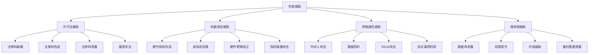

### 1.2 安全设计原则

**深度防护原则**:

系统采用多层安全防护机制，确保即使某一层防护被突破，其他层级仍能提供有效保护。每一层都有独立的安全控制措施，形成完整的安全防护链条。

**零信任架构**:

系统不信任任何内部或外部的请求，所有访问都需要经过身份验证、授权和持续验证。即使是来自内部网络的请求也需要完整的安全验证流程。

**最小权限原则**:

每个用户、服务和系统组件都只被授予完成其功能所需的最小权限集合。权限分配遵循业务需要原则，定期审查和调整权限配置。

**安全可观测性**:

系统具备全面的安全监控和审计能力，能够实时检测异常行为，记录所有安全相关事件，为安全分析和事件响应提供数据支撑。

## 2. 多层安全防护架构

### 2.1 加密安全层设计

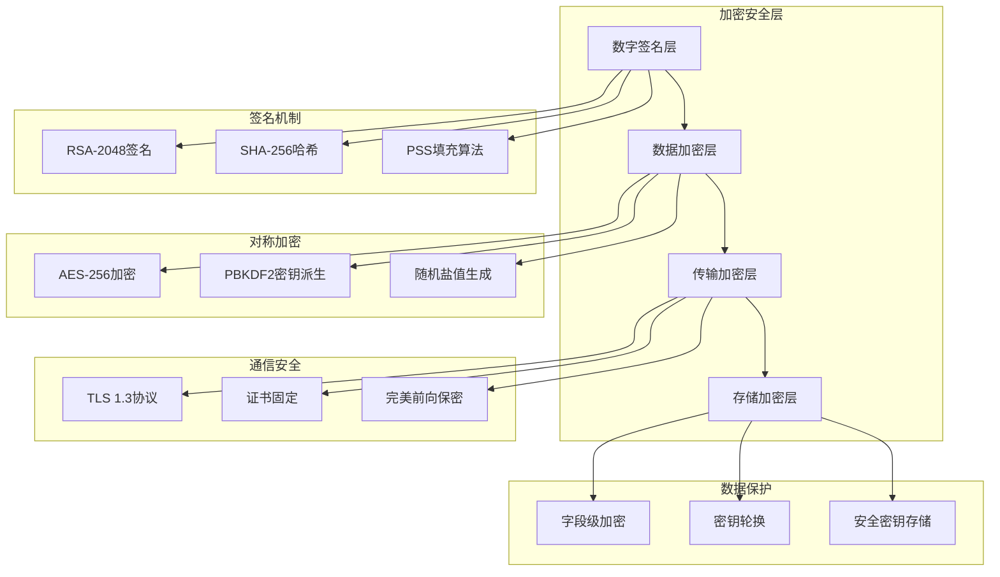

**非对称加密体系**:

系统采用RSA-2048非对称加密算法作为数字签名的核心技术。每个软件产品都拥有独立的密钥对，私钥用于签名许可证数据，公钥用于客户端验证。签名算法使用PSS填充方案和SHA-256哈希算法，确保签名的安全性和不可伪造性。

**对称加密机制**:

敏感的机器绑定数据采用AES-256对称加密算法进行保护。密钥通过PBKDF2算法从主密码派生生成，使用随机盐值增加密钥的唯一性和安全性。加密过程确保即使数据库被泄露，攻击者也无法直接获取明文的机器信息。

**密钥管理策略**:

系统实施严格的密钥生命周期管理，包括密钥生成、分发、存储、轮换和销毁的全过程安全控制。私钥采用硬件安全模块（HSM）或云密钥管理服务进行安全存储，确保密钥不会被非法访问或泄露。

### 2.2 机器指纹安全体系

**多维度硬件特征采集**:

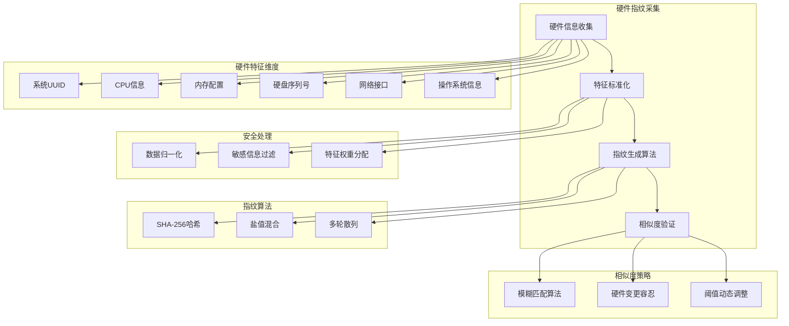

系统采用多维度硬件特征采集策略，通过收集系统UUID、CPU品牌架构、内存配置、硬盘序列号、网络接口信息和操作系统版本等关键硬件特征，构建设备的唯一标识。每个维度的特征都经过标准化处理和权重分配，确保指纹的稳定性和唯一性。

**智能指纹生成算法**:

指纹生成过程采用多阶段哈希算法，结合随机盐值和多轮散列处理，生成128位的设备指纹。算法设计考虑了硬件升级和配置变更的场景，通过特征权重和相似度阈值的动态调整，实现对正常硬件变更的容忍，同时保持对恶意克隆的敏感检测。

**自适应相似度验证**:

系统实施自适应的指纹相似度验证机制，根据硬件类型和变更频率动态调整匹配阈值。对于内存、外设等易变硬件采用较低的权重，对于CPU、主板等核心硬件采用较高的权重。当检测到可疑的指纹变化时，系统会触发额外的验证流程。

### 2.3 许可证生成安全架构

**多层许可证保护机制**:

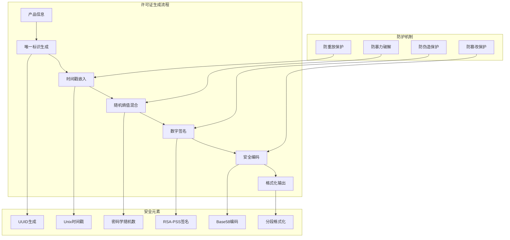

系统采用多层安全机制生成不可伪造的许可证密钥。每个许可证都包含产品标识、方案信息、唯一ID、时间戳和随机因子等核心元素，确保许可证的唯一性和可追溯性。生成过程结合了密码学安全随机数生成器和高强度数字签名算法。

**抗攻击设计策略**:

许可证格式设计充分考虑了各种攻击场景的防护需求。通过嵌入时间戳防止重放攻击，使用高熵随机因子防止暴力破解，采用RSA-PSS签名防止伪造，使用Base58编码提升用户友好性的同时保持安全性。格式版本化设计支持未来的安全升级需求。

**验证机制完整性**:

许可证验证过程实施严格的安全检查流程，包括签名验证、时间戳检查、格式校验和完整性检查。验证算法采用常量时间比较防止时序攻击，通过多重校验确保许可证的真实性和有效性。

### 2.4 网络通信安全架构

**传输层安全保护**:

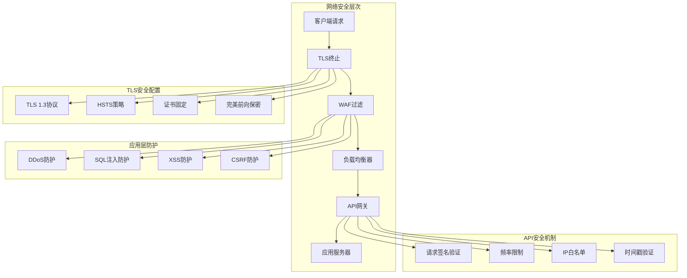

系统采用多层网络安全防护架构，从传输层到应用层实施全面的安全控制。所有通信强制使用TLS 1.3协议加密，配置HSTS策略防止协议降级攻击，实施证书固定防止中间人攻击。Web应用防火墙提供实时的攻击检测和防护能力。

**API请求安全验证**:

敏感API端点实施严格的请求签名验证机制，每个请求都需要包含时间戳、随机数和基于HMAC的签名。验证过程检查请求的完整性、时效性和来源可信度，防止重放攻击和请求篡改。系统还实施智能频率限制和异常行为检测。

**网络隔离与监控**:

生产环境实施严格的网络隔离策略，将数据库、应用服务器和管理接口部署在不同的安全区域。所有网络流量都经过实时监控和日志记录，异常流量会触发自动化的安全响应机制。

## 3. 身份认证与访问控制架构

### 3.1 分层权限管理体系

**基于角色的访问控制（RBAC）**:

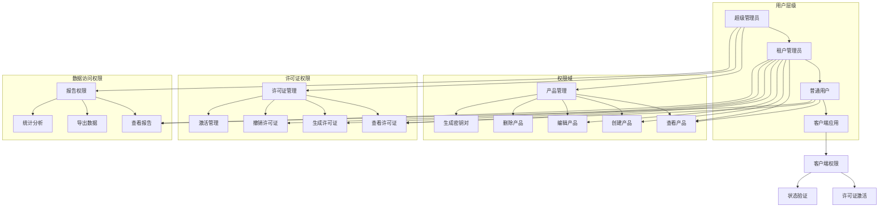

系统实施多层次的权限管理架构，基于RBAC模型设计了细粒度的权限控制体系。权限分为产品管理、许可证管理、激活管理和数据访问四个主要域，每个域下包含具体的操作权限。用户根据角色获得相应的权限集合，确保权限分配的最小化和职责分离。

**动态权限验证机制**:

系统在每次API调用时都会进行实时的权限验证，不仅检查用户是否具备操作权限，还会验证操作对象是否在用户的访问范围内。权限验证采用装饰器模式和中间件模式相结合的方式，确保所有安全检查点都得到有效覆盖。

### 3.2 多租户安全隔离架构

**租户数据完全隔离**:

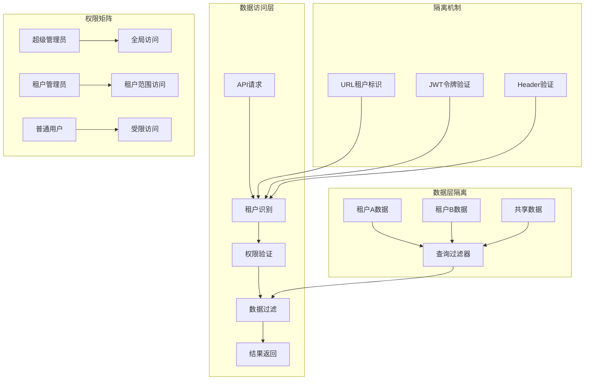

多租户架构采用严格的数据隔离策略，确保不同租户之间的数据完全隔离。每个数据库查询都会自动添加租户过滤条件，防止跨租户的数据访问。系统还实施了租户级别的资源配额管理，确保资源的公平分配和安全隔离。

**租户级安全策略**:

不同租户可以配置独立的安全策略，包括密码策略、会话超时、IP访问限制和API调用频率限制。这种灵活的安全策略配置满足了不同租户的安全需求，同时保持了系统的统一管理和监控能力。

## 4. 数据安全与隐私保护架构

### 4.1 分层数据保护策略

**数据分类与保护等级**:

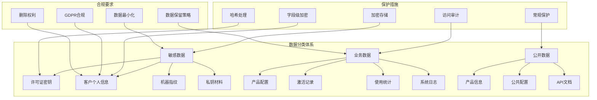

系统根据数据的敏感程度和业务重要性实施分级保护策略。敏感数据包括许可证密钥、客户个人信息和机器指纹等，采用强加密和严格访问控制；业务数据实施标准安全措施和审计跟踪；公开数据采用基础安全防护。

**静态数据加密体系**:

所有存储的敏感数据都经过字段级加密处理，采用AES-256算法和独立的加密密钥。许可证密钥使用单向哈希算法存储，确保原始密钥无法从数据库中恢复。客户信息采用可逆加密，支持业务需要的同时保护隐私安全。

### 4.2 数据库安全防护机制

**连接层安全配置**:

数据库连接全面启用SSL/TLS加密，使用双向证书认证确保连接的可信性。数据库服务器配置严格的防火墙规则，仅允许授权的应用服务器访问。连接池采用加密连接字符串和定期连接健康检查。

**查询安全与监控**:

所有数据库操作都经过参数化查询处理，防止SQL注入攻击。系统实施查询性能监控和异常检测，识别潜在的数据泄露尝试。数据库审计日志记录所有敏感数据的访问操作，支持安全事件的追溯分析。

**数据备份与恢复安全**:

数据备份采用加密存储和异地保管策略，备份文件使用独立的加密密钥保护。恢复过程实施严格的身份验证和授权检查，确保只有授权人员才能执行敏感数据的恢复操作。

## 5. 智能安全监控与响应架构

### 5.1 实时异常检测系统

**多维度行为分析引擎**:

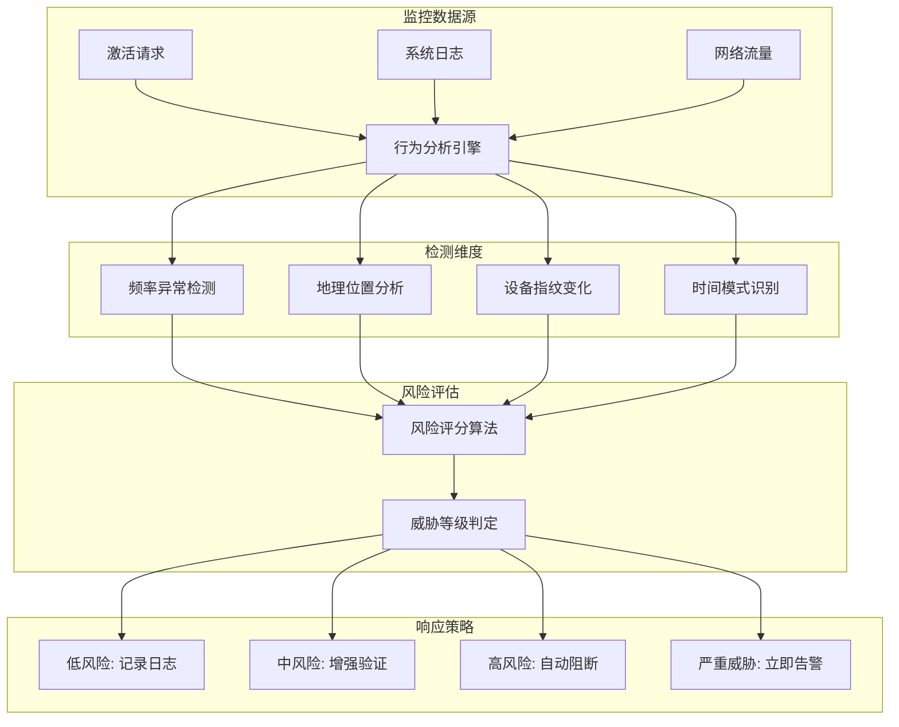

系统构建了多维度的实时行为分析引擎，通过机器学习算法识别异常的激活模式。检测维度包括激活频率分析、地理位置异常检测、设备指纹变化监控和时间模式识别。每个维度都有独立的阈值设定和权重分配，综合计算威胁评分。

**智能威胁识别算法**:

行为分析引擎采用基线学习和异常检测算法，能够自动识别偏离正常模式的行为。系统会学习每个许可证的正常使用模式，包括激活时间、地理位置分布和设备类型，当检测到显著偏离基线的行为时会触发安全警报。

### 5.2 自适应安全响应机制

**分级响应策略**:

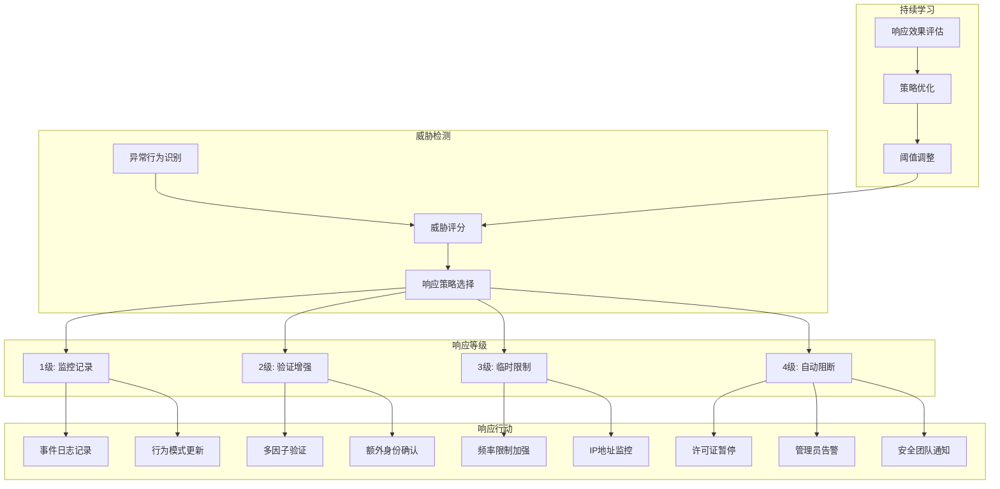

系统实施分级的自动化响应策略，根据威胁等级采取相应的防护措施。低等级威胁进行监控和记录，中等级威胁增强验证流程，高等级威胁实施访问限制，严重威胁触发自动阻断和人工介入。

**机器学习驱动的策略优化**:

安全响应系统具备自我学习和优化能力，通过分析历史安全事件和响应效果，持续优化检测阈值和响应策略。系统能够区分正常的业务波动和真正的安全威胁，减少误报并提高检测准确性。

## 6. 安全运维与管理框架

### 6.1 生产环境安全架构

**分层安全配置体系**:

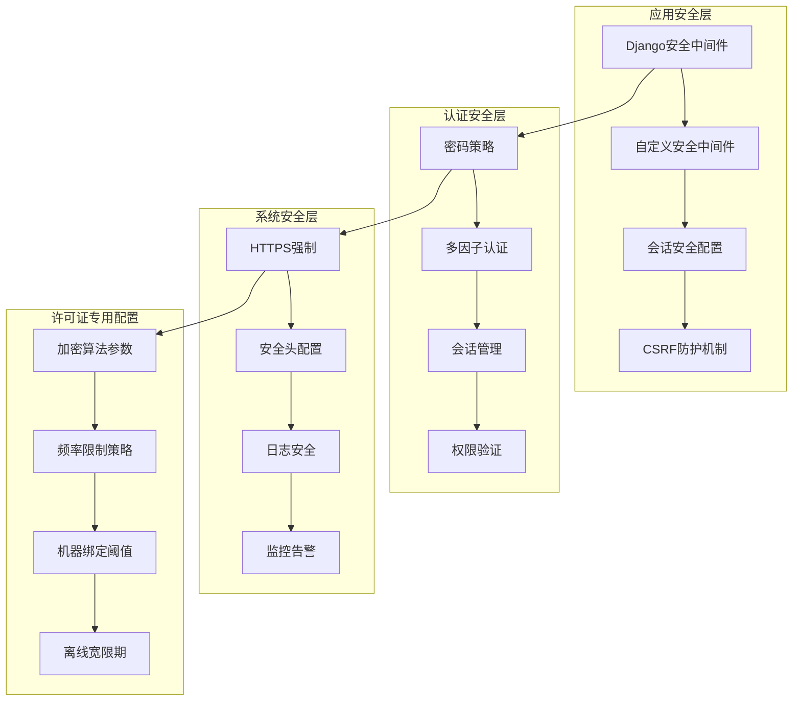

生产环境采用分层的安全配置架构，每一层都有独立的安全策略和配置参数。应用层实施Django内置的安全防护和自定义安全中间件；认证层配置强密码策略和会话安全；系统层强制HTTPS和安全头配置；许可证专用层定义了加密参数和业务规则。

**安全配置管理策略**:

所有安全配置都采用环境变量和配置文件分离的方式管理，敏感配置信息通过密钥管理服务获取。配置变更需要经过安全审查和测试验证，生产环境的配置更新采用蓝绿部署方式，确保配置变更的安全性和可回滚性。

### 6.2 密钥生命周期管理架构

**企业级密钥管理策略**:

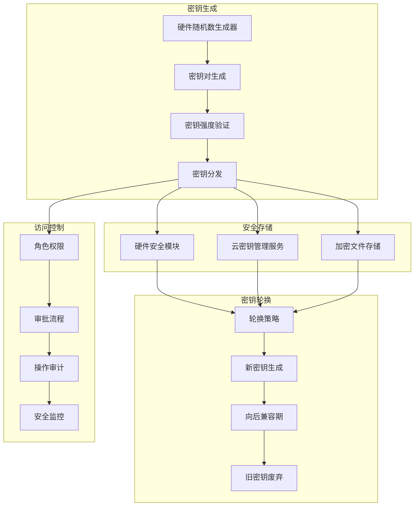

系统实施企业级的密钥生命周期管理，从密钥生成、存储、轮换到废弃的全过程都有严格的安全控制。密钥生成使用硬件随机数生成器确保随机性，存储采用HSM或云KMS确保安全性，轮换策略考虑业务连续性和安全性的平衡。

**密钥轮换与向后兼容**:

密钥轮换采用渐进式策略，新旧密钥并存一段时间以确保系统的向后兼容性。轮换过程包括新密钥生成、系统配置更新、客户端通知和旧密钥废弃四个阶段。每个阶段都有详细的验证检查点和回滚方案。

## 7. 安全审计与合规治理架构

### 7.1 全面审计追溯体系

**安全事件审计架构**:

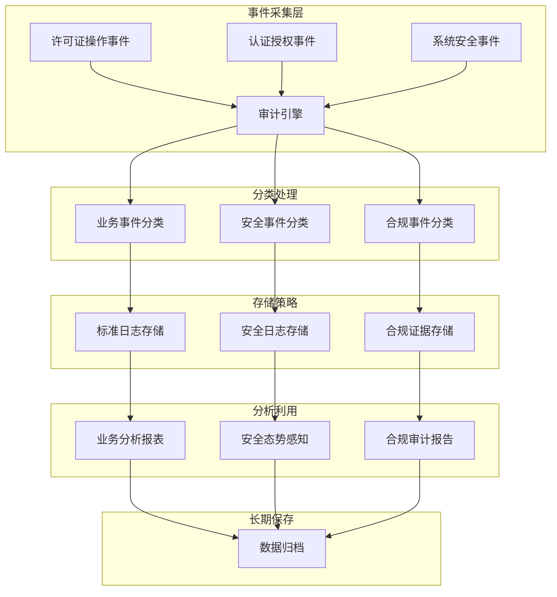

系统构建了全面的安全事件审计追溯体系，实现从事件发生到长期保存的完整生命周期管理。事件采集层捕获所有关键的业务和安全操作；分类处理层按照不同的业务需求和合规要求进行事件分类；存储策略层采用分层存储确保数据的完整性和可检索性；分析利用层提供实时的安全态势感知和合规证据支持。

**审计数据完整性保障**:

所有审计日志都采用数字签名和哈希校验确保数据完整性，防止事后篡改。审计日志的写入采用仅追加模式，删除操作需要特殊权限和审批流程。系统定期进行审计数据的完整性验证，确保合规要求下的证据可靠性。

### 7.2 多维度合规治理框架

**国际标准合规架构**:

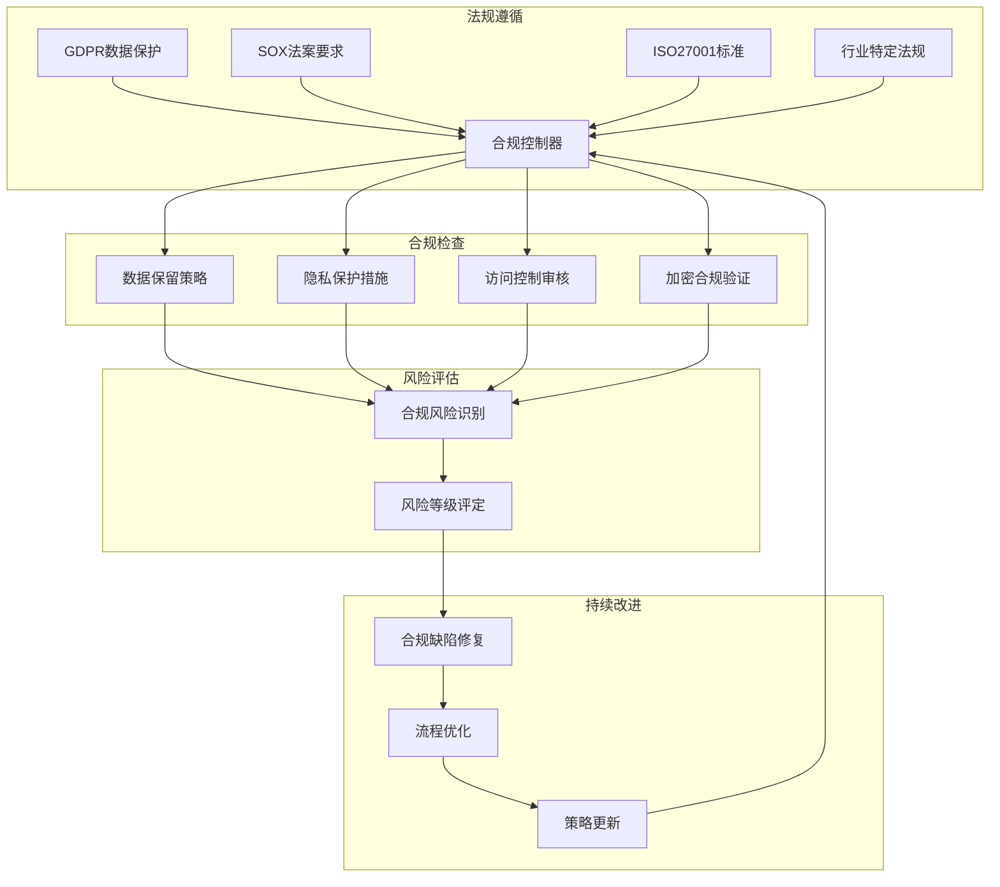

系统建立了涵盖多个国际标准和法规要求的合规治理框架。GDPR合规确保个人数据的合法处理和用户权利保护；SOX合规保证财务相关数据的准确性和可审计性；ISO27001合规建立了信息安全管理体系；行业特定法规确保业务运营的合法合规。

**自动化合规监控**:

合规治理框架具备自动化的监控和报告能力，能够实时检测潜在的合规风险并生成详细的合规报告。系统定期执行合规性自检，识别配置偏差和流程缺陷，自动生成改进建议和修复方案。

## 8. 安全架构总结

### 8.1 多层防护体系概览

本安全策略文档构建了一个全面的多层防护体系，通过威胁建模、加密保护、访问控制、监控响应和合规治理五个核心维度，为机器绑定许可证系统提供企业级的安全保障。

**核心安全原则**:
- **深度防护**: 多层次、多维度的安全控制措施
- **零信任架构**: 不信任任何内外部请求，全面验证和授权
- **持续监控**: 实时威胁检测和自动化安全响应
- **合规导向**: 符合国际标准和法规要求的治理框架

### 8.2 技术架构优势

系统采用现代化的安全技术栈，结合机器学习和人工智能技术，实现了智能化的威胁检测和响应能力。通过标准化的API接口和模块化的架构设计，确保了系统的可扩展性和可维护性。

**关键技术特性**:
- RSA-2048 + AES-256双层加密保护
- 多维度机器指纹识别技术
- 智能异常行为检测算法
- 自适应安全响应机制
- 企业级密钥管理体系

系统通过这些综合性的安全措施，为软件许可证管理提供了可靠的安全基础，能够有效防范各类安全威胁，确保业务的安全稳定运行。

---

*设计完成时间: 2025-09-05*  
*设计原则: 深度防护、零信任、持续监控*
