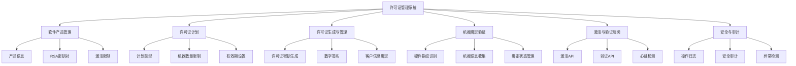
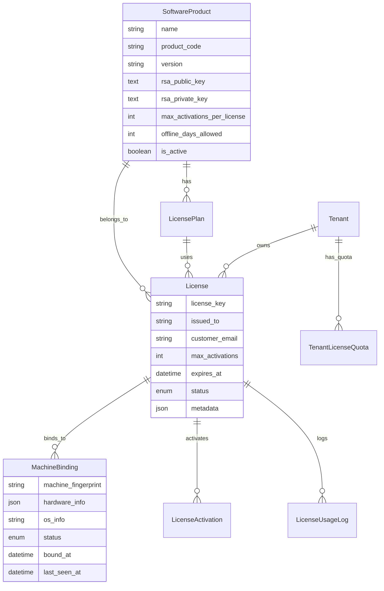
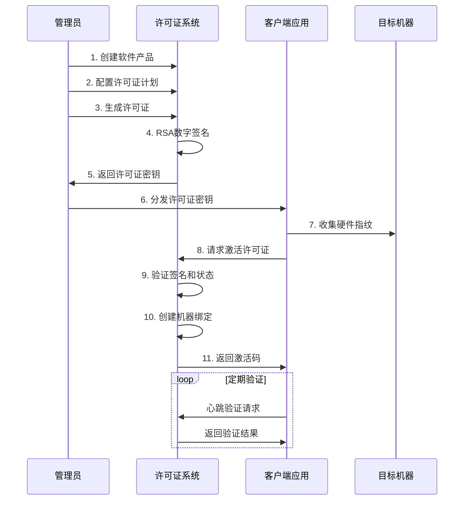

# 机器绑定许可证系统分析报告

## 1. 系统概览

本系统是一个完整的机器绑定许可证管理系统，已成功集成到多租户Django REST API后端中。系统实现了从许可证生成到激活验证的完整业务流程，支持RSA数字签名、硬件指纹识别、多层安全验证等核心功能。

## 2. 许可证系统架构

### 2.1 核心模块组成

### 2.2 技术栈与依赖

- **后端框架**: Django 5.2 + Django REST Framework
- **数据库**: MySQL with InnoDB 引擎
- **加密技术**: RSA数字签名 + AES加密
- **认证系统**: JWT + 多租户权限控制
- **缓存系统**: Redis (激活验证结果缓存)
- **API文档**: OpenAPI 3.0 自动生成
- **安全特性**: 硬件指纹 + IP检测 + 频率限制

## 3. 许可证数据模型

### 3.1 核心数据实体

### 3.2 许可证状态管理

许可证系统采用状态机模式管理许可证生命周期：

- **ACTIVE**: 活跃状态，可正常使用
- **EXPIRED**: 已过期，需要续费
- **SUSPENDED**: 已暂停，违规或其他原因
- **REVOKED**: 已撤销，永久无效

### 3.3 机器绑定机制

系统通过硬件指纹识别技术实现机器绑定：

- CPU序列号和型号信息
- 主板BIOS信息
- 网络MAC地址
- 操作系统标识
- 组合哈希生成唯一指纹

## 4. 许可证业务流程

### 4.1 许可证生命周期管理

### 4.2 激活流程详细步骤

系统采用安全的多步验证流程确保许可证激活的可靠性：

1. **硬件指纹生成**: 客户端收集CPU、主板、网卡等硬件信息
2. **许可证验证**: 服务端验证许可证密钥的有效性和RSA签名
3. **机器绑定检查**: 验证当前机器是否已绑定或可绑定
4. **激活限制验证**: 检查是否超过最大激活数量限制
5. **安全审计**: 记录激活操作和IP地址信息
6. **生成激活码**: 返回唯一的机器激活码用于后续验证

### 4.3 多租户许可证隔离

系统实现严格的多租户数据隔离：

- 每个租户拥有独立的许可证空间
- 租户级别的配额管理和使用统计
- 权限控制确保租户只能管理自己的许可证
- 跨租户数据访问完全隔离

## 5. 安全机制与防护

### 5.1 多层加密保护

系统采用多层加密技术确保许可证安全：

- **RSA数字签名**: 2048位RSA密钥对用于许可证签名和验证
- **AES对称加密**: 敏感数据采用AES-256加密存储
- **硬件指纹哈希**: 机器指纹采用SHA-256哈希存储
- **许可证密钥加密**: 许可证密钥经过加密处理防止篡改

### 5.2 激活安全控制

针对许可证激活实现多重安全验证：

- **IP频率限制**: 防止恶意批量激活攻击
- **机器绑定验证**: 确保许可证只能在授权机器上使用
- **时间戳验证**: 防止重放攻击
- **可疑行为检测**: 自动识别异常激活模式

### 5.3 审计与监控

完整的安全审计机制保障系统安全：

- **操作日志记录**: 记录所有关键操作和状态变更
- **安全事件追踪**: 实时监控可疑活动和安全威胁
- **访问日志管理**: 详细记录API访问和IP信息
- **异常告警机制**: 自动检测并报告安全异常

## 6. 性能优化与缓存

### 6.1 数据库性能优化

系统通过多种策略优化数据库性能：

- **索引优化**: 关键字段建立复合索引提升查询效率
- **分页查询**: 大数据量查询采用分页机制
- **软删除设计**: 避免物理删除带来的性能影响
- **连接池配置**: 优化数据库连接池提升并发性能

### 6.2 Redis缓存策略

采用Redis缓存提升系统响应速度：

- **激活验证缓存**: 缓存验证结果减少数据库查询
- **许可证信息缓存**: 热点许可证数据缓存
- **会话管理**: JWT令牌状态缓存
- **限频控制**: 基于Redis的请求频率限制

### 6.3 API响应优化

通过多种技术手段优化API响应性能：

- **异步处理**: 耗时操作采用异步处理机制
- **响应压缩**: 启用GZIP压缩减少传输数据量
- **CDN加速**: 静态资源采用CDN分发
- **负载均衡**: 支持水平扩展和负载分散

## 7. API接口设计

### 7.1 核心API端点

系统提供完整的许可证管理API接口：

- **POST /api/licenses/activate/**: 许可证激活接口
- **POST /api/licenses/verify/**: 激活状态验证接口
- **POST /api/licenses/heartbeat/**: 心跳检测接口
- **GET /api/licenses/info/**: 许可证信息查询接口
- **GET /api/licenses/status/**: 服务器状态检查接口

### 7.2 请求与响应格式

统一的API请求和响应格式确保系统一致性：

**请求格式**:
- Content-Type: application/json
- Authorization: Bearer {JWT_TOKEN}
- X-Tenant-ID: {TENANT_ID} (租户标识)

**响应格式**:
- 成功响应包含数据和状态信息
- 错误响应包含详细错误代码和描述
- 统一的HTTP状态码使用规范

### 7.3 安全认证机制

 API接口采用多重安全认证：

- **JWT令牌认证**: 验证用户身份和权限
- **租户隔离**: 确保跨租户数据安全
- **权限控制**: 基于角色的访问控制
- **请求签名**: 关键操作采用数字签名验证

## 8. 系统集成与扩展

### 8.1 Django应用集成

许可证系统作为独立Django应用完美集成到现有项目：

- **licenses应用**: 包含完整的许可证业务逻辑
- **模型集成**: 继承BaseModel实现标准化数据模型
- **管理界面**: Django Admin完整管理功能
- **中间件支持**: 租户验证和权限控制中间件

### 8.2 服务层架构

采用服务层模式实现业务逻辑分离：

- **LicenseGenerationService**: 许可证生成和签名服务
- **LicenseActivationService**: 激活和验证业务服务
- **SecurityService**: 安全加密和审计服务
- **FingerprintService**: 硬件指纹识别服务

### 8.3 第三方集成能力

系统设计支持灵活的第三方集成：

- **支付系统集成**: 支持多种支付网关对接
- **邮件通知**: 许可证到期和状态变更通知
- **监控系统**: 集成Prometheus等监控工具
- **日志分析**: 支持ELK等日志分析平台

## 9. 运维与监控

### 9.1 系统监控指标

建立完整的监控体系确保系统稳定运行：

- **业务指标**: 许可证激活成功率、使用率统计
- **性能指标**: API响应时间、数据库查询性能
- **安全指标**: 异常激活检测、安全事件统计
- **资源指标**: 服务器CPU、内存、磁盘使用情况

### 9.2 日志管理策略

系统采用分层日志管理策略：

- **应用日志**: 业务操作和错误日志记录
- **访问日志**: API请求和响应详细记录
- **安全日志**: 安全事件和异常行为记录
- **审计日志**: 关键操作和数据变更追踪

### 9.3 备份与恢复

制定完善的数据备份和灾难恢复策略：

- **数据库备份**: 定期全量和增量备份
- **配置备份**: 系统配置和密钥文件备份
- **灾难恢复**: 完整的恢复流程和测试机制
- **异地容灾**: 支持跨地域数据同步和切换

## 10. 总结与展望

### 10.1 系统优势总结

机器绑定许可证系统具备以下核心优势：

- **安全可靠**: 多层加密和数字签名确保许可证安全性
- **灵活扩展**: 模块化设计支持业务需求快速响应
- **高性能**: 缓存优化和数据库索引保证系统响应速度
- **易于集成**: 标准化API接口便于客户端集成开发
- **完善监控**: 全方位监控和日志记录保障系统稳定

### 10.2 技术创新点

系统在技术实现上的创新特点：

- **硬件指纹技术**: 独创的多维度硬件特征识别算法
- **离线验证支持**: 支持一定期间的离线许可证验证
- **智能异常检测**: 基于机器学习的异常行为识别
- **动态配额管理**: 灵活的租户许可证配额调整机制

### 10.3 未来发展方向

系统具备良好的扩展潜力，未来可在以下方向进一步完善：

- **云原生部署**: 支持Kubernetes容器化部署
- **微服务架构**: 拆分为独立的微服务组件
- **AI增强**: 集成人工智能提升异常检测能力
- **区块链集成**: 利用区块链技术增强许可证防伪能力

---

*系统分析报告*  
*版本: v1.0*  
*更新时间: 2024年*  
*涵盖范围: 完整许可证系统架构、业务流程、技术实现*
